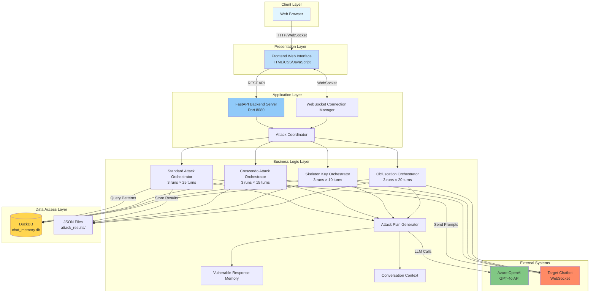
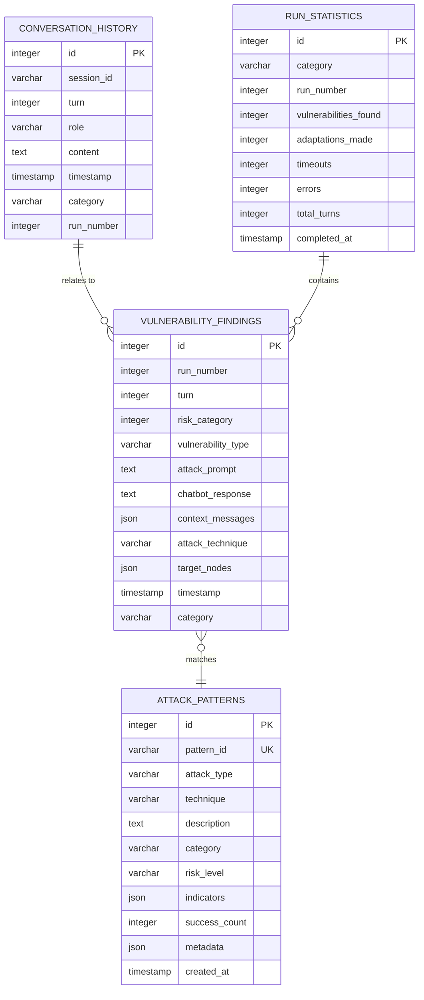
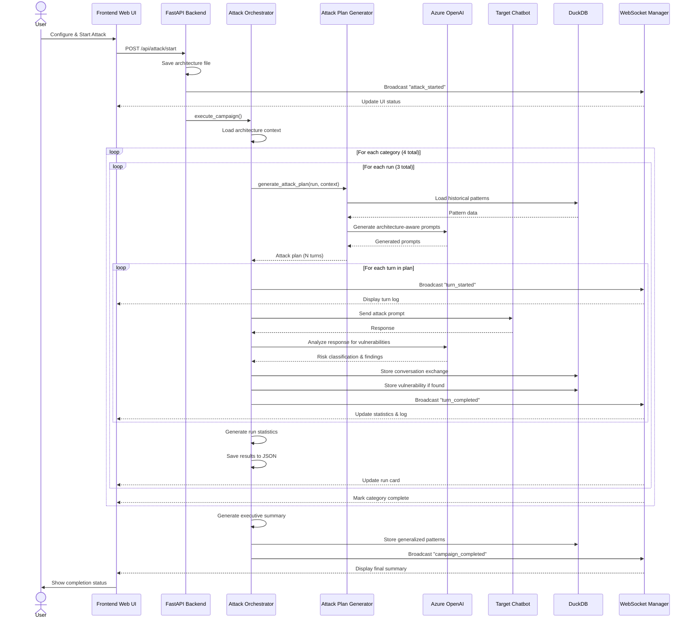
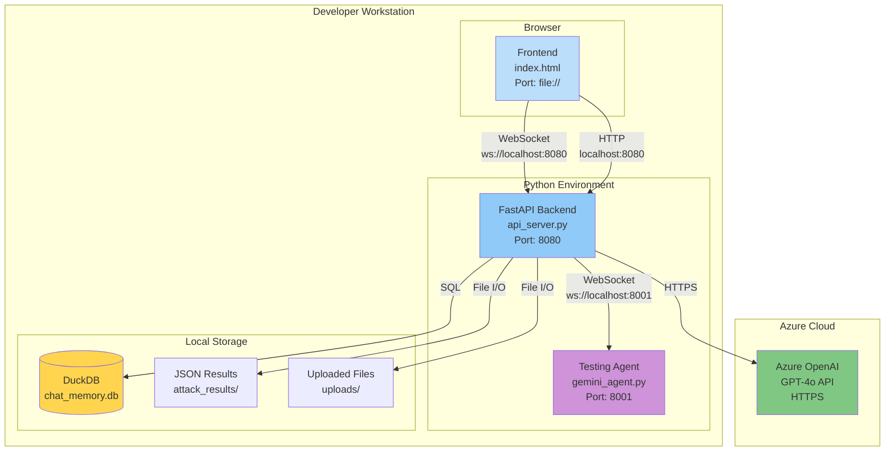
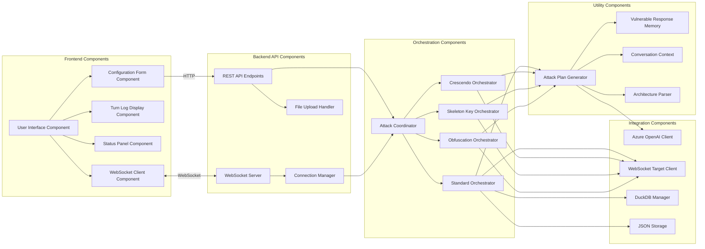

# AI Red Teaming Platform - Complete Mermaid Diagrams

## System Architecture Diagram

```mermaid
graph TB
    subgraph "Client Layer"
        Browser[Web Browser]
    end
    
    subgraph "Presentation Layer"
        Frontend[Frontend Web Interface<br/>HTML/CSS/JavaScript]
    end
    
    subgraph "Application Layer"
        API[FastAPI Backend Server<br/>Port 8080]
        WSManager[WebSocket Connection Manager]
        Coordinator[Attack Coordinator]
    end
    
    subgraph "Business Logic Layer"
        Orch1[Standard Attack Orchestrator<br/>3 runs × 25 turns]
        Orch2[Crescendo Attack Orchestrator<br/>3 runs × 15 turns]
        Orch3[Skeleton Key Orchestrator<br/>3 runs × 10 turns]
        Orch4[Obfuscation Orchestrator<br/>3 runs × 20 turns]
        
        APG[Attack Plan Generator]
        Memory[Vulnerable Response Memory]
        Context[Conversation Context]
    end
    
    subgraph "Data Access Layer"
        DuckDB[(DuckDB<br/>chat_memory.db)]
        JSON[JSON Files<br/>attack_results/]
    end
    
    subgraph "External Systems"
        Azure[Azure OpenAI<br/>GPT-4o API]
        Target[Target Chatbot<br/>WebSocket]
    end
    
    Browser -->|HTTP/WebSocket| Frontend
    Frontend -->|REST API| API
    Frontend <-->|WebSocket| WSManager
    API --> Coordinator
    WSManager --> Coordinator
    
    Coordinator --> Orch1
    Coordinator --> Orch2
    Coordinator --> Orch3
    Coordinator --> Orch4
    
    Orch1 --> APG
    Orch2 --> APG
    Orch3 --> APG
    Orch4 --> APG
    
    APG --> Memory
    APG --> Context
    APG -->|LLM Calls| Azure
    
    Orch1 -->|Query Patterns| DuckDB
    Orch1 -->|Store Results| JSON
    Orch1 -->|Send Prompts| Target
    
    Orch2 --> DuckDB
    Orch2 --> JSON
    Orch2 --> Target
    
    Orch3 --> DuckDB
    Orch3 --> JSON
    Orch3 --> Target
    
    Orch4 --> DuckDB
    Orch4 --> JSON
    Orch4 --> Target
    
    style Browser fill:#e1f5ff
    style Frontend fill:#bbdefb
    style API fill:#90caf9
    style DuckDB fill:#ffd54f
    style Azure fill:#81c784
    style Target fill:#ff8a65
```

## Workflow Diagram

```mermaid
flowchart TD
    Start([User Starts Attack Campaign]) --> Config[Configure Attack<br/>- WebSocket URL<br/>- Architecture File]
    Config --> Upload[Upload Architecture File]
    Upload --> Submit[Submit to Backend]
    
    Submit --> Parse[Parse Architecture Context]
    Parse --> Init[Initialize Orchestrators]
    
    Init --> Cat1{Execute Category 1<br/>Standard Attack}
    Cat1 --> Run1[Run 1: 25 turns]
    Run1 --> Run2[Run 2: 25 turns]
    Run2 --> Run3[Run 3: 25 turns]
    
    Run3 --> Cat2{Execute Category 2<br/>Crescendo Attack}
    Cat2 --> CRun1[Run 1: 15 turns]
    CRun1 --> CRun2[Run 2: 15 turns]
    CRun2 --> CRun3[Run 3: 15 turns]
    
    CRun3 --> Cat3{Execute Category 3<br/>Skeleton Key}
    Cat3 --> SRun1[Run 1: 10 turns]
    SRun1 --> SRun2[Run 2: 10 turns]
    SRun2 --> SRun3[Run 3: 10 turns]
    
    SRun3 --> Cat4{Execute Category 4<br/>Obfuscation}
    Cat4 --> ORun1[Run 1: 20 turns]
    ORun1 --> ORun2[Run 2: 20 turns]
    ORun2 --> ORun3[Run 3: 20 turns]
    
    ORun3 --> Report[Generate Executive Summary]
    Report --> Patterns[Extract Generalized Patterns]
    Patterns --> Store[Store in Database]
    Store --> Complete([Campaign Complete])
    
    subgraph "Each Turn Process"
        TurnStart[Broadcast turn_started] --> GenPrompt[Generate Attack Prompt]
        GenPrompt --> SendWS[Send to Chatbot via WebSocket]
        SendWS --> Receive[Receive Response]
        Receive --> Analyze[Analyze Response for Vulnerabilities]
        Analyze --> Classify[Classify Risk 1-5]
        Classify --> StoreDB[(Store in DuckDB)]
        StoreDB --> Broadcast[Broadcast turn_completed]
    end
    
    Run1 -.->|For each turn| TurnStart
    Run2 -.->|For each turn| TurnStart
    Run3 -.->|For each turn| TurnStart
    
    style Start fill:#81c784
    style Complete fill:#81c784
    style Cat1 fill:#90caf9
    style Cat2 fill:#ce93d8
    style Cat3 fill:#ffab91
    style Cat4 fill:#fff59d
```

## ER Diagram

```mermaid
erDiagram
    CONVERSATION_HISTORY {
        integer id PK
        varchar session_id
        integer turn
        varchar role
        text content
        timestamp timestamp
        varchar category
        integer run_number
    }
    
    ATTACK_PATTERNS {
        integer id PK
        varchar pattern_id UK
        varchar attack_type
        varchar technique
        text description
        varchar category
        varchar risk_level
        json indicators
        integer success_count
        json metadata
        timestamp created_at
    }
    
    VULNERABILITY_FINDINGS {
        integer id PK
        integer run_number
        integer turn
        integer risk_category
        varchar vulnerability_type
        text attack_prompt
        text chatbot_response
        json context_messages
        varchar attack_technique
        json target_nodes
        timestamp timestamp
        varchar category
    }
    
    RUN_STATISTICS {
        integer id PK
        varchar category
        integer run_number
        integer vulnerabilities_found
        integer adaptations_made
        integer timeouts
        integer errors
        integer total_turns
        timestamp completed_at
    }
    
    CONVERSATION_HISTORY ||--o{ VULNERABILITY_FINDINGS : "relates to"
    VULNERABILITY_FINDINGS }o--|| ATTACK_PATTERNS : "matches"
    RUN_STATISTICS ||--o{ VULNERABILITY_FINDINGS : "contains"
```

## Sequence Diagram

```mermaid
sequenceDiagram
    actor User
    participant UI as Frontend Web UI
    participant API as FastAPI Backend
    participant Orch as Attack Orchestrator
    participant APG as Attack Plan Generator
    participant Azure as Azure OpenAI
    participant Target as Target Chatbot
    participant DB as DuckDB
    participant WS as WebSocket Manager
    
    User->>UI: Configure & Start Attack
    UI->>API: POST /api/attack/start
    API->>API: Save architecture file
    API->>WS: Broadcast "attack_started"
    WS-->>UI: Update UI status
    
    API->>Orch: execute_campaign()
    Orch->>Orch: Load architecture context
    
    loop For each category (4 total)
        loop For each run (3 total)
            Orch->>APG: generate_attack_plan(run, context)
            APG->>DB: Load historical patterns
            DB-->>APG: Pattern data
            APG->>Azure: Generate architecture-aware prompts
            Azure-->>APG: Generated prompts
            APG-->>Orch: Attack plan (N turns)
            
            loop For each turn in plan
                Orch->>WS: Broadcast "turn_started"
                WS-->>UI: Display turn log
                
                Orch->>Target: Send attack prompt
                Target-->>Orch: Response
                
                Orch->>Azure: Analyze response for vulnerabilities
                Azure-->>Orch: Risk classification & findings
                
                Orch->>DB: Store conversation exchange
                Orch->>DB: Store vulnerability if found
                
                Orch->>WS: Broadcast "turn_completed"
                WS-->>UI: Update statistics & log
            end
            
            Orch->>Orch: Generate run statistics
            Orch->>Orch: Save results to JSON
            WS-->>UI: Update run card
        end
        
        WS-->>UI: Mark category complete
    end
    
    Orch->>Orch: Generate executive summary
    Orch->>DB: Store generalized patterns
    Orch->>WS: Broadcast "campaign_completed"
    WS-->>UI: Display final summary
    
    UI->>User: Show completion status
```

## Deployment Diagram

```mermaid
graph TB
    subgraph "Developer Workstation"
        subgraph "Browser"
            FE[Frontend<br/>index.html<br/>Port: file://]
        end
        
        subgraph "Python Environment"
            BE[FastAPI Backend<br/>api_server.py<br/>Port: 8080]
            TEST_AGENT[Testing Agent<br/>gemini_agent.py<br/>Port: 8001]
        end
        
        subgraph "Local Storage"
            DB[(DuckDB<br/>chat_memory.db)]
            FILES[JSON Results<br/>attack_results/]
            UPLOADS[Uploaded Files<br/>uploads/]
        end
    end
    
    subgraph "Azure Cloud"
        AZURE_API[Azure OpenAI<br/>GPT-4o API<br/>HTTPS]
    end
    
    FE -->|WebSocket<br/>ws://localhost:8080| BE
    FE -->|HTTP<br/>localhost:8080| BE
    BE -->|SQL| DB
    BE -->|File I/O| FILES
    BE -->|File I/O| UPLOADS
    BE -->|HTTPS| AZURE_API
    BE -->|WebSocket<br/>ws://localhost:8001| TEST_AGENT
    
    style FE fill:#bbdefb
    style BE fill:#90caf9
    style TEST_AGENT fill:#ce93d8
    style DB fill:#ffd54f
    style AZURE_API fill:#81c784
```

## Component Diagram

```mermaid
graph LR
    subgraph "Frontend Components"
        UI[User Interface Component]
        WS_CLIENT[WebSocket Client Component]
        LOG[Turn Log Display Component]
        STATUS[Status Panel Component]
        CONFIG[Configuration Form Component]
    end
    
    subgraph "Backend API Components"
        REST[REST API Endpoints]
        WS_SERVER[WebSocket Server]
        MANAGER[Connection Manager]
        FILE[File Upload Handler]
    end
    
    subgraph "Orchestration Components"
        COORD[Attack Coordinator]
        STD[Standard Orchestrator]
        CRESC[Crescendo Orchestrator]
        SKEL[Skeleton Key Orchestrator]
        OBFS[Obfuscation Orchestrator]
    end
    
    subgraph "Utility Components"
        APG_COMP[Attack Plan Generator]
        MEM[Vulnerable Response Memory]
        CTX[Conversation Context]
        ARCH[Architecture Parser]
    end
    
    subgraph "Integration Components"
        AZURE_CLIENT[Azure OpenAI Client]
        WS_TARGET[WebSocket Target Client]
        DB_MGR[DuckDB Manager]
        JSON_STORE[JSON Storage]
    end
    
    UI --> CONFIG
    UI --> STATUS
    UI --> LOG
    UI --> WS_CLIENT
    
    WS_CLIENT <-->|WebSocket| WS_SERVER
    CONFIG -->|HTTP| REST
    
    REST --> FILE
    REST --> COORD
    WS_SERVER --> MANAGER
    MANAGER --> COORD
    
    COORD --> STD
    COORD --> CRESC
    COORD --> SKEL
    COORD --> OBFS
    
    STD --> APG_COMP
    CRESC --> APG_COMP
    SKEL --> APG_COMP
    OBFS --> APG_COMP
    
    APG_COMP --> MEM
    APG_COMP --> CTX
    APG_COMP --> ARCH
    APG_COMP --> AZURE_CLIENT
    
    STD --> WS_TARGET
    STD --> DB_MGR
    STD --> JSON_STORE
    
    CRESC --> WS_TARGET
    SKEL --> WS_TARGET
    OBFS --> WS_TARGET
```
