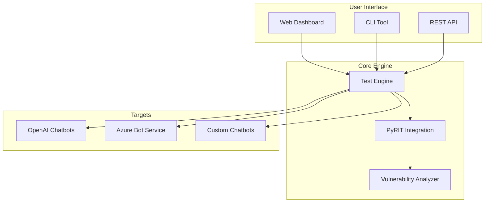

"# Chatbot Security Testing Agent

A comprehensive security testing solution that evaluates chatbot vulnerabilities using red teaming techniques and Microsoft's PyRIT (Python Risk Identification Toolkit).

## 🎯 Overview

This project provides an automated security testing agent for AI-powered chatbots. It helps organizations identify vulnerabilities such as:

- **Prompt Injection** - Attacks that manipulate chatbot behavior
- **Jailbreaking** - Attempts to bypass content filters
- **Data Leakage** - Unintended disclosure of sensitive information
- **Social Engineering** - Exploits targeting AI systems

## 📚 Documentation

| Document | Description |
|----------|-------------|
| [MLP (Minimum Lovable Product)](docs/MLP.md) | Core features, use cases, and expected user experience |
| [PRD (Product Requirement Document)](docs/PRD.md) | Detailed requirements, architecture, and specifications |

## 🚀 Key Features

- **PyRIT Integration** - Leverages Microsoft's proven red teaming framework
- **Multi-Chatbot Support** - Connect to OpenAI, Azure Bot Service, and custom APIs
- **Real-time Dashboard** - Visual vulnerability detection and severity classification
- **Custom Scenarios** - Build and execute custom attack scenarios
- **Comprehensive Reporting** - Generate PDF, JSON, and HTML reports

## 🏗️ Architecture

## 📋 Issue Templates

This repository includes GitHub issue templates for:

- **MLP Feature Requests** - Propose new features for the product
- **PRD Change Requests** - Suggest changes to requirements
- **Security Testing Scenarios** - Submit new attack scenarios

## 🛡️ Security

This tool is designed for authorized security testing only. Always ensure you have proper authorization before testing any chatbot system.

## 📄 License

See [LICENSE](LICENSE) for details.

## 🤝 Contributing

Contributions are welcome! Please see our issue templates to get started." 
