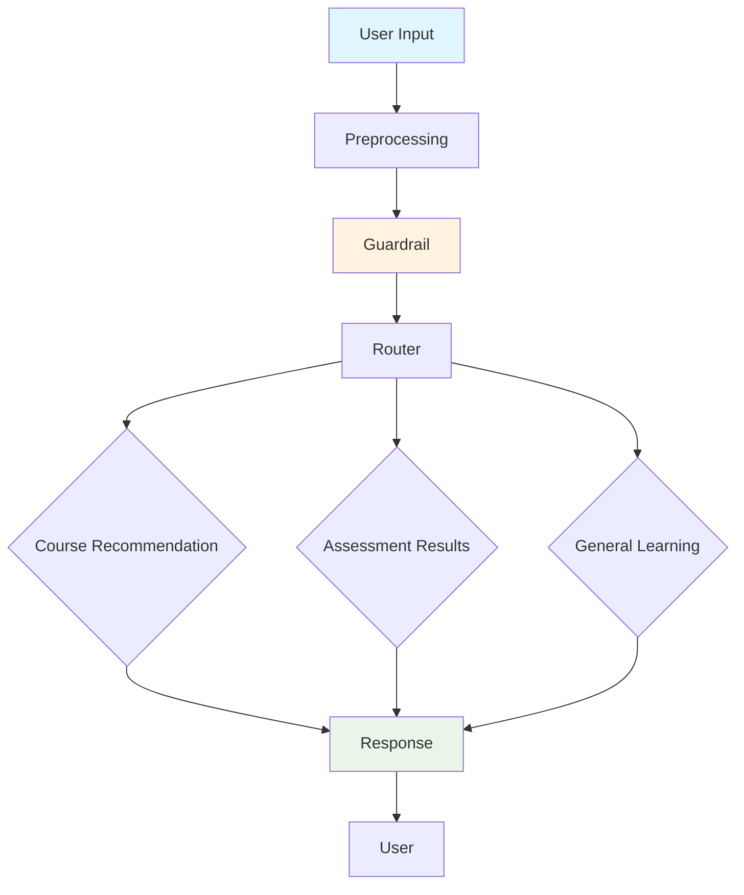

# NueSkill Chatbot Agent

## Overview

The NueSkill Chatbot Agent is an intelligent conversational assistant designed to help consultants in the NueSkill online learning platform. It provides personalized guidance on skill development, course recommendations, and assessment feedback through natural language conversations.

## Purpose

The agent helps users:
- Discover and understand their skill gaps through conversational explanations
- Receive targeted learning suggestions based on their needs
- Access assessment results and performance insights
- Navigate the NueSkill learning platform effectively
- Get answers to educational questions and learning-related queries

## Agent Structure

The chatbot agent is organized into several specialized components that work together to provide comprehensive learning support:

### Core Components

1. **Preprocessing Component**
   - Handles initial input validation and preparation
   - Ensures queries are ready for processing

2. **Guardrail Component**
   - Validates that queries are appropriate for the learning platform
   - Ensures conversations stay focused on educational topics
   - Provides polite guidance for off-topic requests

3. **Router Component**
   - Intelligently directs queries to the most appropriate handler
   - Determines whether a query is about courses, assessments, or general learning

4. **Course Recommendation Component**
   - Provides personalized course suggestions
   - Matches user needs with available learning resources
   - Includes detailed course information and learning paths

5. **Assessment Results Component**
   - Retrieves and explains assessment performance
   - Provides insights into strengths and areas for improvement
   - Offers targeted recommendations based on results

6. **General Learning Component**
   - Handles general educational questions
   - Provides explanations and learning guidance
   - Maintains conversation context for follow-up questions

### Memory System

The agent maintains conversation history to provide context-aware responses and remember user preferences across the conversation.

## Agent Diagram

## Communication Endpoints

### Chat Interface
- **WebSocket Endpoint**: `ws://localhost:8000/chat` (local development)
- **Secure WebSocket Endpoint**: `wss://neuskill-chatbot-ddd2gbdvbwhuhpa0.centralindia-01.azurewebsites.net/chat` (production)
- **Purpose**: Real-time conversational interface
- **Usage**: Connect with employee_id parameter for personalized sessions

### Health Check
- **HTTP Endpoint**: `http://localhost:8000/health` (local)
- **HTTPS Endpoint**: `https://neuskill-chatbot-ddd2gbdvbwhuhpa0.centralindia-01.azurewebsites.net/health` (production)
- **Purpose**: System status monitoring
- **Response**: JSON status information

## How to Interact

1. **Start a Conversation**: Connect to the WebSocket endpoint with your employee ID
2. **Ask Questions**: Use natural language to ask about courses, assessments, or learning topics
3. **Receive Guidance**: Get personalized recommendations and explanations
4. **Follow Up**: The agent remembers context for related questions

### Example Interactions

- "What courses do you recommend for Python programming?"
- "Show my assessment results"
- "Help me understand my skill gaps"
- "What are my strengths in data analysis?"

## Features

### Course Recommendations
- Personalized course suggestions based on skill needs
- Detailed course descriptions and learning objectives
- Multiple format options (videos, labs, projects)

### Assessment Insights
- Clear explanations of assessment results
- Identification of strengths and improvement areas
- Actionable recommendations for skill development

### Learning Guidance
- Answers to educational questions
- Platform navigation assistance
- Progress tracking support

### Safety and Focus
- Ensures all interactions are learning-related
- Politely redirects off-topic conversations
- Maintains professional and educational tone

## Getting Started

To use the NueSkill Chatbot Agent:

1. Access the NueSkill platform
2. Open the chat interface
3. Start asking questions about your learning journey
4. Receive personalized guidance and recommendations

The agent is designed to be your learning companion, providing support whenever you need it during your skill development journey.