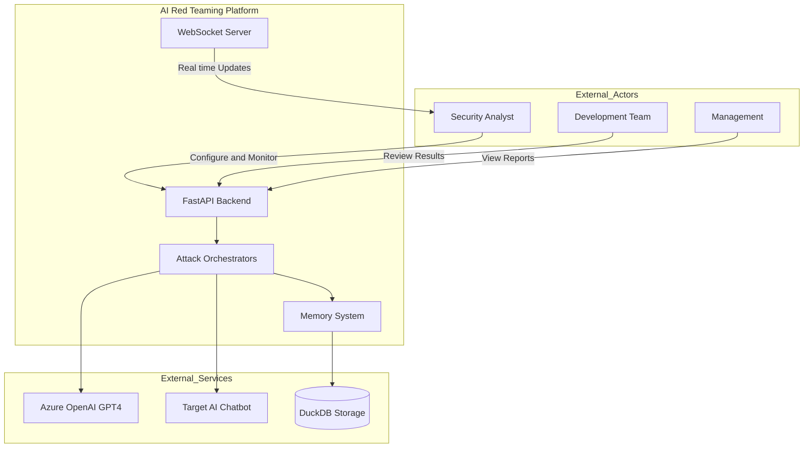
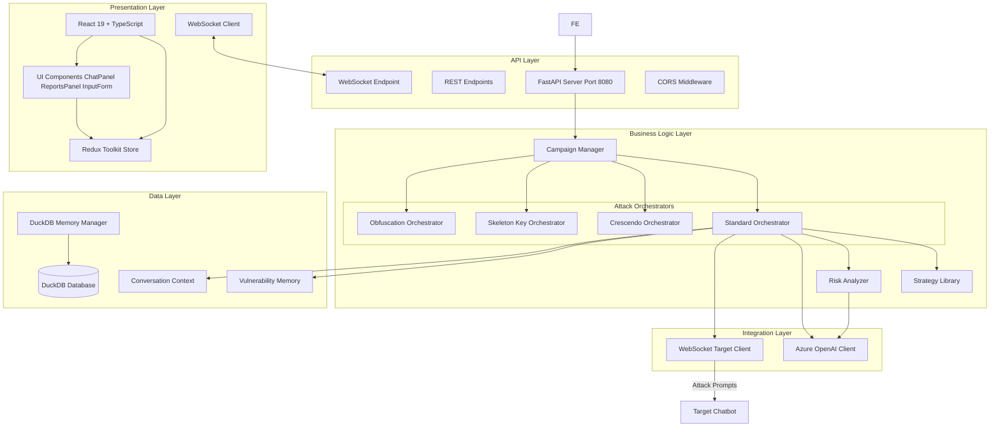
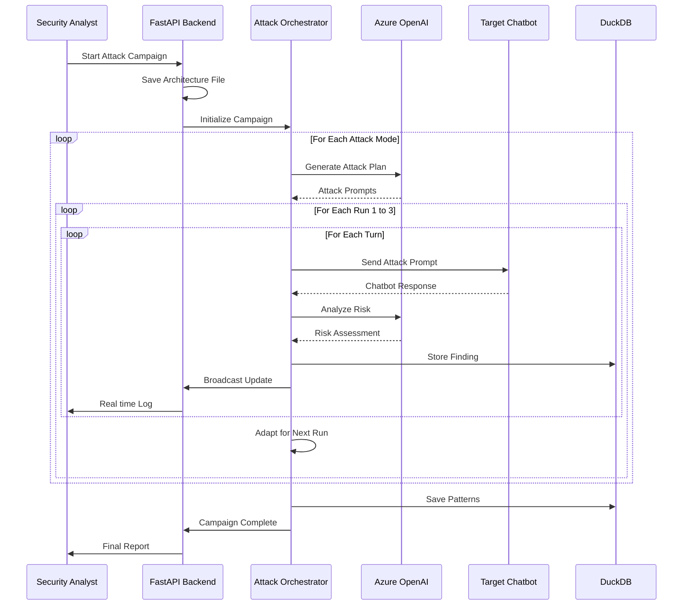
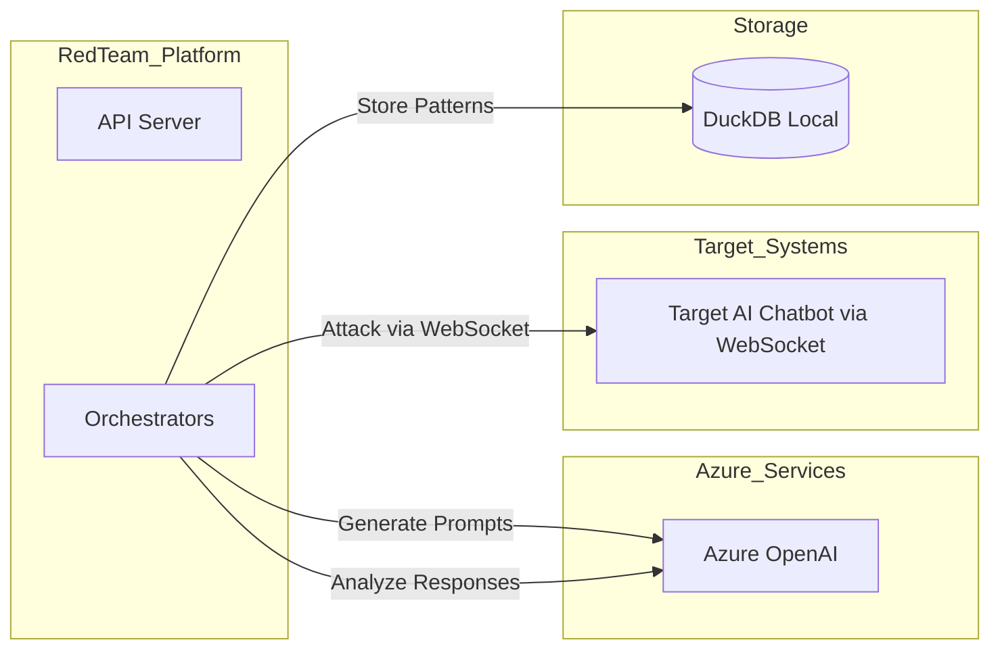
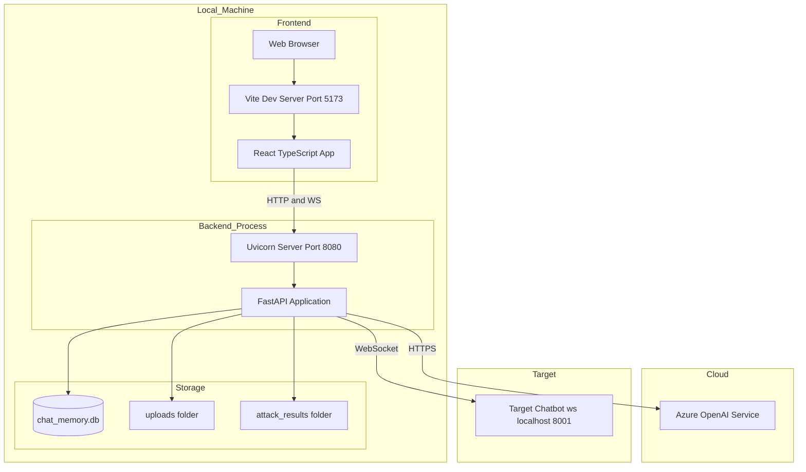

# High-Level Design (HLD) - AI Red Teaming Platform

## 1. Executive Summary

The **AI Red Teaming Platform** is an automated security assessment system designed to test AI chatbots for vulnerabilities using multiple attack strategies. The platform orchestrates intelligent, adaptive attacks against target chatbots via WebSocket communication, providing real-time monitoring and comprehensive vulnerability reporting.

### Key Business Objectives

| Objective | Description |
|-----------|-------------|
| **Automated Security Testing** | Replace manual, time-consuming security assessments with automated, repeatable campaigns |
| **Multi-Vector Attack Coverage** | Test chatbots against diverse attack types (jailbreaks, prompt injection, obfuscation) |
| **Adaptive Learning** | System learns from successful attacks to improve future assessments |
| **Real-Time Visibility** | Provide stakeholders with live monitoring and instant vulnerability alerts |
| **Compliance Support** | Generate audit-ready reports for security compliance requirements |

---

## 2. System Context Diagram

---

## 3. High-Level Architecture

### 3.1 Architecture Overview

---

## 4. Core Components Overview

### 4.1 Component Summary

| Component | Purpose | Technology |
|-----------|---------|------------|
| **API Server** | REST and WebSocket endpoints for frontend communication | FastAPI, Uvicorn |
| **Connection Manager** | Manages WebSocket connections for real-time broadcasts | Python asyncio |
| **Attack Orchestrators** | Coordinate multi-run attack campaigns | Python async |
| **Azure OpenAI Client** | Generate attack prompts and analyze responses | Azure OpenAI GPT-4 |
| **WebSocket Target** | Communicate with target chatbot | websockets library |
| **Memory System** | Store vulnerabilities and learning patterns | PyRIT DuckDB |
| **Strategy Library** | Pre-built attack pattern templates | Python classes |

### 4.2 Attack Mode Summary

| Attack Mode | Runs | Turns per Run | Primary Technique |
|-------------|------|---------------|-------------------|
| **Standard** | 3 | 25 | Multi-phase reconnaissance to exploitation |
| **Crescendo** | 3 | 15 | Personality-based emotional manipulation |
| **Skeleton Key** | 3 | 10 | Jailbreak and system prompt extraction |
| **Obfuscation** | 3 | 20 | Filter bypass using encoding and language tricks |

---

## 5. Data Flow Overview

### 5.1 Attack Campaign Flow

---

## 6. Technology Stack

### 6.1 Backend Technologies

| Category | Technology | Version | Purpose |
|----------|------------|---------|---------|
| **Framework** | FastAPI | Latest | REST API and WebSocket server |
| **Runtime** | Python | 3.9+ | Core programming language |
| **AI Integration** | Azure OpenAI | GPT-4o | Attack generation and risk analysis |
| **Memory Framework** | PyRIT | 0.4+ | Persistent pattern storage |
| **Database** | DuckDB | 0.9+ | Local analytical database |
| **WebSocket** | websockets | 12+ | Target chatbot communication |
| **HTTP Client** | httpx | 0.25+ | Azure API calls |

### 6.2 Frontend Technologies

| Category | Technology | Version | Purpose |
|----------|------------|---------|--------|
| **Framework** | React | 19.2.0 | Component-based UI |
| **Language** | TypeScript | 5.9.3 | Type-safe development |
| **State Management** | Redux Toolkit | 2.11.1 | Centralized state with async thunks |
| **UI Components** | Material-UI (MUI) | 7.3.6 | Professional component library |
| **Charts** | Recharts | 3.5.1 | Real-time vulnerability visualization |
| **Styling** | React-JSS + Emotion | Latest | CSS-in-JS styling |
| **Build Tool** | Vite | 7.2.4 | Fast build and HMR |
| **HTTP Client** | Axios | 1.13.2 | API communication |
| **Real-time** | WebSocket API | Native | Live attack monitoring |

---

## 7. Security Considerations

### 7.1 Security Architecture

| Layer | Security Measure |
|-------|------------------|
| **API** | CORS middleware for origin control |
| **Credentials** | Environment variables for API keys |
| **Content** | Azure content filter handling |
| **Data** | Local DuckDB storage only |
| **Network** | Internal WebSocket communication |

### 7.2 Operational Security

- API keys stored in environment variables (not in code)
- Content filter violation detection and graceful handling
- Local-only database storage for sensitive findings
- No external data transmission beyond Azure OpenAI

### 7.3 Frontend Security & Performance (Dec 2025 Updates)

- **WebSocket Lifecycle Management**: Centralized socket lifecycle prevents disconnection on tab switches
- **Memory Leak Prevention**: Event listeners properly cleaned up (no duplicate registrations)
- **Redux State Management**: Non-serializable values (WebSocket instances) flagged for refactoring
- **CORS Configuration**: Backend configured for localhost development origins

---

## 8. Scalability Considerations

### 8.1 Current Design

- Single-instance deployment
- In-memory session state
- Local DuckDB persistence
- Configurable runs and turns via environment

### 8.2 Future Scaling Options

| Enhancement | Benefit |
|-------------|---------|
| **Horizontal Scaling** | Multiple orchestrator instances |
| **Queue-based** | Redis or RabbitMQ for job distribution |
| **Cloud Storage** | Azure Blob for report persistence |
| **Distributed DB** | PostgreSQL for multi-user support |

---

## 9. Integration Points

### 9.1 External Integrations

---

## 10. Deployment Architecture

### 10.1 Local Deployment

---

## 11. Key Design Decisions Summary

| Decision | Rationale |
|----------|-----------|
| **FastAPI for Backend** | Async support, automatic OpenAPI docs, WebSocket native |
| **WebSocket for Target** | Real-time bidirectional communication with chatbots |
| **PyRIT Integration** | Leverages Microsoft's red-teaming memory infrastructure |
| **Multi-Orchestrator Design** | Modular attack modes with specialized strategies |
| **DuckDB for Storage** | Lightweight, embedded analytics database |
| **Azure OpenAI** | Enterprise-grade AI with content safety controls |

---

## 12. Document Information

| Attribute | Value |
|-----------|-------|
| **Version** | 1.1 |
| **Created** | December 2025 |
| **Last Updated** | December 15, 2025 |
| **Author** | Red Team Development |
| **Status** | Active |
| **Changes** | Added React/TypeScript frontend, WebSocket lifecycle fixes |
