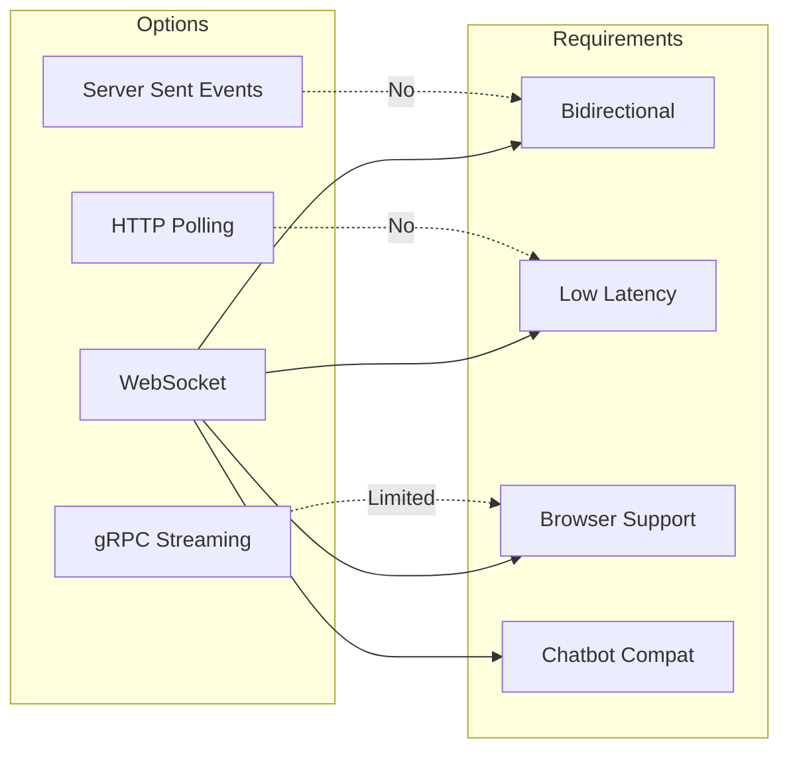
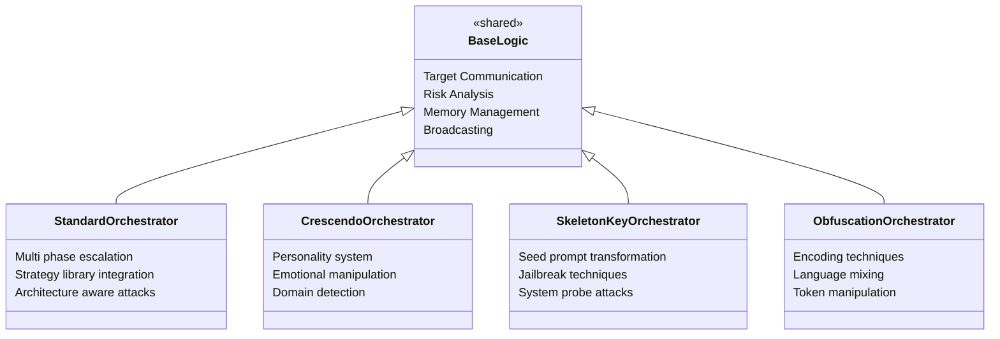
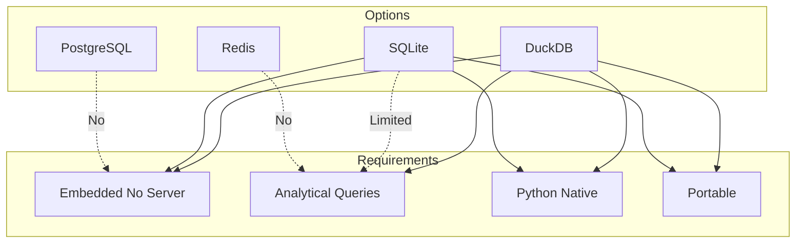
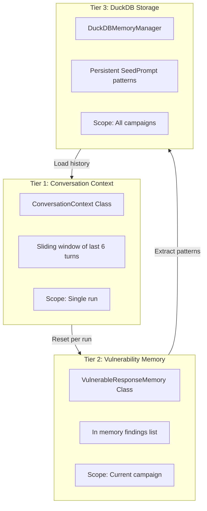
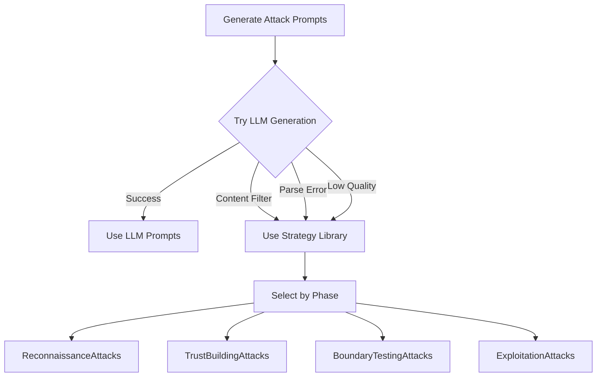

# Architecture Decision Records (ADR)

## ADR Index

| ADR | Title | Status | Date |
|-----|-------|--------|------|
| ADR-001 | FastAPI as Backend Framework | Accepted | Dec 2025 |
| ADR-002 | WebSocket for Real-Time Communication | Accepted | Dec 2025 |
| ADR-003 | PyRIT Integration for Memory Management | Accepted | Dec 2025 |
| ADR-004 | Multi-Orchestrator Architecture | Accepted | Dec 2025 |
| ADR-005 | Azure OpenAI for Attack Generation | Accepted | Dec 2025 |
| ADR-006 | DuckDB for Local Persistence | Accepted | Dec 2025 |
| ADR-007 | Three-Tier Memory Architecture | Accepted | Dec 2025 |
| ADR-008 | Strategy Library Pattern | Accepted | Dec 2025 |

---

## ADR-001: FastAPI as Backend Framework

### Status
**Accepted**

### Context
We needed a Python web framework to serve REST APIs and WebSocket endpoints for the red teaming platform. The framework must support:
- Asynchronous request handling for concurrent attacks
- Native WebSocket support for real-time monitoring
- Easy integration with Python ML/AI libraries
- Automatic API documentation

### Decision
We chose **FastAPI** as the backend framework.

### Rationale

| Criterion | FastAPI | Flask | Django |
|-----------|---------|-------|--------|
| Async Support | Native | Extension | Limited |
| WebSocket | Native | Extension | Channels |
| Auto Docs | OpenAPI | Extension | DRF |
| Performance | High | Medium | Medium |
| Learning Curve | Low | Low | High |

### Consequences

**Positive:**
- Native async/await support enables efficient concurrent operations
- Built-in WebSocket handling simplifies real-time features
- Automatic OpenAPI documentation aids development
- High performance with Uvicorn ASGI server
- Excellent type hints and validation via Pydantic

**Negative:**
- Smaller ecosystem compared to Flask/Django
- Team needs familiarity with async patterns
- Less mature than alternatives for large-scale deployments

### Alternatives Considered
- **Flask**: Lacks native async and WebSocket support
- **Django**: Heavyweight for this use case, async support is recent
- **Starlette**: Lower-level, requires more boilerplate

---

## ADR-002: WebSocket for Real-Time Communication

### Status
**Accepted**

### Context
The platform requires two types of WebSocket communication:
1. **Frontend Monitoring**: Real-time attack progress updates to web dashboard
2. **Target Communication**: Bidirectional messaging with target AI chatbots

### Decision
We use **WebSocket protocol** for both frontend monitoring and target chatbot communication.

### Rationale

| Requirement | WebSocket | SSE | Polling | gRPC |
|-------------|-----------|-----|---------|------|
| Bidirectional | ✅ | ❌ | ❌ | ✅ |
| Low Latency | ✅ | ✅ | ❌ | ✅ |
| Browser Support | ✅ | ✅ | ✅ | ❌ |
| Chatbot Compatible | ✅ | ❌ | ❌ | ❌ |

### Consequences

**Positive:**
- Single protocol for both frontend and target communication
- True bidirectional communication enables conversational attacks
- Low latency for real-time monitoring
- Wide browser and chatbot platform support

**Negative:**
- Connection management complexity (heartbeats, reconnection)
- Stateful connections require careful error handling
- Scaling requires sticky sessions or shared state

---

## ADR-003: PyRIT Integration for Memory Management

### Status
**Accepted**

### Context
We need persistent storage for:
- Learned attack patterns across sessions
- Successful attack techniques for self-improvement
- Vulnerability findings for reporting

Microsoft's PyRIT (Python Risk Identification Toolkit) provides memory infrastructure designed for AI red teaming.

### Decision
We integrate **PyRIT's DuckDBMemory and SeedPrompt** models for persistent storage.

### Rationale

**Why PyRIT:**
- Purpose-built for AI red teaming workflows
- Structured storage for attack patterns (SeedPrompt)
- DuckDB provides fast analytical queries
- Maintained by Microsoft with security focus
- Aligns with our attack methodology

**What we use:**
- `DuckDBMemory`: Persistent storage backend
- `SeedPrompt`: Structured pattern storage model

**What we don't use:**
- PyRIT's attack execution framework (custom orchestrators)
- PyRIT's target connectors (custom WebSocket target)

### Consequences

**Positive:**
- Leverage battle-tested memory infrastructure
- Structured storage enables cross-session learning
- DuckDB is lightweight and embedded (no server needed)
- Extensible for future PyRIT features

**Negative:**
- Dependency on PyRIT versioning and API changes
- Limited to what DuckDB supports (no distributed storage)
- Must maintain compatibility with PyRIT updates

---

## ADR-004: Multi-Orchestrator Architecture

### Status
**Accepted**

### Context
Different attack methodologies require specialized logic:
- Standard attacks: Multi-phase escalation
- Crescendo: Personality-based manipulation
- Skeleton Key: Jailbreak techniques
- Obfuscation: Filter bypass methods

### Decision
We implement **separate orchestrator classes** for each attack mode with shared base functionality.

### Rationale

### Consequences

**Positive:**
- Clear separation of concerns for each attack type
- Easy to add new attack modes without affecting others
- Specialized optimization per attack methodology
- Independent testing and development

**Negative:**
- Some code duplication across orchestrators
- Coordination complexity when running multiple modes
- Need to maintain consistency across orchestrators

---

## ADR-005: Azure OpenAI for Attack Generation

### Status
**Accepted**

### Context
We need a powerful LLM to:
- Generate context-aware attack prompts
- Analyze chatbot responses for vulnerabilities
- Adapt attacks based on previous findings

### Decision
We use **Azure OpenAI (GPT-4)** as the primary LLM backend.

### Rationale

| Criterion | Azure OpenAI | OpenAI Direct | Local LLM |
|-----------|--------------|---------------|-----------|
| Enterprise Ready | ✅ | ⚠️ | ❌ |
| Content Filters | ✅ | ✅ | ❌ |
| Performance | High | High | Variable |
| Cost Control | ✅ | ⚠️ | ✅ |
| Compliance | ✅ | ⚠️ | ✅ |
| Reliability | High | High | Variable |

**Key factors:**
- Enterprise security and compliance (Microsoft backing)
- Built-in content safety filters (ironic for red teaming, but manageable)
- Consistent API with high availability
- Cost management through Azure subscriptions

### Consequences

**Positive:**
- Enterprise-grade reliability and SLAs
- Integration with existing Azure infrastructure
- Advanced GPT-4 capabilities for sophisticated attacks
- Audit logging for compliance

**Negative:**
- Content filters may block aggressive prompts (mitigated with fallbacks)
- Vendor lock-in to Microsoft ecosystem
- Cost per API call requires monitoring
- Internet dependency (no offline operation)

---

## ADR-006: DuckDB for Local Persistence

### Status
**Accepted**

### Context
We need to persist:
- Learned attack patterns
- Vulnerability findings
- Session data

Requirements:
- No external database server
- Fast analytical queries
- Python-native integration
- File-based portability

### Decision
We use **DuckDB** as the embedded database.

### Rationale

| Feature | DuckDB | SQLite | PostgreSQL |
|---------|--------|--------|------------|
| Embedded | ✅ | ✅ | ❌ |
| Analytics | ✅ | ⚠️ | ✅ |
| Python API | ✅ | ✅ | ✅ |
| Columnar | ✅ | ❌ | ⚠️ |
| JSON Support | ✅ | ⚠️ | ✅ |

### Consequences

**Positive:**
- Zero configuration, single file database
- Excellent analytical query performance
- Native Python integration
- Portable database files
- PyRIT compatibility via DuckDBMemory

**Negative:**
- Not designed for high concurrency writes
- Less mature than SQLite/PostgreSQL
- Limited ecosystem of tools
- Single-machine only (no distributed support)

---

## ADR-007: Three-Tier Memory Architecture

### Status
**Accepted**

### Context
Attack campaigns need different memory scopes:
1. **Turn-level**: Current conversation context
2. **Run-level**: Findings within current campaign
3. **Persistent**: Patterns across all campaigns

### Decision
We implement a **three-tier memory architecture**:

### Rationale

| Tier | Purpose | Lifetime | Storage |
|------|---------|----------|---------|
| Conversation | LLM context window | Per run | In-memory list |
| Vulnerability | Campaign findings | Per campaign | In-memory dataclass |
| Persistent | Cross-session learning | Forever | DuckDB file |

### Consequences

**Positive:**
- Clear separation of memory scopes
- Efficient context management (sliding window prevents overflow)
- Learning accumulates across campaigns
- Easy to reset/clear at appropriate boundaries

**Negative:**
- Multiple systems to coordinate
- Potential data loss if campaign crashes before persistence
- Memory usage grows within campaigns

---

## ADR-008: Strategy Library Pattern

### Status
**Accepted**

### Context
We need a fallback mechanism when LLM-generated attacks:
- Get blocked by content filters
- Fail to generate valid JSON
- Produce low-quality prompts

### Decision
We implement a **Strategy Library** of pre-built attack patterns.

### Rationale

**Strategy Library Structure:**

| Strategy Class | Phase | Prompts |
|----------------|-------|---------|
| ReconnaissanceAttacks | Turns 1-6 | Mapping, baseline testing |
| TrustBuildingAttacks | Turns 7-12 | Story-based, context building |
| BoundaryTestingAttacks | Turns 13-19 | Encoding, injection attempts |
| ExploitationAttacks | Turns 20-25 | Maximum impact attacks |

### Consequences

**Positive:**
- Guaranteed attack coverage even when LLM fails
- Curated, tested attack patterns
- Faster execution (no LLM latency)
- Safe mode option for heavily filtered environments

**Negative:**
- Static patterns may be less adaptive
- Requires manual curation and updates
- Not architecture-aware like LLM generation
- Potential for stale/detected patterns

---

## Document Information

| Attribute | Value |
|-----------|-------|
| **Version** | 1.0 |
| **Created** | December 2025 |
| **Author** | Red Team Development |
| **Status** | Active |
