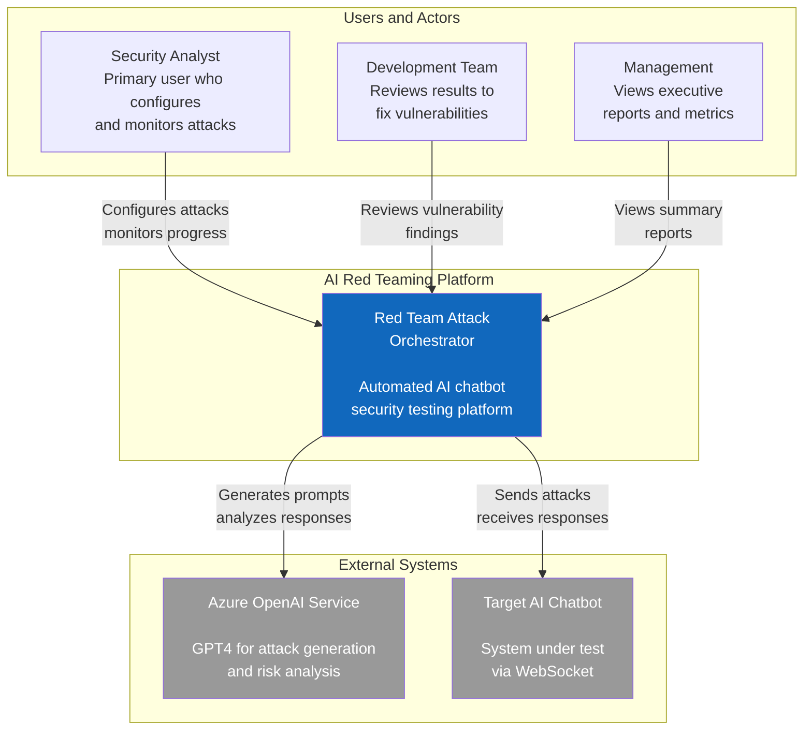
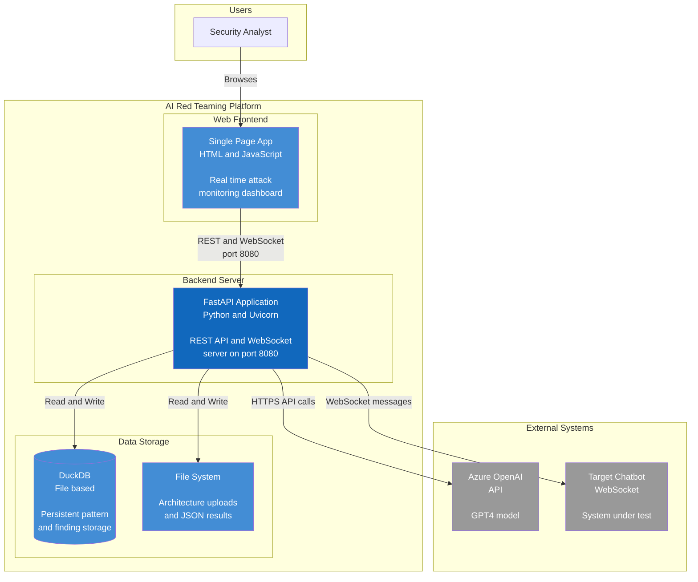
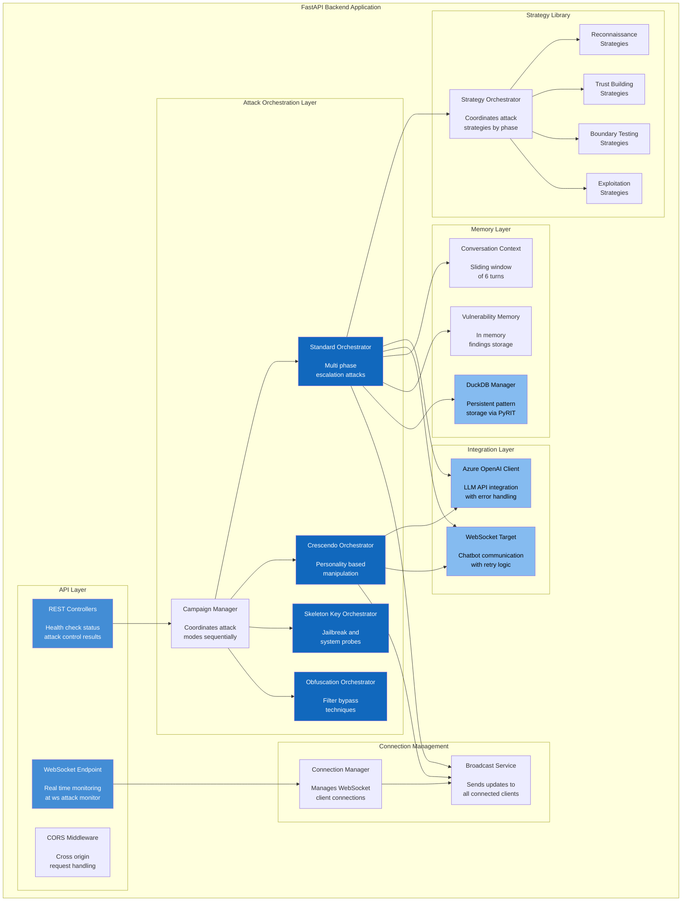
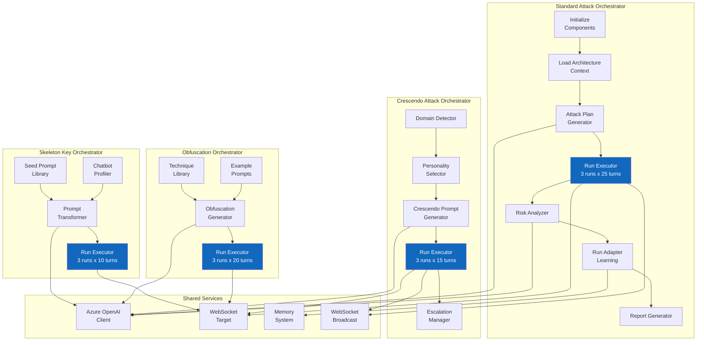
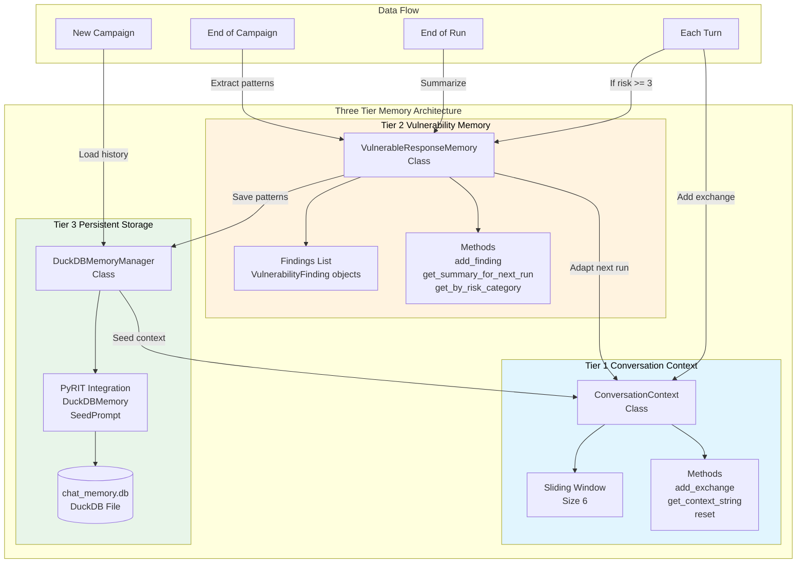
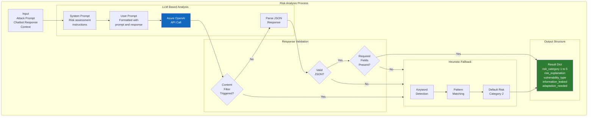
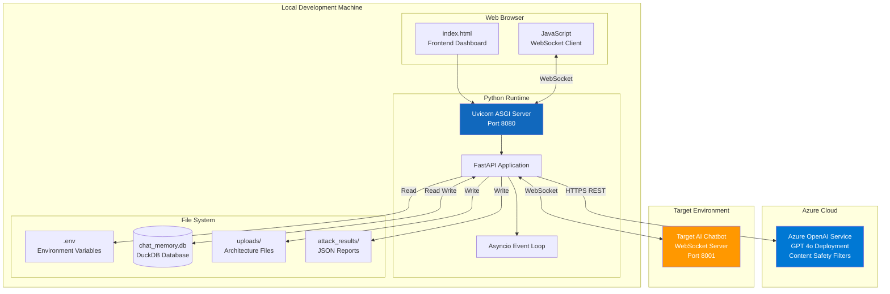
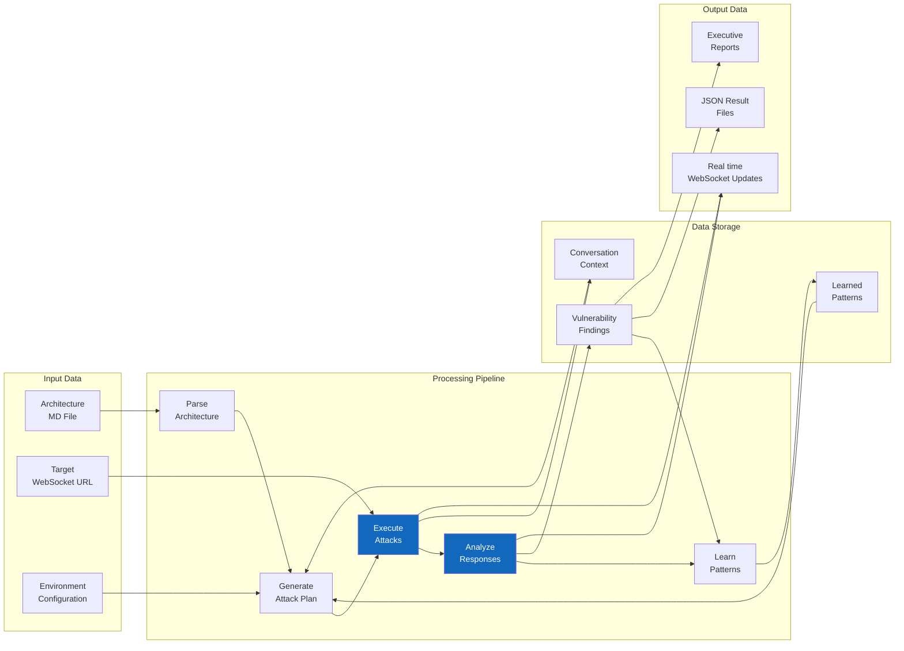

# C4 Architecture Diagrams

This document contains C4 model diagrams for the AI Red Teaming Platform, progressing from high-level context to detailed component views.

---

## 1. Level 1: System Context Diagram

Shows the system's relationship with users and external systems.

---

## 2. Level 2: Container Diagram

Shows the major containers (applications/services) within the system.

---

## 3. Level 3: Component Diagram - Backend

Shows the internal components of the FastAPI backend.

---

## 4. Level 3: Component Diagram - Orchestrators

Detailed view of the orchestrator components and their interactions.

---

## 5. Level 3: Component Diagram - Memory System

Detailed view of the three-tier memory architecture.

---

## 6. Level 4: Code Diagram - Risk Analysis

Detailed code-level view of the risk analysis process.

---

## 7. Deployment Diagram

Shows the physical deployment architecture.

---

## 8. Data Flow Diagram

Shows how data flows through the system during an attack campaign.

---

## Document Information

| Attribute | Value |
|-----------|-------|
| **Version** | 1.0 |
| **Created** | December 2025 |
| **Author** | Red Team Development |
| **C4 Model** | Simon Brown's C4 Model |
| **Diagram Tool** | Mermaid.js |
