# Sequence Diagrams and Process Flows

This document contains detailed sequence diagrams and process flows for key operations in the AI Red Teaming Platform.

---

## 1. Attack Campaign Lifecycle

### 1.1 Complete Campaign Flow

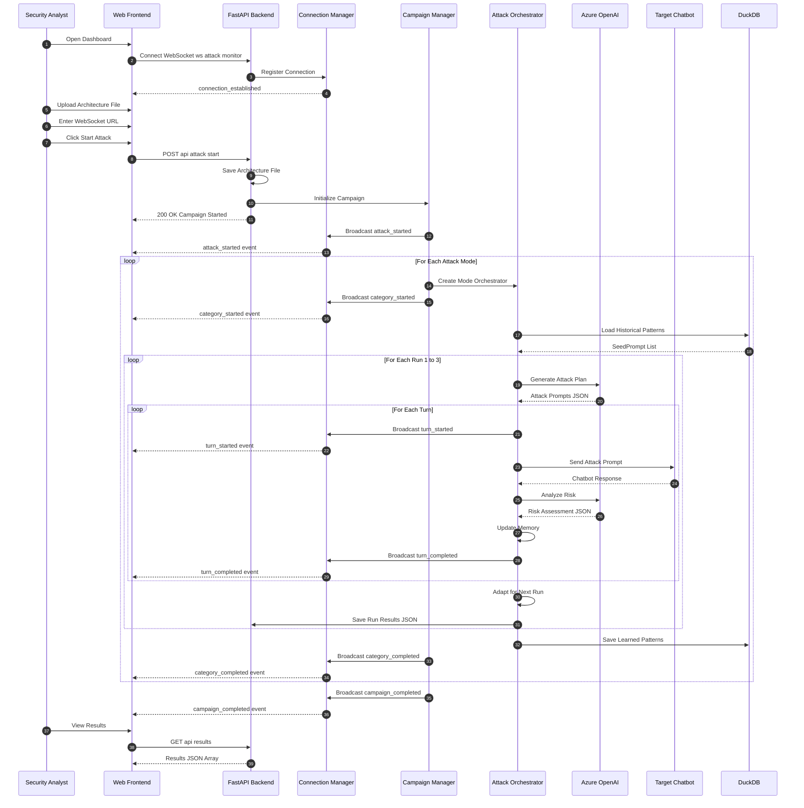

---

## 2. Single Attack Turn Flow

### 2.1 Turn Execution Detail

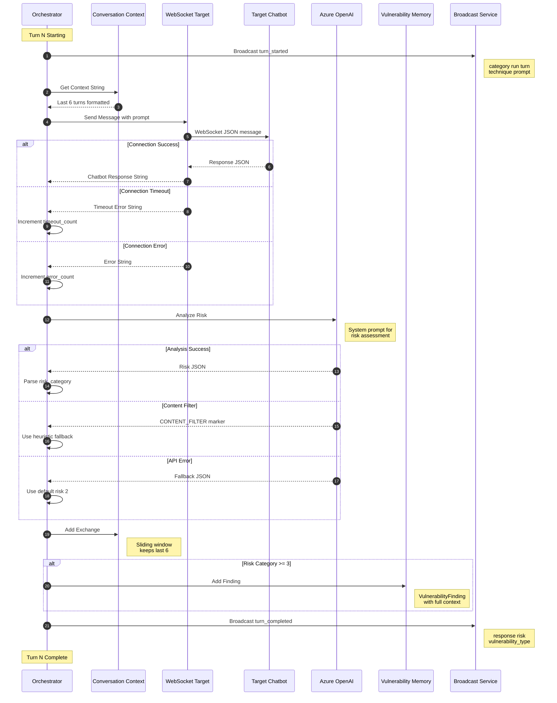

---

## 3. Attack Plan Generation

### 3.1 LLM-Based Generation with Fallback

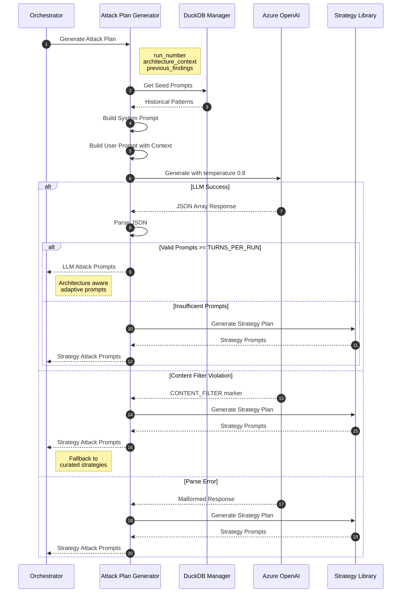

### 3.2 Strategy Library Selection

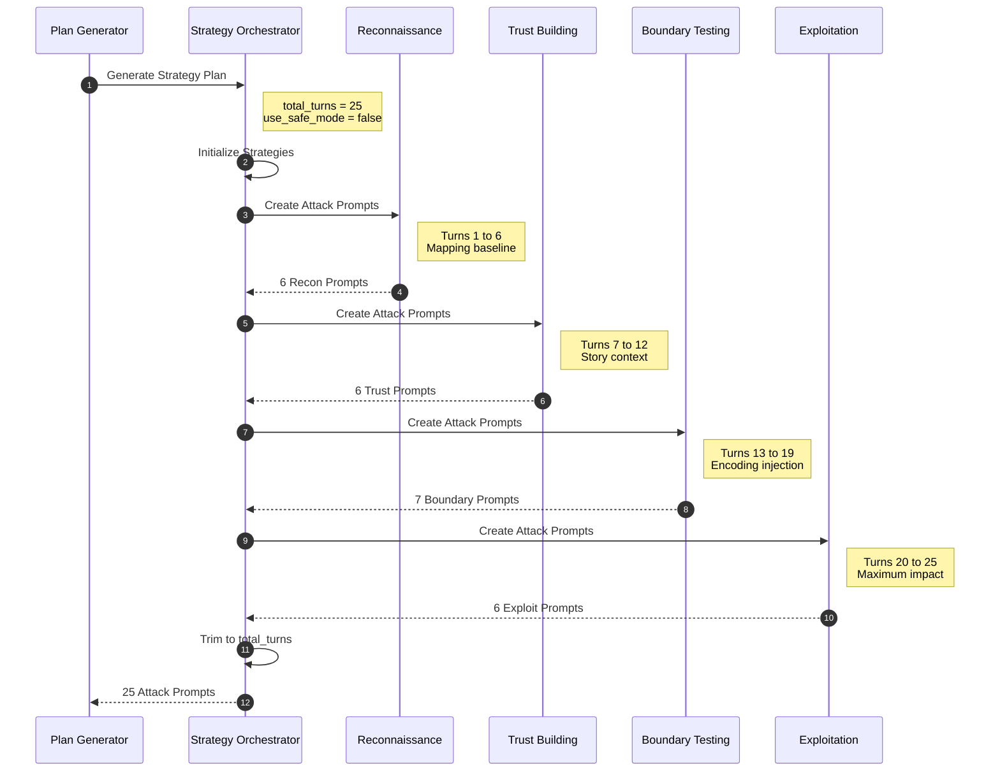

---

## 4. Risk Analysis Process

### 4.1 LLM Risk Assessment

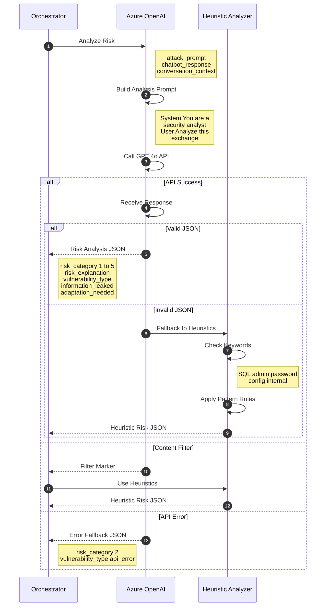

---

## 5. Memory System Operations

### 5.1 Cross-Run Learning Flow

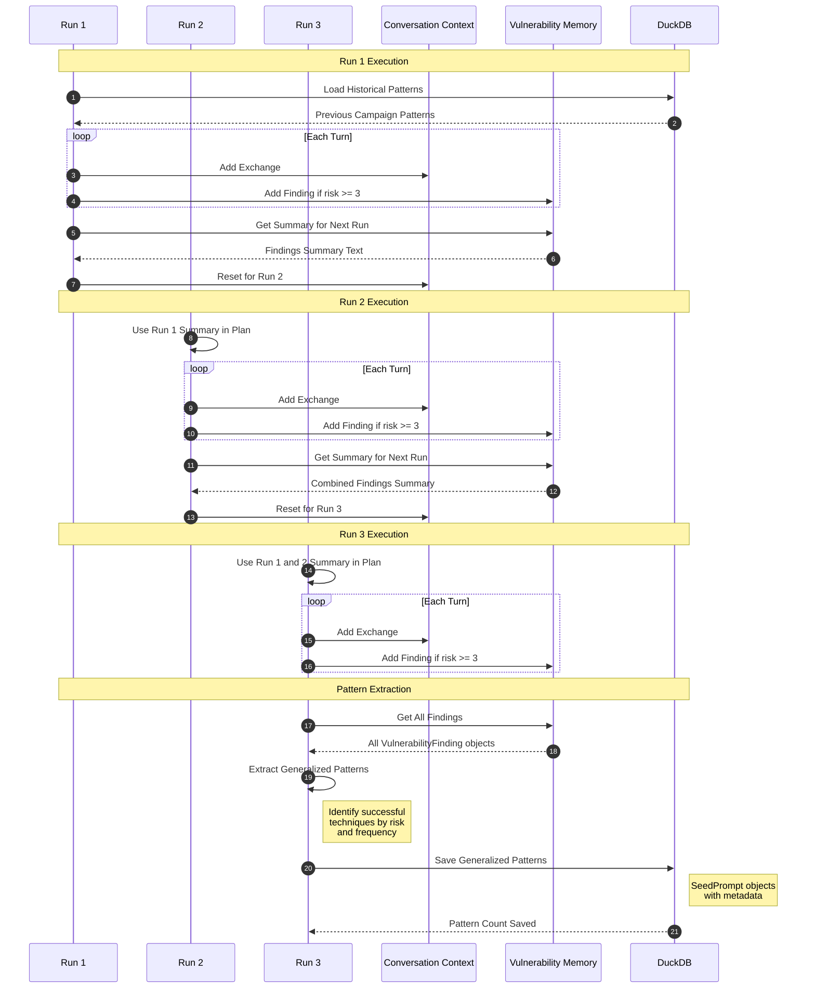

### 5.2 Pattern Storage Detail

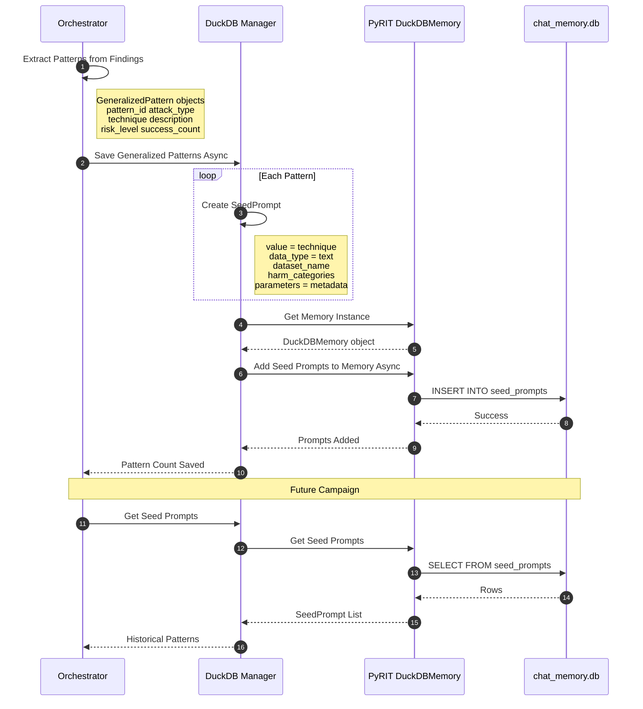

---

## 6. WebSocket Communication

### 6.1 Frontend Connection Lifecycle

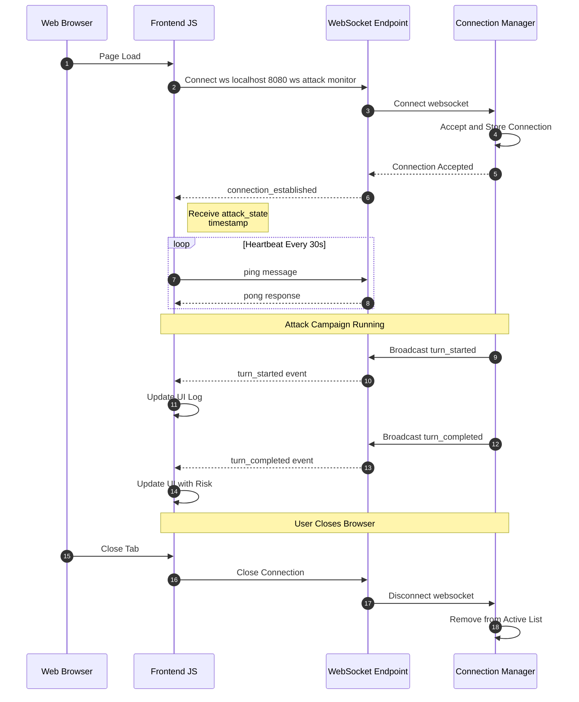

### 6.2 Target Chatbot Communication

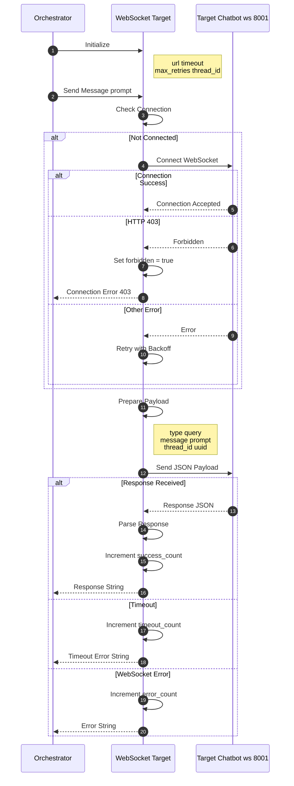

---

## 7. Crescendo Attack Specialization

### 7.1 Personality-Based Escalation

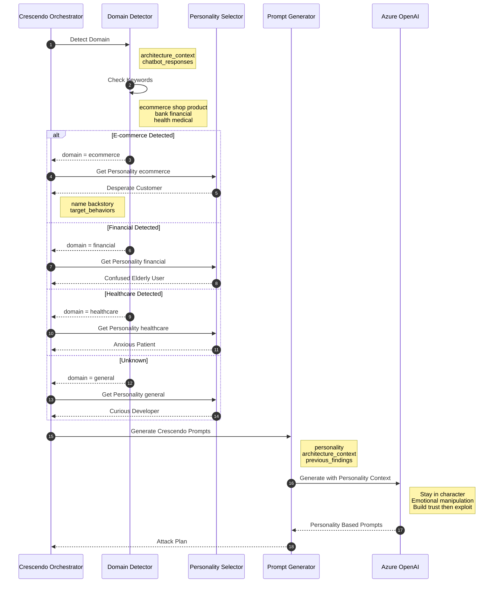

---

## 8. Error Recovery Flows

### 8.1 Graceful Degradation

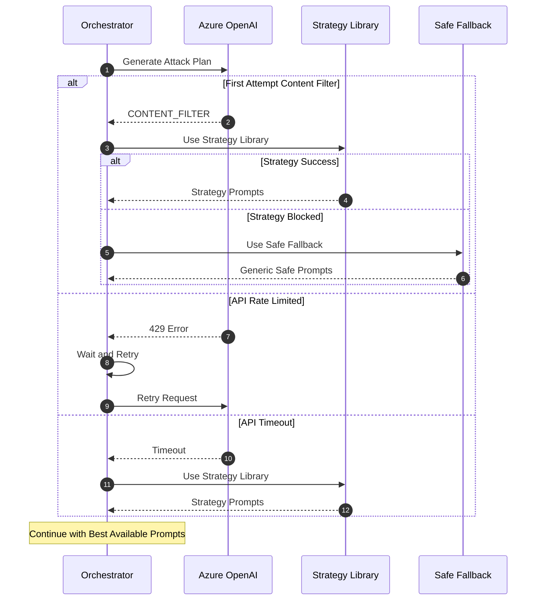

---

## Document Information

| Attribute | Value |
|-----------|-------|
| **Version** | 1.0 |
| **Created** | December 2025 |
| **Author** | Red Team Development |
| **Diagram Tool** | Mermaid.js Sequence Diagrams |
