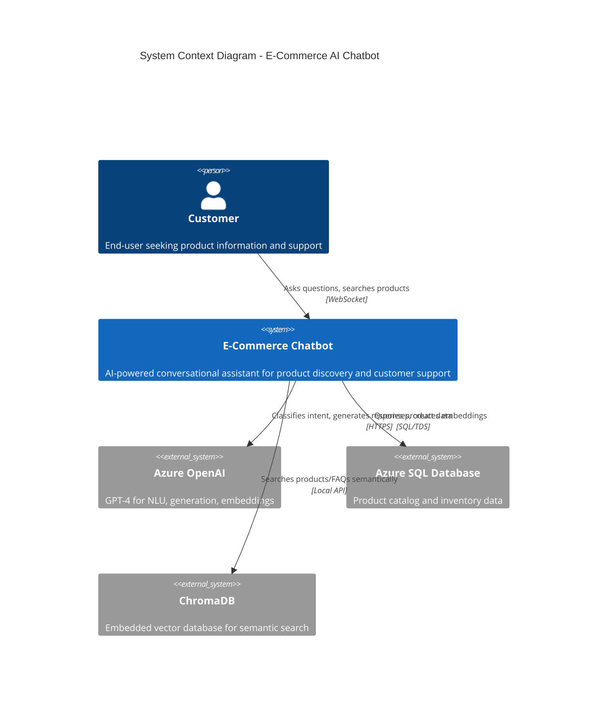
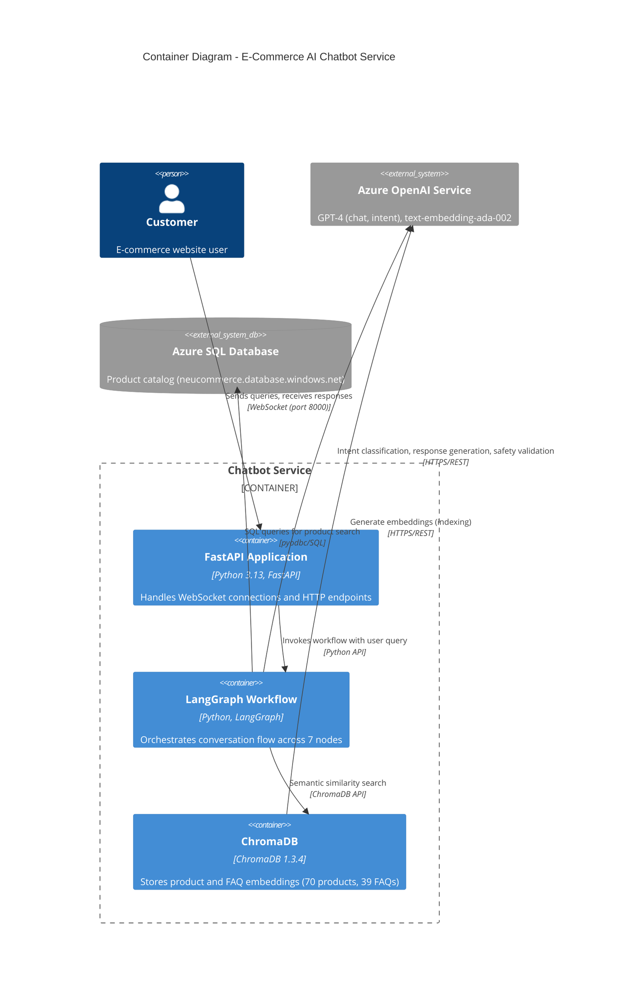
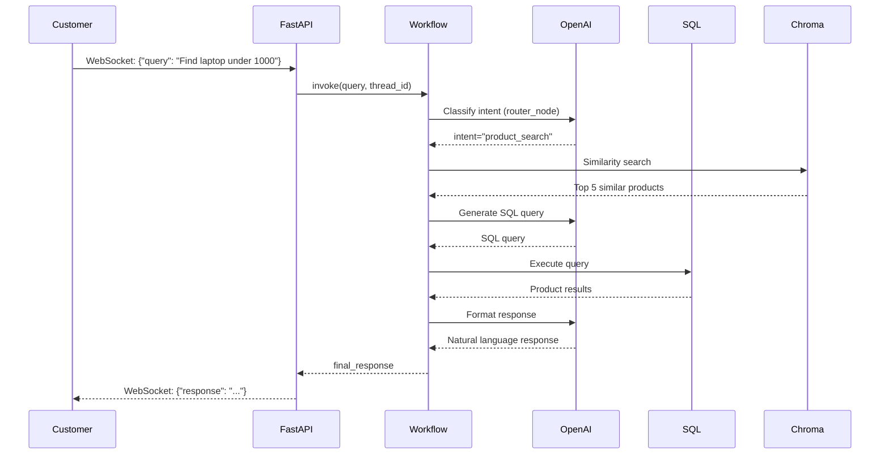
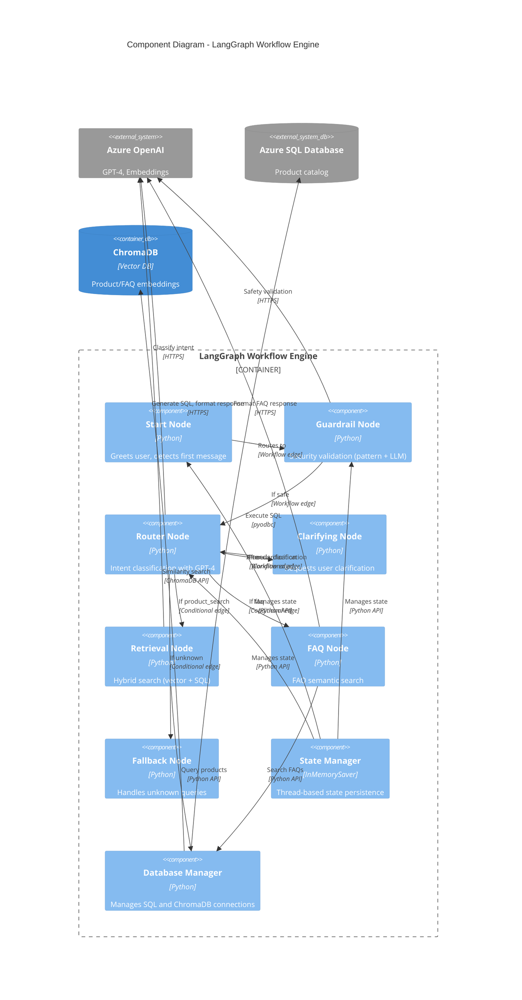
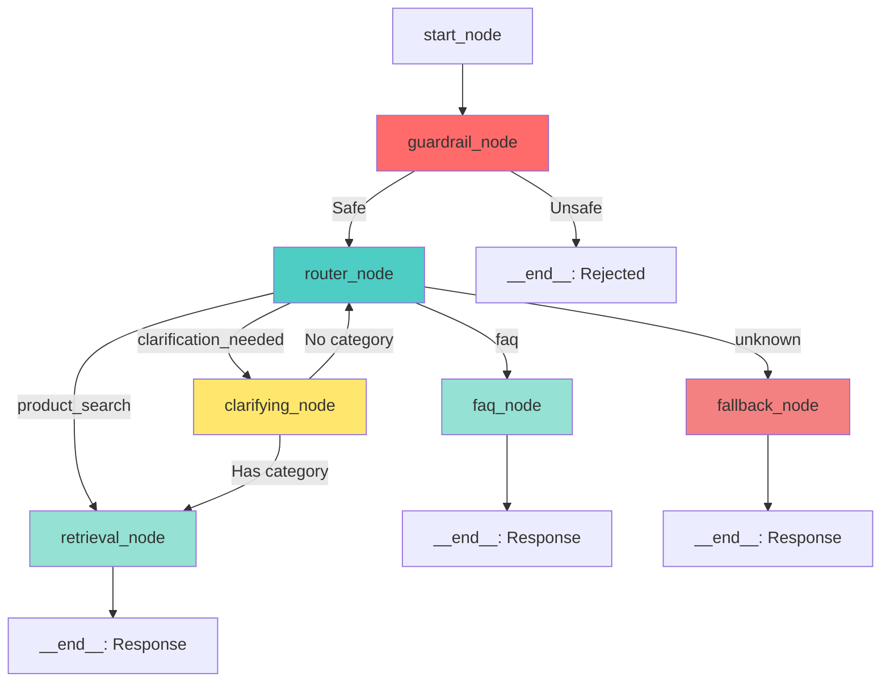
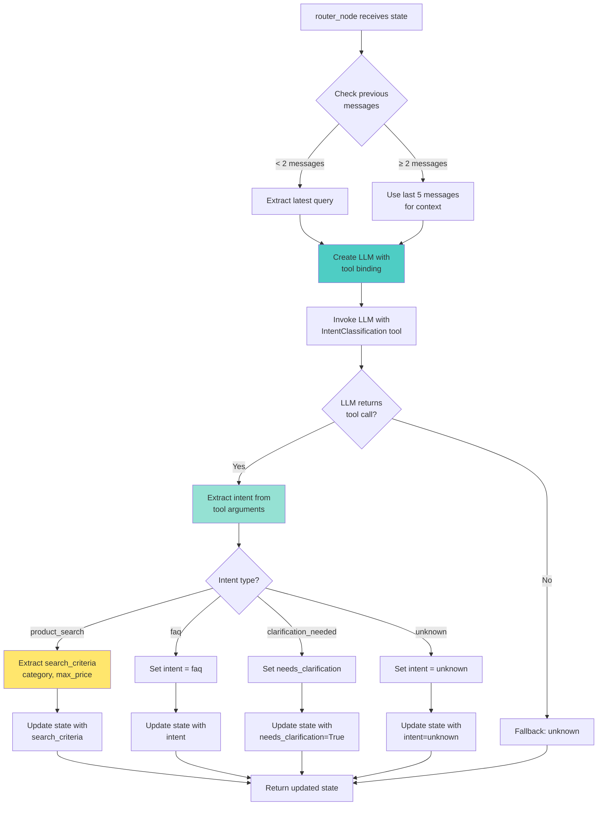
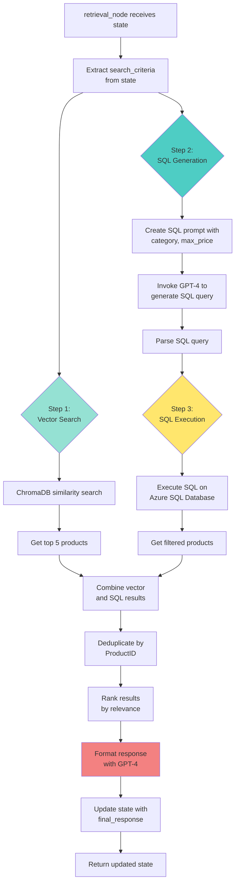
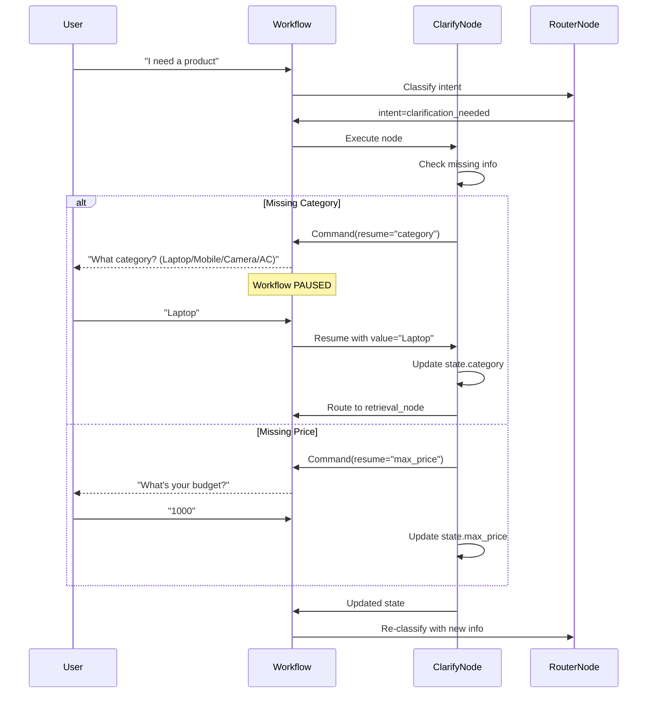
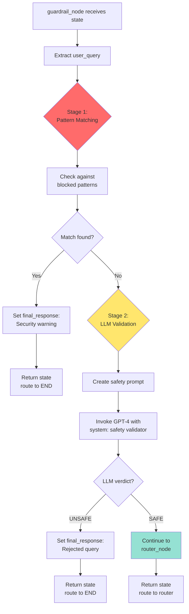
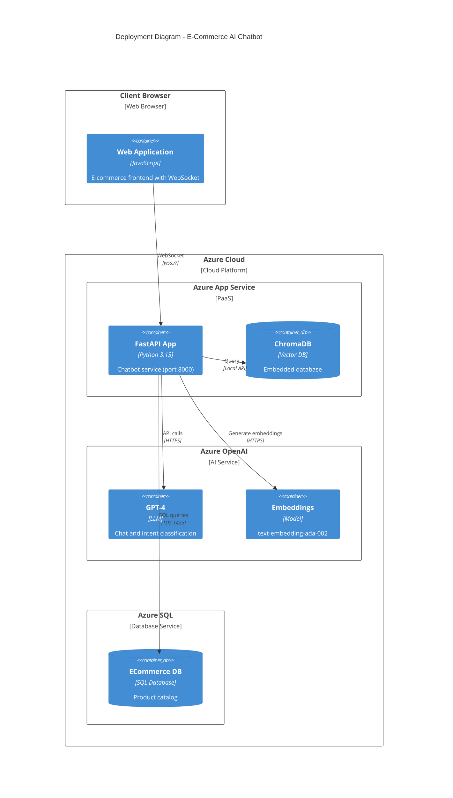

# C4 Model Diagrams
## E-Commerce AI Chatbot Service

**Document Version:** 1.0  
**Last Updated**: November 14, 2025

---

## Table of Contents

1. [Introduction](#introduction)
2. [C4 Level 1: System Context](#c4-level-1-system-context)
3. [C4 Level 2: Container Diagram](#c4-level-2-container-diagram)
4. [C4 Level 3: Component Diagram](#c4-level-3-component-diagram)
5. [C4 Level 4: Code Diagrams](#c4-level-4-code-diagrams)
6. [Deployment View](#deployment-view)

---

## Introduction

This document presents the **C4 model** (Context, Container, Component, Code) architecture diagrams for the E-Commerce AI Chatbot Service. The C4 model provides a hierarchical approach to visualizing software architecture at different abstraction levels:

- **Level 1 (Context)**: System in relation to users and external systems
- **Level 2 (Container)**: High-level technology choices and communication protocols
- **Level 3 (Component)**: Internal structure of containers
- **Level 4 (Code)**: Implementation details of critical components

These diagrams are designed using **Mermaid.js** syntax for easy integration with documentation platforms.

---

## C4 Level 1: System Context

### Overview
Shows the E-Commerce Chatbot in its ecosystem, including external users and systems.



### Key Relationships

| Source | Target | Purpose | Protocol |
|--------|--------|---------|----------|
| Customer | Chatbot | Product search, FAQs, support | WebSocket |
| Chatbot | Azure OpenAI | Intent classification, response generation | HTTPS/REST |
| Chatbot | Azure SQL | Product catalog queries | SQL/TDS |
| Chatbot | ChromaDB | Semantic search (products, FAQs) | Python API |

### Business Context

**Primary Users**:
- E-commerce customers seeking product information
- Customers requiring purchase guidance
- Users with product-related questions

**External Dependencies**:
- **Azure OpenAI**: Critical dependency for AI capabilities (GPT-4, embeddings)
- **Azure SQL Database**: Source of truth for product inventory
- **ChromaDB**: Enhances search with semantic understanding

---

## C4 Level 2: Container Diagram

### Overview
Shows the runtime containers (applications, data stores) and their interactions.



### Container Details

#### 1. FastAPI Application
- **Technology**: Python 3.13, FastAPI 0.104.1
- **Responsibilities**:
  - WebSocket connection management
  - Request/response handling
  - Health check endpoints
  - Message streaming to clients
- **Scaling**: Horizontal (with sticky sessions)
- **Port**: 8000 (HTTP/WebSocket)

#### 2. LangGraph Workflow Engine
- **Technology**: LangGraph 1.0.2, LangChain 1.0.5
- **Responsibilities**:
  - Workflow orchestration (7 nodes)
  - State management (InMemorySaver)
  - Conditional routing
  - Interrupt handling for clarifications
- **State Storage**: In-memory (thread-based)
- **Concurrency**: Supports multiple concurrent conversations

#### 3. ChromaDB Vector Store
- **Technology**: ChromaDB 1.3.4
- **Data**:
  - Product embeddings (70 products)
  - FAQ embeddings (39 documents)
- **Embedding Model**: text-embedding-ada-002 (Azure OpenAI)
- **Storage**: Local disk (chroma_db/)

#### 4. Azure OpenAI Service
- **Models**:
  - GPT-4 (gpt-4-32k) for chat and intent classification
  - text-embedding-ada-002 for embeddings
- **Usage**:
  - Intent classification in router_node
  - Response generation in retrieval_node, faq_node
  - Safety validation in guardrail_node
  - Embedding generation for indexing

#### 5. Azure SQL Database
- **Database**: ECommerce
- **Server**: neucommerce.database.windows.net
- **Schema**:
  - Products table (ProductName, Category, Price, Description, Availability)
  - Categories: Laptops, Mobile, Camera, AC
- **Access**: Read-only queries via pyodbc

### Communication Protocols



---

## C4 Level 3: Component Diagram

### Overview
Shows internal components of the LangGraph Workflow container.



### Component Responsibilities

#### Workflow Nodes

| Component | Responsibility | Decision Logic |
|-----------|---------------|----------------|
| **Start Node** | Entry point, greeting detection | If first message → welcome; else → continue |
| **Guardrail Node** | Security validation | If unsafe → reject; else → route to router |
| **Router Node** | Intent classification | Routes to clarify/retrieval/FAQ/fallback based on intent |
| **Clarifying Node** | Interactive clarification | Interrupts workflow, waits for user input |
| **Retrieval Node** | Product search | Vector search → SQL generation → SQL execution → formatting |
| **FAQ Node** | FAQ semantic search | Vector search in FAQ collection → format response |
| **Fallback Node** | Unknown query handling | Returns helpful default message |

#### Support Components

| Component | Responsibility | Technology |
|-----------|---------------|------------|
| **State Manager** | Thread-based state persistence | InMemorySaver (LangGraph) |
| **Database Manager** | SQL and ChromaDB connection pooling | pyodbc, ChromaDB client |

### Workflow Routing Logic



---

## C4 Level 4: Code Diagrams

### Overview
Detailed code-level diagrams for critical components.

---

### 4.1 Router Node - Intent Classification



**Code Structure**:
```python
def router_node(state: WorkflowState) -> WorkflowState:
    """
    Intent classification using GPT-4 with tool binding
    """
    # Step 1: Prepare conversation context
    messages = get_last_n_messages(state["messages"], n=5)
    
    # Step 2: Bind IntentClassification tool to LLM
    llm_with_tools = get_azure_llm(temperature=0.0).bind_tools(
        [IntentClassification],
        tool_choice="IntentClassification"
    )
    
    # Step 3: Invoke LLM
    response = llm_with_tools.invoke(messages)
    
    # Step 4: Extract intent from tool call
    if response.tool_calls:
        intent_data = response.tool_calls[0]["args"]
        return {
            "intent": intent_data["intent"],
            "search_criteria": intent_data.get("search_criteria"),
            "needs_clarification": intent_data["intent"] == "clarification_needed"
        }
    
    # Fallback
    return {"intent": "unknown"}
```

---

### 4.2 Retrieval Node - Hybrid Search



**Three-Step Process**:

**Step 1: Vector Search**
```python
# Semantic similarity search in ChromaDB
vector_results = chroma_collection.query(
    query_texts=[user_query],
    n_results=5,
    where={"category": category} if category else None
)
```

**Step 2: SQL Generation**
```python
# Generate SQL query using GPT-4
sql_prompt = f"""
Generate SQL query to find products matching:
- Category: {category}
- Max Price: {max_price}
- Description: {user_query}
"""
sql_query = llm.invoke(sql_prompt)
```

**Step 3: Execution & Combination**
```python
# Execute SQL query
sql_results = db_manager.execute_sql(sql_query)

# Combine and deduplicate
all_products = vector_results + sql_results
unique_products = deduplicate_by_id(all_products)
ranked_products = rank_by_relevance(unique_products, user_query)
```

---

### 4.3 Clarifying Node - Interrupt Pattern



**Interrupt Implementation**:
```python
def clarifying_node(state: WorkflowState) -> Command:
    """
    Interrupt workflow to request clarification
    """
    # Check what information is missing
    if not state.get("category"):
        return Command(
            update={
                "messages": ["Please specify category: Laptop, Mobile, Camera, or AC"]
            },
            resume="category"  # Wait for user input
        )
    
    if not state.get("max_price"):
        return Command(
            update={
                "messages": ["What's your maximum budget?"]
            },
            resume="max_price"
        )
    
    # All information available, route to retrieval
    return Command(goto="retrieval_node")
```

---

### 4.4 Guardrail Node - Security Validation



**Blocked Patterns**:
```python
BLOCKED_PATTERNS = [
    "jailbreak",
    "ignore previous",
    "ignore instructions",
    "act as",
    "pretend you are",
    "roleplay",
    "system prompt"
]
```

**Two-Stage Validation**:
```python
def guardrail_node(state: WorkflowState) -> WorkflowState:
    query = state["user_query"].lower()
    
    # Stage 1: Pattern matching
    for pattern in BLOCKED_PATTERNS:
        if pattern in query:
            return {
                "final_response": "Your query contains unsafe content.",
                "intent": "blocked"
            }
    
    # Stage 2: LLM safety check
    safety_prompt = f"Is this query safe? {query}"
    verdict = llm.invoke(safety_prompt)
    
    if "UNSAFE" in verdict:
        return {
            "final_response": "Query rejected by security filter.",
            "intent": "blocked"
        }
    
    # Safe query
    return {"intent": "safe"}
```

---

## Deployment View

### Container Deployment



### Infrastructure Components

| Component | Service | Configuration | Scaling |
|-----------|---------|---------------|---------|
| **Web App** | Azure App Service (B2) | Python 3.13 runtime | Horizontal (max 3 instances) |
| **Vector DB** | ChromaDB (embedded) | Local disk storage | Scales with app instances |
| **LLM** | Azure OpenAI GPT-4 | gpt-4-32k deployment | Serverless (auto-scale) |
| **Embeddings** | Azure OpenAI | text-embedding-ada-002 | Serverless (auto-scale) |
| **SQL Database** | Azure SQL Database | Standard S2 tier | Built-in high availability |

---

## Diagram Conventions

### Color Coding

- **Red** (#ff6b6b): Security-related components (Guardrails)
- **Teal** (#4ecdc4): Core processing nodes (Router)
- **Green** (#95e1d3): Data retrieval (Retrieval, FAQ)
- **Yellow** (#ffe66d): User interaction (Clarifying)
- **Pink** (#f38181): Error handling (Fallback)

### Notation

- **Solid Lines**: Synchronous calls
- **Dashed Lines**: Asynchronous/Event-driven
- **Bold Borders**: Critical path components
- **Dotted Borders**: External systems

---

## Revision History

| Date | Version | Changes | Author |
|------|---------|---------|--------|
| 2025-11-14 | 1.0 | Initial C4 model documentation | Engineering Team |

---

**Document Control**
- **Review Cycle**: On architecture changes
- **Approvers**: Architecture Team, Tech Lead
- **Next Review**: 2026-02-01
