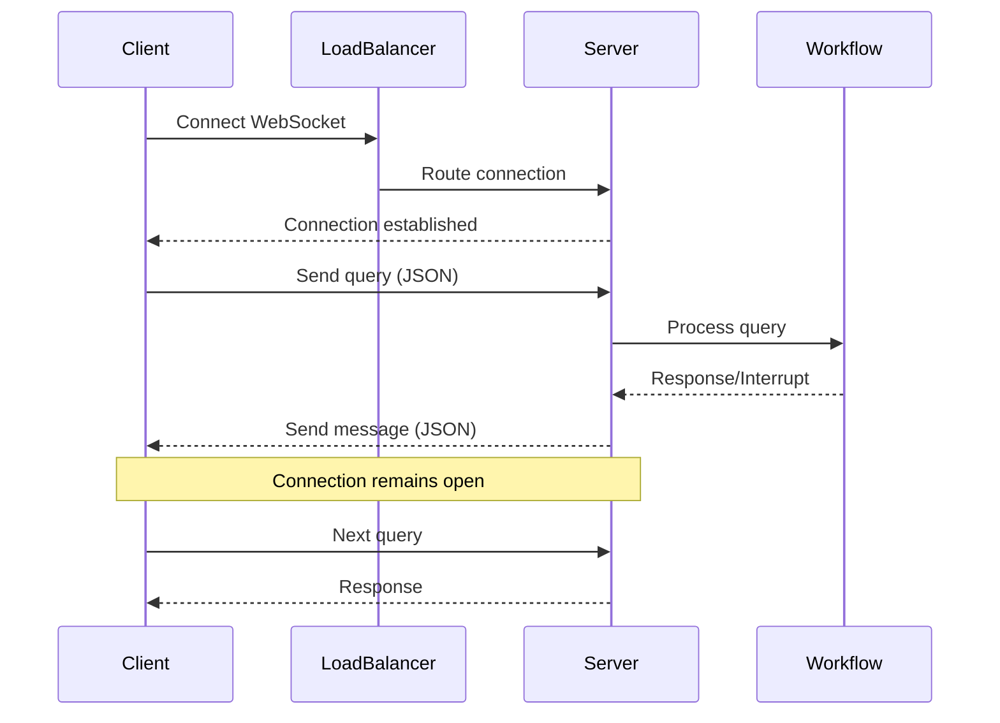
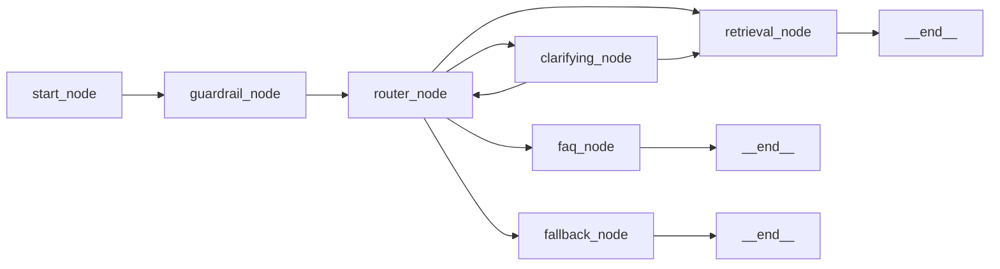
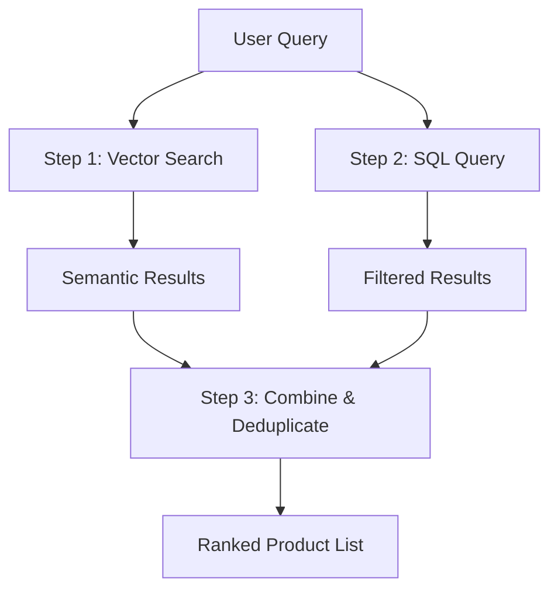
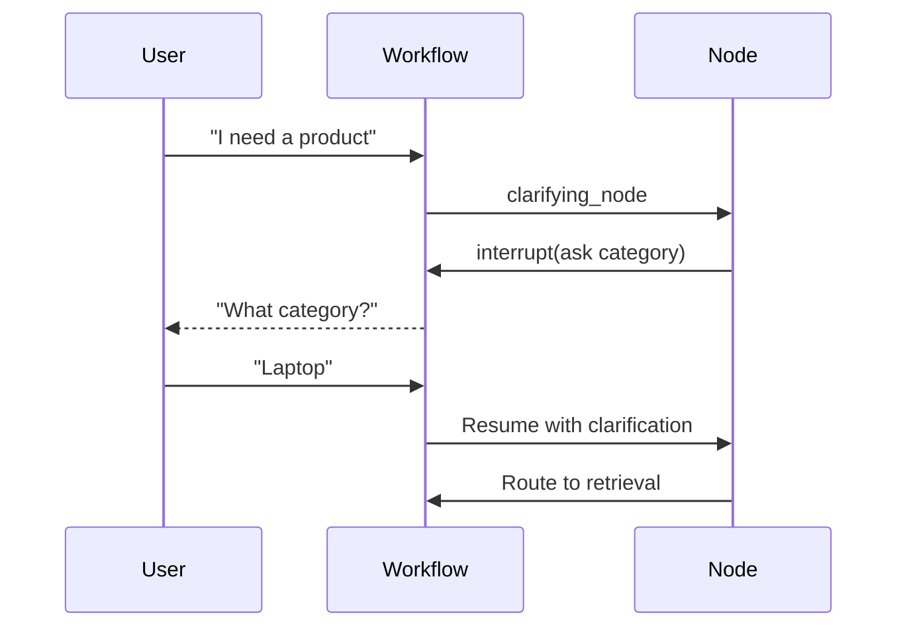
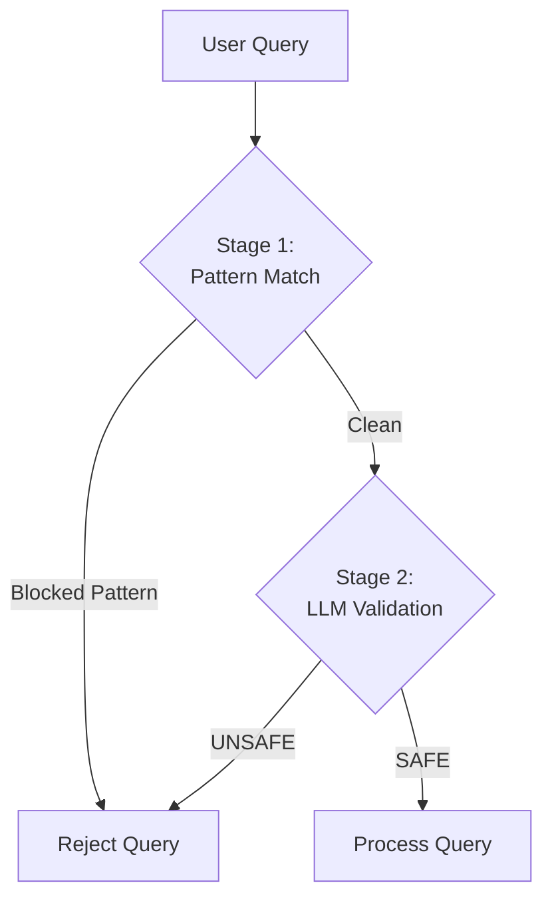

# Architecture Decision Records (ADR)
## E-Commerce AI Chatbot Service

**Document Version:** 1.0  
**Last Updated**: November 14, 2025

---

## ADR Index

1. [Use WebSocket for Real-Time Communication](#adr-001-use-websocket-for-real-time-communication)
2. [Adopt LangGraph for Workflow Orchestration](#adr-002-adopt-langgraph-for-workflow-orchestration)
3. [Implement Hybrid Search (Vector + SQL)](#adr-003-implement-hybrid-search-vector-sql)
4. [Use Azure OpenAI for NLU and Generation](#adr-004-use-azure-openai-for-nlu-and-generation)
5. [Implement Thread-Based State Management](#adr-005-implement-thread-based-state-management)
6. [Use Interrupt Pattern for Clarifications](#adr-006-use-interrupt-pattern-for-clarifications)
7. [Implement Two-Stage Security Guardrails](#adr-007-implement-two-stage-security-guardrails)
8. [Use TypedDict for Workflow State](#adr-008-use-typeddict-for-workflow-state)

---

## ADR-001: Use WebSocket for Real-Time Communication

**Date**: 2025-10-15  
**Status**: Accepted  
**Deciders**: Engineering Team, Product Management  

### Context

The chatbot requires real-time bidirectional communication to support:
- Immediate user query responses
- Multi-turn conversations with context
- Interactive clarifications (interrupts)
- Streaming responses for better UX

**Alternatives Considered**:
1. **HTTP REST API with Polling**
   - Client polls for updates every N seconds
   - Simple to implement
   - Higher latency, inefficient bandwidth usage

2. **Server-Sent Events (SSE)**
   - One-way server-to-client streaming
   - Good for notifications
   - Cannot send client messages without additional HTTP requests

3. **WebSocket** (Selected)
   - Full-duplex communication
   - Low latency
   - Efficient for real-time chat

### Decision

Implement WebSocket-based communication using FastAPI's WebSocket support.

### Consequences

**Positive**:
- ✅ Real-time bidirectional messaging
- ✅ Support for interrupts without additional HTTP calls
- ✅ Lower latency compared to polling
- ✅ Better user experience with instant responses
- ✅ Efficient bandwidth usage

**Negative**:
- ❌ More complex connection management
- ❌ Stateful connections complicate horizontal scaling
- ❌ Requires load balancer with WebSocket support
- ❌ Client must implement WebSocket reconnection logic

### Implementation



---

## ADR-002: Adopt LangGraph for Workflow Orchestration

**Date**: 2025-10-20  
**Status**: Accepted  
**Deciders**: Engineering Team  

### Context

The chatbot requires complex conversation flow management:
- Multiple processing nodes (7 nodes)
- Conditional routing based on intent
- State persistence across turns
- Support for interrupts and resumption

**Alternatives Considered**:
1. **Custom State Machine**
   - Full control over implementation
   - Requires building state management, routing, persistence
   - High development and maintenance cost

2. **Apache Airflow**
   - DAG-based workflow engine
   - Designed for batch jobs, not real-time chat
   - Overkill for chatbot use case

3. **LangGraph** (Selected)
   - Purpose-built for LLM workflows
   - Native support for interrupts
   - Integrates with LangChain ecosystem
   - Built-in state management

### Decision

Use LangGraph 1.0.2 as the workflow orchestration framework.

### Consequences

**Positive**:
- ✅ Declarative workflow definition with StateGraph
- ✅ Built-in interrupt support for clarifications
- ✅ Checkpointing for state persistence
- ✅ Conditional routing between nodes
- ✅ Integrates seamlessly with LangChain tools
- ✅ Reduced development time

**Negative**:
- ❌ Learning curve for team
- ❌ Dependency on external framework
- ❌ Limited community (relatively new)
- ❌ Version upgrades may break compatibility

### Implementation

**Workflow Graph Structure**:


---

## ADR-003: Implement Hybrid Search (Vector + SQL)

**Date**: 2025-10-22  
**Status**: Accepted  
**Deciders**: Engineering Team, Data Science  

### Context

Product search requires balancing semantic understanding with structured filtering:
- **Semantic Search**: "Find me a powerful laptop" → understand "powerful"
- **Structured Filters**: Price range, category, availability
- **Performance**: Fast response times (<2s)
- **Accuracy**: Return relevant products

**Alternatives Considered**:
1. **SQL-Only Search**
   - Fast and reliable
   - Cannot handle semantic queries
   - Keyword matching insufficient

2. **Vector-Only Search**
   - Excellent semantic understanding
   - Difficult to enforce hard filters (price, category)
   - May return irrelevant but similar results

3. **Hybrid Search** (Selected)
   - Vector search for semantic similarity
   - SQL for structured filters
   - Combine and rank results

### Decision

Implement hybrid search combining ChromaDB vector search with Azure SQL queries.

### Consequences

**Positive**:
- ✅ Semantic understanding of vague queries
- ✅ Precise filtering by price, category, availability
- ✅ Better result relevance
- ✅ Fallback to SQL if vector search fails
- ✅ Leverages existing product database

**Negative**:
- ❌ Two data sources to maintain
- ❌ Increased complexity in result merging
- ❌ Embedding maintenance overhead
- ❌ Potential inconsistency between SQL and vector store

### Implementation

**Three-Step Retrieval**:


**Data Synchronization**: Manual embedding generation for new products

---

## ADR-004: Use Azure OpenAI for NLU and Generation

**Date**: 2025-10-18  
**Status**: Accepted  
**Deciders**: Engineering Team, Security Team  

### Context

The chatbot requires:
- Intent classification
- Entity extraction (category, price)
- Natural language response generation
- Semantic embeddings for vector search

**Alternatives Considered**:
1. **Open-Source LLMs (Llama, Mistral)**
   - Lower cost
   - Requires GPU infrastructure
   - Self-hosted complexity
   - Model quality varies

2. **OpenAI GPT-4 (Direct API)**
   - High quality
   - Per-request billing
   - No data residency control
   - Rate limiting

3. **Azure OpenAI** (Selected)
   - Enterprise SLA
   - Data residency in Azure region
   - Dedicated capacity options
   - Integration with Azure services

### Decision

Use Azure OpenAI GPT-4 for language understanding and generation, Azure Embeddings for vector search.

### Consequences

**Positive**:
- ✅ High-quality NLU and generation
- ✅ Enterprise support and SLA
- ✅ Data stays within Azure ecosystem
- ✅ Compliance with data residency requirements
- ✅ Managed service (no GPU infrastructure)

**Negative**:
- ❌ Higher cost than open-source
- ❌ Vendor lock-in to Azure
- ❌ API rate limits
- ❌ Requires Azure subscription

### Implementation

**Model Configuration**:
- **Chat Model**: GPT-4 (gpt-4-32k)
- **Temperature**: 0.0 (deterministic)
- **Embedding Model**: text-embedding-ada-002
- **Max Tokens**: 4096

---

## ADR-005: Implement Thread-Based State Management

**Date**: 2025-10-25  
**Status**: Accepted  
**Deciders**: Engineering Team  

### Context

Multi-turn conversations require persisting context:
- Previous messages for context awareness
- User preferences (category, price)
- Conversation state (waiting for clarification, etc.)
- Session management

**Alternatives Considered**:
1. **Stateless (No Memory)**
   - Simple architecture
   - No context across messages
   - Poor user experience

2. **Database-Backed State**
   - Persistent across restarts
   - Adds database dependency
   - Higher latency per message

3. **In-Memory Thread-Based** (Selected)
   - Fast access
   - Built into LangGraph
   - Isolated per conversation
   - Lost on server restart

### Decision

Use LangGraph's `InMemorySaver` checkpointer with thread-based state management.

### Consequences

**Positive**:
- ✅ Fast state access (in-memory)
- ✅ Automatic state management by LangGraph
- ✅ Thread isolation (concurrent users)
- ✅ Simple implementation

**Negative**:
- ❌ State lost on server restart
- ❌ Not suitable for long-term storage
- ❌ Memory consumption grows with active sessions
- ❌ Horizontal scaling requires sticky sessions

### Implementation

**State Storage**:
```python
checkpointer = InMemorySaver()
workflow_graph = workflow.compile(checkpointer=checkpointer)

config = {"configurable": {"thread_id": thread_id}}
state = workflow_graph.get_state(config)
```

**Future Enhancement**: Replace with Redis or database-backed checkpointer for production.

---

## ADR-006: Use Interrupt Pattern for Clarifications

**Date**: 2025-10-28  
**Status**: Accepted  
**Deciders**: Engineering Team, UX Team  

### Context

Ambiguous queries require user clarification:
- Missing product category
- Vague requirements
- Invalid inputs
- Multi-step information gathering

**Alternatives Considered**:
1. **Best-Effort Guessing**
   - Assume defaults or most common category
   - Fast response
   - May return irrelevant results
   - Poor UX for ambiguous queries

2. **Sequential Prompts**
   - Ask follow-up questions in separate messages
   - Requires multiple request/response cycles
   - State management complexity

3. **Workflow Interrupts** (Selected)
   - Pause workflow execution
   - Request user input
   - Resume with clarification
   - Native LangGraph support

### Decision

Use LangGraph's interrupt feature to pause workflows and request user clarifications.

### Consequences

**Positive**:
- ✅ Interactive conversation flow
- ✅ Accurate results through clarification
- ✅ Better user experience
- ✅ Handles multi-step input gathering
- ✅ Native framework support

**Negative**:
- ❌ Requires WebSocket for async messaging
- ❌ More complex frontend implementation
- ❌ State must be maintained during interrupt
- ❌ Timeout handling needed

### Implementation

**Interrupt Flow**:


---

## ADR-007: Implement Two-Stage Security Guardrails

**Date**: 2025-11-01  
**Status**: Accepted  
**Deciders**: Engineering Team, Security Team  

### Context

The chatbot must protect against:
- Prompt injection attacks ("ignore previous instructions")
- SQL injection attempts
- Jailbreak attempts
- Off-topic or harmful content

**Alternatives Considered**:
1. **Pattern Matching Only**
   - Fast and deterministic
   - Easy to bypass with creative phrasing
   - High false negatives

2. **LLM-Only Validation**
   - Excellent at understanding context
   - Slower and costlier
   - Can be tricked with sophisticated attacks

3. **Two-Stage Hybrid** (Selected)
   - Pattern matching as first filter
   - LLM validation as second layer
   - Balances speed, cost, and accuracy

### Decision

Implement two-stage security guardrails: pattern matching followed by LLM-based content safety validation.

### Consequences

**Positive**:
- ✅ Fast rejection of obvious attacks (patterns)
- ✅ Nuanced understanding with LLM
- ✅ Reduced LLM costs (blocked queries don't reach LLM)
- ✅ Defense in depth

**Negative**:
- ❌ Added latency for LLM validation
- ❌ Maintenance of pattern list
- ❌ LLM costs for each query
- ❌ Potential false positives

### Implementation

**Guardrail Stages**:


**Blocked Patterns**:
- `jailbreak`
- `ignore previous`
- `ignore instructions`
- `act as`
- `pretend you are`
- `roleplay`

---

## ADR-008: Use TypedDict for Workflow State

**Date**: 2025-11-05  
**Status**: Accepted  
**Deciders**: Engineering Team  

### Context

Workflow state needs type safety and validation:
- 10+ fields in state dictionary
- Passed through multiple nodes
- Type checking for development
- Documentation for maintainability

**Alternatives Considered**:
1. **Plain Dict**
   - No type safety
   - Easy to misuse
   - Poor IDE support

2. **Pydantic BaseModel**
   - Runtime validation
   - Serialization support
   - Overhead for nested updates
   - LangGraph prefers TypedDict

3. **TypedDict** (Selected)
   - Type hints for static analysis
   - Compatible with LangGraph
   - Minimal overhead
   - Good IDE autocomplete

### Decision

Use Python's `TypedDict` for defining `WorkflowState` schema.

### Consequences

**Positive**:
- ✅ Type safety during development
- ✅ IDE autocomplete and type checking
- ✅ Self-documenting code
- ✅ Compatible with LangGraph
- ✅ No runtime overhead

**Negative**:
- ❌ No runtime validation
- ❌ Only available in Python 3.8+
- ❌ Type hints ignored at runtime
- ❌ Manual validation still needed

### Implementation

```python
class WorkflowState(TypedDict):
    messages: List[Any]
    user_query: str
    intent: str
    retrieved_products: Optional[List[Dict]]
    retrieved_faqs: Optional[List[Dict]]
    final_response: str
    needs_clarification: bool
    max_price: Optional[float]
    search_criteria: Optional[Dict]
    category: Optional[str]
```

---

## ADR Summary Table

| ADR | Decision | Status | Impact |
|-----|----------|--------|--------|
| 001 | WebSocket Communication | Accepted | High - Core architecture |
| 002 | LangGraph Orchestration | Accepted | High - Workflow engine |
| 003 | Hybrid Search | Accepted | Medium - Search quality |
| 004 | Azure OpenAI | Accepted | High - AI capabilities |
| 005 | Thread-Based State | Accepted | Medium - Scalability limit |
| 006 | Interrupt Pattern | Accepted | Medium - UX enhancement |
| 007 | Two-Stage Guardrails | Accepted | High - Security |
| 008 | TypedDict State | Accepted | Low - Code quality |

---

## Revision History

| Date | Version | Changes | Author |
|------|---------|---------|--------|
| 2025-11-14 | 1.0 | Initial ADR documentation | Engineering Team |

---

**Document Control**
- **Review Cycle**: On major architecture changes
- **Approvers**: Architecture Review Board, Security Team
- **Next Review**: 2026-02-01
