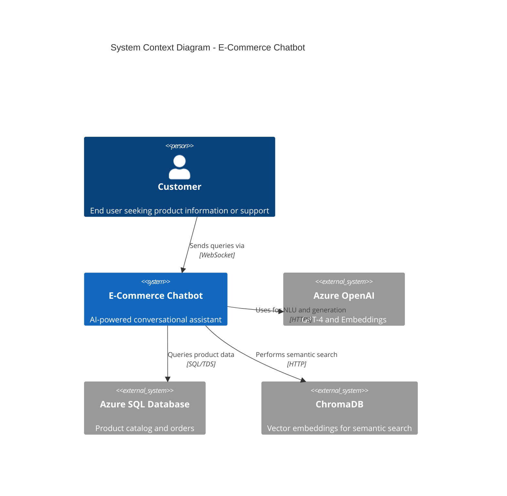
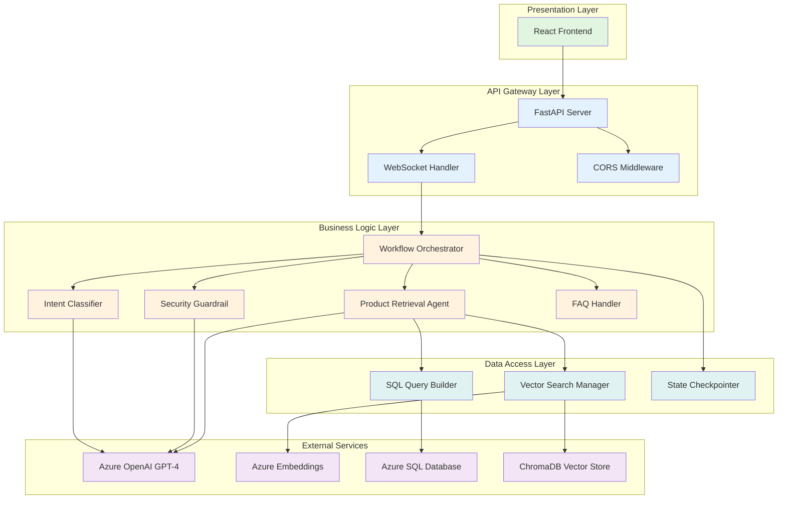
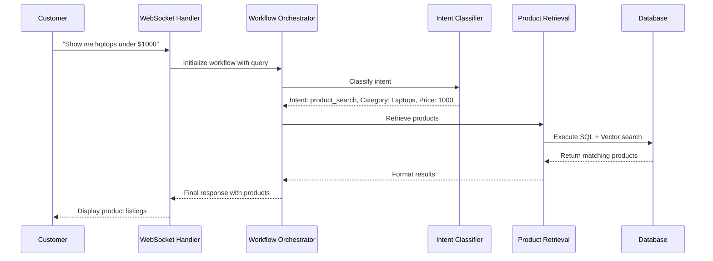
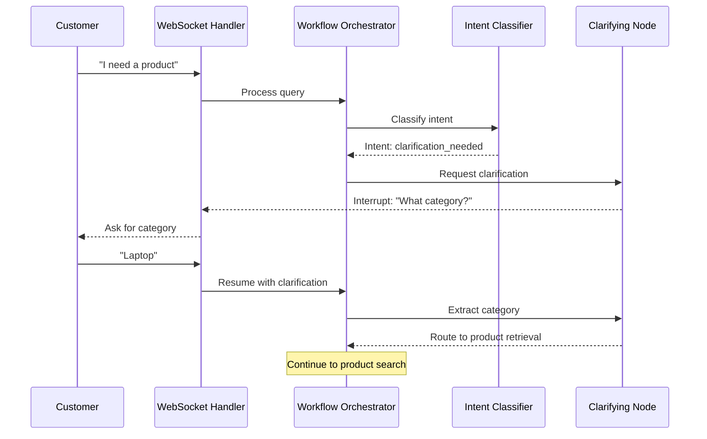
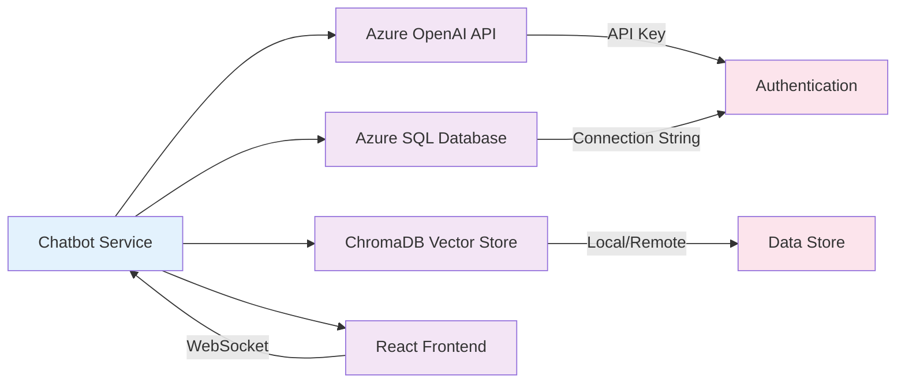

# High-Level Design (HLD)
## E-Commerce AI Chatbot Service

**Document Version:** 1.0  
**Last Updated:** November 14, 2025  
**Author:** System Architecture Team

---

## 1. Executive Summary

### 1.1 Purpose
The E-Commerce AI Chatbot Service is an intelligent conversational assistant designed to help customers find products, get information about store policies, and receive personalized recommendations. The system leverages Azure OpenAI for natural language understanding and maintains context across multi-turn conversations.

### 1.2 Business Objectives
- **Improve Customer Experience**: Provide instant, 24/7 assistance to customers
- **Increase Sales**: Help customers find products quickly through intelligent search
- **Reduce Support Costs**: Automate common inquiries about policies and products
- **Scale Operations**: Handle multiple concurrent conversations efficiently

### 1.3 Key Capabilities
- Real-time chat via WebSocket connections
- Context-aware multi-turn conversations
- Product search across 4 categories (Laptops, Mobile, Camera, AC)
- FAQ support for store policies
- Price-based filtering
- Safety guardrails against malicious inputs
- Interactive clarification for ambiguous queries

---

## 2. System Architecture Overview

### 2.1 Architecture Style
- **Pattern**: Event-Driven Microservice with Stateful Workflows
- **Communication**: WebSocket for real-time bidirectional messaging
- **State Management**: Thread-based conversation tracking

### 2.2 High-Level Components

### 2.3 Component Breakdown

---

## 3. Key Functional Areas

### 3.1 Conversation Management

**Business Purpose**: Maintain context across multiple interactions to provide personalized, coherent responses.

**Key Features**:
- Thread-based state persistence using unique identifiers
- Message history tracking (last 5 messages for context)
- Session management across WebSocket connections

**Business Value**: Customers can have natural, flowing conversations without repeating information.

### 3.2 Intent Classification

**Business Purpose**: Understand what the customer wants to accomplish.

**Intent Categories**:
1. **Product Search**: Customer looking for products to purchase
2. **FAQ**: Questions about policies, shipping, returns
3. **Clarification Needed**: Query too vague to process
4. **Unknown**: Out-of-scope or greeting messages

**Business Value**: Routes customer queries to the right handler, ensuring quick and accurate responses.

### 3.3 Product Discovery

**Business Purpose**: Help customers find products matching their needs.

**Supported Categories**:
- Laptops
- Mobile Phones (Smartphones)
- Cameras
- Air Conditioners (AC)

**Search Capabilities**:
- Price-based filtering
- Category-specific search
- Semantic similarity matching
- SQL-based structured queries

**Business Value**: Increases conversion by helping customers quickly find relevant products.

### 3.4 Safety & Security

**Business Purpose**: Protect the system from malicious inputs and misuse.

**Protection Mechanisms**:
- Pattern matching for known attack vectors (jailbreak attempts, prompt injection)
- AI-based content safety validation
- Input sanitization for SQL injection prevention

**Business Value**: Maintains system integrity and protects customer data.

### 3.5 Interactive Clarification

**Business Purpose**: Handle ambiguous queries by asking follow-up questions.

**Clarification Scenarios**:
- Missing product category
- Vague product descriptions
- Ambiguous pricing requirements

**Business Value**: Reduces abandoned searches by helping customers refine their requests.

---

## 4. Data Flow Overview

### 4.1 Typical Customer Journey

### 4.2 Clarification Flow

---

## 5. Technology Stack

### 5.1 Backend Technologies
| Component | Technology | Purpose |
|-----------|------------|---------|
| Framework | FastAPI 0.104.1 | High-performance async API framework |
| Workflow Engine | LangGraph 1.0.2 | Stateful workflow orchestration |
| LLM Framework | LangChain 1.0.5 | AI model integration and chaining |
| WebSocket | websockets 12.0 | Real-time bidirectional communication |
| Runtime | Python 3.13 | Programming language |

### 5.2 AI/ML Services
| Service | Provider | Purpose |
|---------|----------|---------|
| Language Model | Azure OpenAI GPT-4 | Intent classification, response generation |
| Embeddings | Azure text-embedding-ada-002 | Semantic search vectors |
| Vector Database | ChromaDB 1.3.4 | Similarity-based product matching |

### 5.3 Data Storage
| Database | Type | Purpose |
|----------|------|---------|
| Azure SQL Database | Relational | Product catalog, orders, inventory |
| ChromaDB | Vector Store | Semantic search embeddings |
| InMemorySaver | Cache | Conversation state persistence |

---

## 6. Non-Functional Requirements

### 6.1 Performance
- **Response Time**: < 2 seconds for product queries
- **Concurrent Users**: Support 100+ simultaneous conversations
- **Message Throughput**: Handle 1000+ messages/minute

### 6.2 Availability
- **Uptime Target**: 99.5% availability
- **Recovery Time**: < 5 minutes for service restart
- **Data Persistence**: Conversation state retained for active sessions

### 6.3 Security
- **Authentication**: WebSocket connection validation
- **Data Protection**: HTTPS/WSS encryption in transit
- **Input Validation**: AI-powered content safety checks
- **Injection Prevention**: SQL parameterization and sanitization

### 6.4 Scalability
- **Horizontal Scaling**: Stateless API servers (except WebSocket connections)
- **Database**: Azure SQL auto-scaling
- **Caching**: In-memory state management per thread

---

## 7. Integration Points

### 7.1 External Dependencies

### 7.2 API Contracts
- **WebSocket Message Format**: JSON with `type`, `message`, `thread_id`
- **Product Response**: JSON array with `title`, `description`, `price`, `image_url`
- **Interrupt Format**: JSON with `message`, `questions`, `original_query`

---

## 8. Deployment Architecture

### 8.1 Hosting Environment
- **Platform**: Cloud-based (Azure)
- **Compute**: Container-based or VM deployment
- **Networking**: Load balancer for WebSocket connections

### 8.2 Configuration Management
- **Environment Variables**: `.env` file for secrets and endpoints
- **Configuration Files**: `settings.py` for application settings
- **Feature Flags**: Category availability, model versions

---

## 9. Monitoring & Observability

### 9.1 Logging
- **Application Logs**: Console output for workflow events
- **Error Tracking**: Exception traces for debugging
- **Audit Trail**: User queries and responses

### 9.2 Metrics
- **Business Metrics**: Queries per category, conversion rates
- **Technical Metrics**: Response times, error rates, token usage
- **Infrastructure Metrics**: CPU, memory, database connections

---

## 10. Future Enhancements

### 10.1 Planned Features
- **Multi-language Support**: Localization for global markets
- **Voice Interface**: Speech-to-text integration
- **Product Comparisons**: Side-by-side feature analysis
- **Order Tracking**: Integration with order management system

### 10.2 Technical Improvements
- **Persistent State Storage**: Database-backed conversation history
- **Advanced Analytics**: ML-based query analysis
- **Caching Layer**: Redis for frequently accessed products
- **Rate Limiting**: Per-user request throttling

---

## 11. Success Criteria

### 11.1 Business KPIs
- 30% reduction in customer support tickets
- 20% increase in product discovery
- 4.5/5 user satisfaction rating
- <3 second average response time

### 11.2 Technical KPIs
- 99.5% uptime
- <1% error rate
- 95% intent classification accuracy
- Support 200+ concurrent users

---

## Appendix A: Glossary

| Term | Definition |
|------|------------|
| **Thread ID** | Unique identifier for a conversation session |
| **Intent** | The customer's goal or purpose for the query |
| **Workflow** | State machine that processes queries through multiple nodes |
| **Node** | Individual processing step in the workflow |
| **Interrupt** | Pause in workflow to request user clarification |
| **Vector Search** | Semantic similarity-based product matching |
| **Guardrail** | Security mechanism to prevent malicious inputs |

---

**Document Control**
- **Reviewers**: Product Management, Engineering Lead, Security Team
- **Approval**: Architecture Review Board
- **Next Review**: Quarterly or on major feature release
