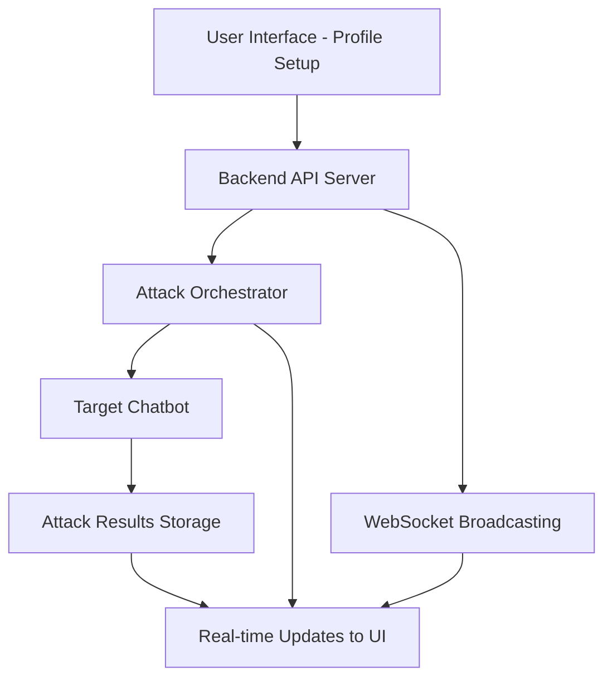

# Red Teaming Workflow Diagram

This diagram represents the high-level abstract flow of the red teaming system:

- **User Interface**: Where users configure chatbot profiles and initiate attacks
- **Backend API Server**: Handles requests, manages attack execution
- **Attack Orchestrator**: Coordinates different attack strategies (standard, crescendo, skeleton key, obfuscation)
- **Target Chatbot**: The system being tested via WebSocket communication
- **Attack Results Storage**: Stores vulnerability findings and reports
- **Real-time Updates**: Live feedback to the user interface during attacks