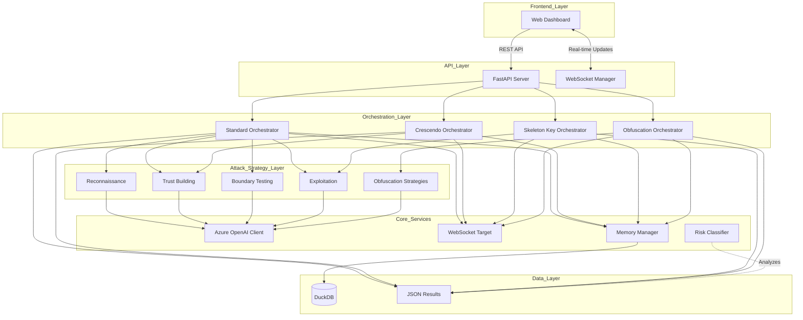
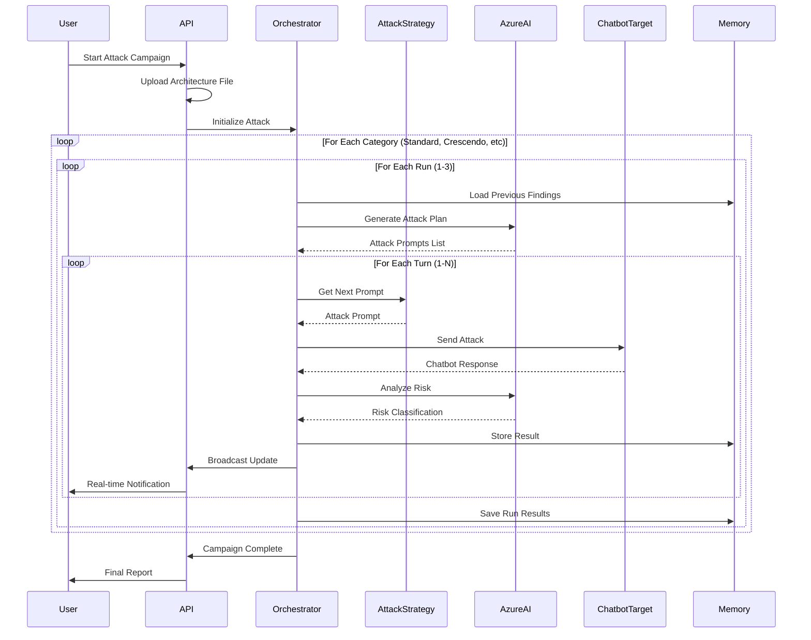
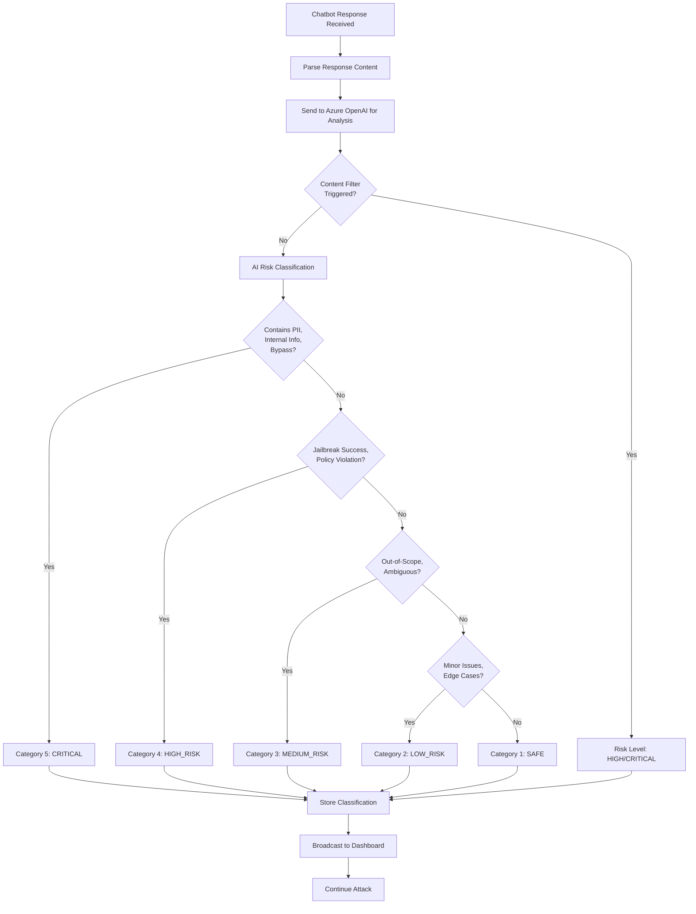
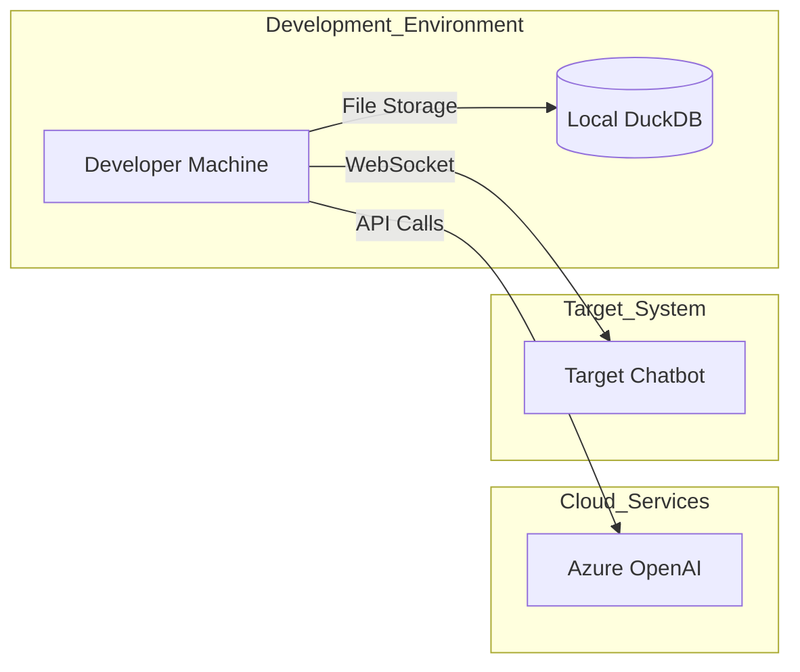
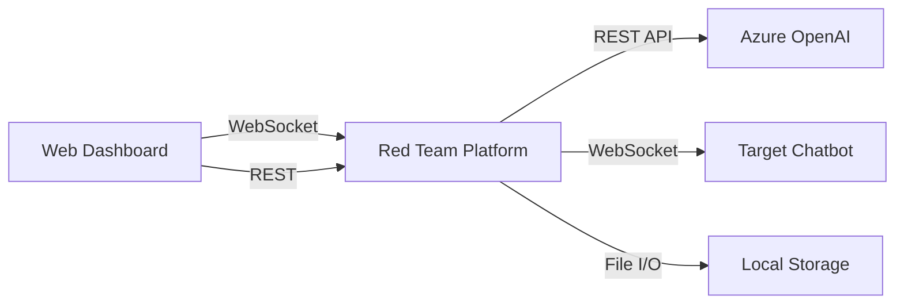
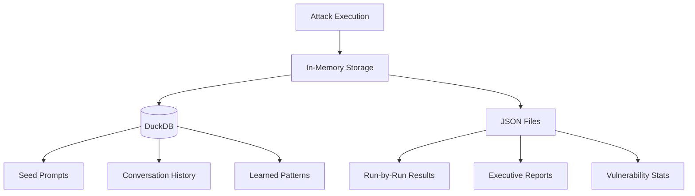

# High-Level Design (HLD)
## AI Red Teaming Attack Orchestration Platform

**Version:** 1.0.0  
**Last Updated:** December 12, 2025  
**Document Status:** Active

---

## 1. Executive Summary

### 1.1 System Overview
The AI Red Teaming Attack Orchestration Platform is a comprehensive security testing framework designed to assess AI chatbot vulnerabilities through automated, multi-phase attack campaigns. The system employs advanced AI-powered attack strategies, real-time monitoring, and sophisticated vulnerability analysis to identify security weaknesses in conversational AI systems.

### 1.2 Business Purpose
- **Security Assessment**: Automated evaluation of AI chatbot security posture
- **Vulnerability Discovery**: Identification of weaknesses in content filtering, boundary enforcement, and information disclosure
- **Compliance Validation**: Verification of AI safety guardrails and policy enforcement
- **Risk Quantification**: Measurable scoring of security risks across multiple attack vectors

### 1.3 Key Capabilities
- **Multi-Category Attack Execution**: Standard, Crescendo, Skeleton Key, and Obfuscation attacks
- **Real-Time Monitoring**: WebSocket-based live attack observation
- **Adaptive Learning**: Self-improving attack strategies based on previous run results
- **Architecture-Aware Testing**: Contextual attacks leveraging target system documentation
- **Comprehensive Reporting**: Detailed vulnerability reports with risk classification

---

## 2. System Architecture

### 2.1 Architectural Style
The system follows a **Microservices-Oriented Architecture** with:
- **Event-Driven Communication**: WebSocket for real-time updates
- **Asynchronous Processing**: Python asyncio for concurrent operations
- **RESTful API**: FastAPI for command and control
- **Persistent Storage**: DuckDB for attack memory and learning

### 2.2 Core Components

### 2.3 Component Responsibilities

#### 2.3.1 Frontend Layer
- **Web Dashboard**: HTML/JavaScript-based UI for attack visualization and control
- Displays real-time attack progress, vulnerability discovery, and risk metrics

#### 2.3.2 API Layer
- **FastAPI Server** (`api_server.py`): RESTful endpoints for attack lifecycle management
- **WebSocket Manager**: Broadcasts real-time attack events to connected clients
- **Connection Manager**: Maintains active WebSocket connections with automatic cleanup

#### 2.3.3 Orchestration Layer
- **Standard Orchestrator**: Multi-phase escalation attacks (reconnaissance → trust → boundary → exploitation)
- **Crescendo Orchestrator**: Personality-based social engineering attacks
- **Skeleton Key Orchestrator**: Jailbreak and system probe techniques
- **Obfuscation Orchestrator**: Advanced evasion using encoding, fragmentation, and linguistic tricks

#### 2.3.4 Attack Strategy Layer
- **Reconnaissance**: Information gathering and capability mapping
- **Trust Building**: Contextual manipulation to lower guard
- **Boundary Testing**: Security filter probing and bypass attempts
- **Exploitation**: Targeted attacks on identified vulnerabilities
- **Obfuscation Strategies**: Encoding, substitution, and fragmentation techniques

#### 2.3.5 Core Services
- **Azure OpenAI Client**: LLM-powered attack generation and response analysis
- **WebSocket Target**: Chatbot communication with retry logic and error handling
- **Memory Manager**: DuckDB-backed storage for attack history and learning
- **Risk Classifier**: 5-tier risk categorization (Safe, Low, Medium, High, Critical)

#### 2.3.6 Data Layer
- **DuckDB**: Structured storage for conversation history and learned patterns
- **JSON Files**: Detailed attack run results and reports

---

## 3. System Workflows

### 3.1 Attack Campaign Lifecycle

### 3.2 Risk Classification Flow

---

## 4. Technology Stack

### 4.1 Backend Technologies
| Component | Technology | Purpose |
|-----------|-----------|---------|
| **API Framework** | FastAPI 0.104+ | High-performance async REST API |
| **AI Engine** | Azure OpenAI GPT-4o | Attack generation and analysis |
| **Database** | DuckDB | Embedded analytics database |
| **WebSocket** | websockets library | Real-time bidirectional communication |
| **Async Runtime** | Python asyncio | Concurrent attack execution |
| **HTTP Client** | httpx | Async HTTP requests to Azure |

### 4.2 Frontend Technologies
| Component | Technology | Purpose |
|-----------|-----------|---------|
| **UI Framework** | HTML5/CSS3/JavaScript | Dashboard interface |
| **Charts** | Chart.js | Visualization of attack metrics |
| **WebSocket Client** | Native WebSocket API | Real-time updates |

### 4.3 External Dependencies
- **Azure OpenAI Service**: GPT-4o deployment for LLM capabilities
- **Target Chatbot**: WebSocket-based conversational AI system
- **Environment Configuration**: `.env` files for secrets management

---

## 5. Deployment Architecture

### 5.1 Deployment Model

### 5.2 Deployment Configuration
- **Runtime**: Python 3.9+
- **Process Model**: Single async event loop
- **Port Allocation**: 
  - API Server: 8002 (configurable)
  - Target Chatbot: 8000/8001 (configurable)
- **Storage**: Local file system for results, DuckDB for structured data

---

## 6. Security & Compliance

### 6.1 Security Measures
- **API Key Protection**: Environment variables for Azure credentials
- **Input Validation**: FastAPI automatic validation and sanitization
- **CORS Configuration**: Configurable cross-origin resource sharing
- **Error Handling**: Graceful degradation on API failures

### 6.2 Ethical Considerations
- **Authorized Testing Only**: System designed for consensual security testing
- **Rate Limiting**: Configurable delays to prevent service disruption
- **Audit Trail**: Complete logging of all attack attempts and responses

---

## 7. Performance Characteristics

### 7.1 Scalability
- **Attack Concurrency**: Sequential turn execution within runs
- **Multi-Category Support**: Up to 4 attack categories per campaign
- **Run Parallelization**: 3 runs per category (sequential execution)

### 7.2 Performance Metrics
| Metric | Value | Notes |
|--------|-------|-------|
| **API Response Time** | < 100ms | Health checks and status |
| **Attack Turn Latency** | 2-5 seconds | Depends on target chatbot |
| **Risk Analysis Time** | 1-3 seconds | Azure OpenAI processing |
| **Campaign Duration** | 35-45 minutes | Full 4-category execution |
| **WebSocket Throughput** | 100+ msg/sec | Real-time broadcasting |

---

## 8. Integration Points

### 8.1 External System Integrations

### 8.2 API Contracts

#### REST Endpoints
- `POST /api/attack/start` - Initiate attack campaign
- `POST /api/attack/stop` - Terminate running attack
- `GET /api/status` - Get current attack state
- `GET /api/results` - Retrieve all attack results
- `GET /api/results/{category}/{run}` - Get specific run details
- `GET /api/dashboard/category_success_rate` - Analytics data

#### WebSocket Events
- `attack_started` - Campaign initiation
- `turn_update` - Individual attack turn result
- `run_complete` - Single run completion
- `category_complete` - Category completion
- `attack_stopped` - Campaign termination

---

## 9. Data Management

### 9.1 Data Storage Strategy

### 9.2 Data Retention
- **DuckDB**: Persistent across runs, cumulative learning
- **JSON Results**: Indefinite retention, manual cleanup
- **In-Memory**: Cleared at campaign completion

---

## 10. Monitoring & Observability

### 10.1 Logging Strategy
- **Console Logging**: Real-time attack progress to stdout
- **WebSocket Broadcasting**: Live updates to connected dashboards
- **File Logging**: JSON-formatted results for post-analysis

### 10.2 Key Metrics
- Vulnerabilities discovered per category
- Attack success rate (vulnerable responses / total turns)
- Risk distribution (Category 1-5 breakdown)
- Timeout and error rates
- Content filter trigger frequency

---

## 11. Future Enhancements

### 11.1 Planned Features
- **Multi-Target Orchestration**: Simultaneous testing of multiple chatbots
- **Custom Attack Strategies**: User-defined attack pattern library
- **ML-Based Risk Scoring**: Trained model for vulnerability prediction
- **Integration with CI/CD**: Automated security testing pipelines
- **Advanced Reporting**: PDF generation, trend analysis, compliance reports

### 11.2 Scalability Roadmap
- **Distributed Execution**: Multi-node attack coordination
- **Cloud Deployment**: Containerized deployment to Azure/AWS
- **Database Migration**: PostgreSQL for enterprise-scale storage
- **API Gateway**: Rate limiting, authentication, authorization

---

## 12. Glossary

| Term | Definition |
|------|------------|
| **Crescendo Attack** | Gradually escalating social engineering technique |
| **Skeleton Key** | Jailbreak technique to bypass AI safety controls |
| **Obfuscation** | Encoding/disguising attack payloads to evade filters |
| **Risk Category** | 5-tier classification (Safe, Low, Medium, High, Critical) |
| **Turn** | Single attack-response exchange |
| **Run** | Complete attack sequence (multiple turns) |
| **Campaign** | Full multi-category attack execution |
| **Vulnerability** | Identified security weakness in chatbot responses |

---

## 13. References

- **PyRIT Documentation**: [Microsoft PyRIT Framework](https://github.com/Azure/PyRIT)
- **Azure OpenAI**: [Azure Cognitive Services](https://azure.microsoft.com/services/cognitive-services/)
- **FastAPI**: [Modern Python Web Framework](https://fastapi.tiangolo.com/)
- **DuckDB**: [Embedded Analytics Database](https://duckdb.org/)

---

**Document Control**  
- **Owner**: AI Security Team  
- **Review Cycle**: Quarterly  
- **Next Review**: March 2026
