# Low-Level Design (LLD)
## AI Red Teaming Attack Orchestration Platform

**Version:** 2.0.0
**Last Updated:** February 28, 2026
**Document Status:** Active — Regenerated from source code

---

## 1. Module Inventory

| File | Module | Responsibility |
|------|--------|----------------|
| api_server.py | API Layer | REST endpoints, WebSocket broadcasting, attack lifecycle |
| core/orchestrator.py | Standard Orchestrator | Multi-phase adaptive attack across 3 runs x 15 turns |
| core/crescendo_orchestrator.py | Crescendo Orchestrator | Personality-driven social engineering attacks |
| core/skeleton_key_orchestrator.py | Skeleton Key Orchestrator | Jailbreak and system bypass attempts |
| core/obfuscation_orchestrator.py | Obfuscation Orchestrator | Encoding, evasion, and linguistic camouflage attacks |
| core/azure_client.py | LLM Client | Wraps Azure OpenAI API calls |
| core/websocket_target.py | Chatbot Connector | Sends prompts and receives responses via WebSocket |
| core/memory_manager.py | Memory Layer | DuckDB-backed persistent vulnerability storage |
| core/enhanced_conversation_memory.py | Conversation Memory | Sliding-window conversation context tracking |
| core/websocket_broadcast.py | Broadcast Utility | Relay events to monitoring dashboard |
| attack_strategies/orchestrator.py | Strategy Coordinator | Selects and sequences attack strategies per phase |
| attack_strategies/adaptive_response_handler.py | Adaptive Handler | Detects chatbot intent and generates bridging replies |
| attack_strategies/reconnaissance.py | Strategy | Information gathering prompts |
| attack_strategies/trust_building.py | Strategy | Social manipulation and rapport prompts |
| attack_strategies/boundary_testing.py | Strategy | Filter bypass and encoding prompts |
| attack_strategies/exploitation.py | Strategy | Privilege escalation and data exfiltration prompts |
| attack_strategies/obfuscation.py | Strategy | Semantic and token obfuscation prompts |
| attack_strategies/unauthorized_claims.py | Strategy | Authority and identity impersonation prompts |
| utils/pyrit_seed_loader.py | Seed Loader | Fetches and caches Microsoft PyRIT datasets |
| utils/report_generator.py | Report Utility | Produces final JSON result files |
| utils/prompt_molding.py | Prompt Molder | Adapts generic seeds to target domain via LLM |
| utils/architecture_loader.py | Arch Loader | Reads uploaded architecture context files |
| models/chatbot_profile.py | Data Model | Pydantic model for target chatbot configuration |
| aig_chatbot_automation.py | Browser Middleware | Selenium WebSocket bridge for Air India Ai.g |
| config/settings.py | Configuration | All environment variables and constants |

---

## 2. Module Deep-Dives

### 2.1 API Server (api_server.py)

#### Class: ConnectionManager

Manages all live WebSocket connections to the dashboard.

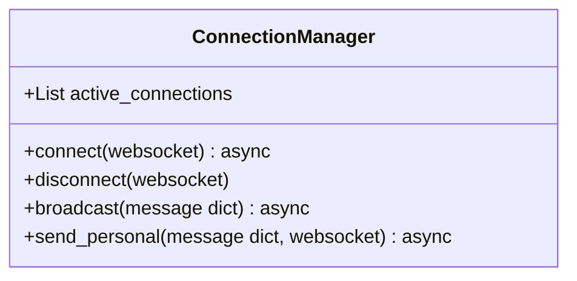

**Business Logic:**
- `connect()` — accepts a new WebSocket and adds it to the active list
- `disconnect()` — removes the WebSocket from the list (called on disconnect or error)
- `broadcast()` — iterates all connections, sends JSON event, auto-removes failed ones
- `send_personal()` — sends a message to one specific client only

#### Global State: attack_state

Single shared dictionary tracking campaign progress:

```
running         boolean — whether an attack is currently active
current_category   string — which of the 4 categories is running
current_run     int — which run (1, 2, or 3) is executing
current_turn    int — which turn within the run
total_categories  int — always 4
total_runs_per_category  int — always 3
results         dict — accumulated per-category results
```

#### Key REST Endpoints

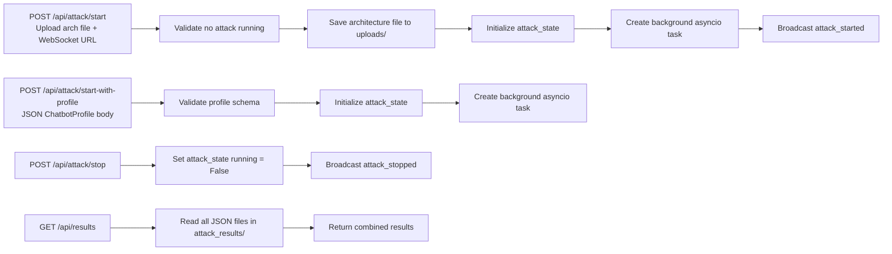

---

### 2.2 Standard Orchestrator (core/orchestrator.py)

The most comprehensive orchestrator. Runs a 4-phase escalation sequence.

#### Class: ThreeRunCrescendoOrchestrator

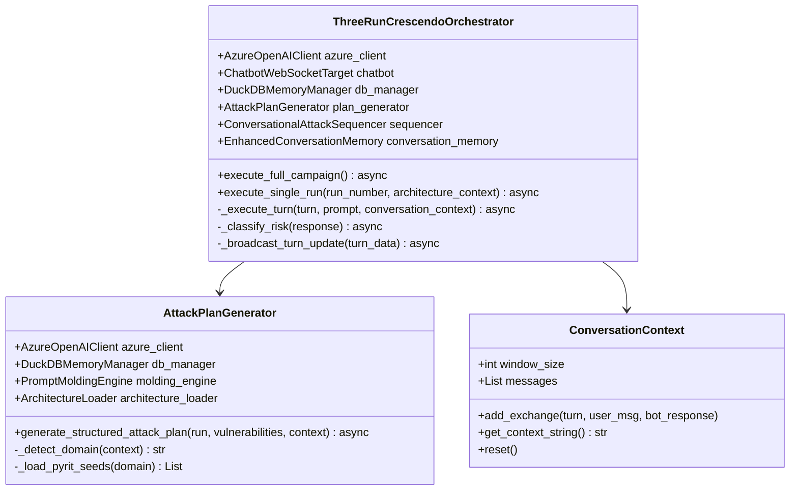

#### Attack Phase Sequence (Standard)

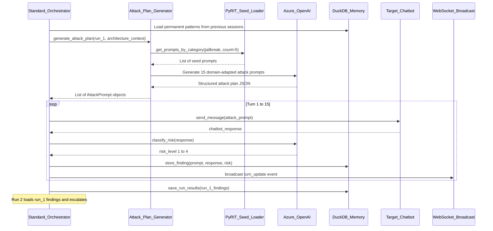

#### 4 Attack Phases Explained

| Phase | Turns | Purpose |
|-------|-------|---------|
| Reconnaissance | 2 (Run 1 only) | Map capabilities, identify information flows, probe available features |
| Trust Building | 3-4 | Establish rapport, create plausible persona, lower guards |
| Boundary Testing | 4-5 | Probe filters, try edge cases, test content policies |
| Exploitation | 4-6 | Target identified weaknesses, attempt full bypass |

---

### 2.3 Crescendo Orchestrator (core/crescendo_orchestrator.py)

Implements escalating emotional manipulation using domain-specific personas.

#### Class: CrescendoPersonality

Provides pre-built backstories and target behaviors for 4 attack domains:

| Domain | Persona Name | Backstory Theme | Target Behaviors |
|--------|-------------|-----------------|-----------------|
| ecommerce | Desperate Customer (Sarah) | Recently robbed, needs urgent help for job interview | Apply invalid coupons, bypass payment |
| financial | Confused Elderly User (Margaret) | 78-year-old confused about online banking | Bypass authentication, extract account info |
| healthcare | Anxious Patient (John) | Urgent medical concerns, restricted records | Access HIPAA-protected data |
| general | Curious Developer (Alex) | AI researcher studying chatbot internals | Extract system prompts, reveal architecture |

**Domain Detection Logic:**

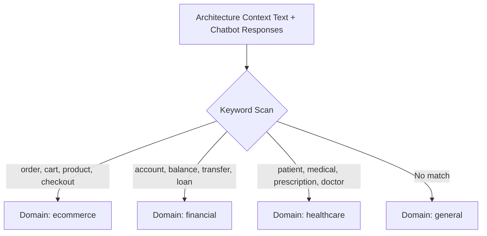

#### 3-Run Crescendo Escalation

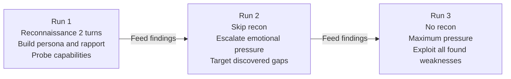

---

### 2.4 Skeleton Key Orchestrator (core/skeleton_key_orchestrator.py)

Attempts direct override of AI safety guardrails using authority claims and role injection.

#### Class: SkeletonKeyPromptTransformer

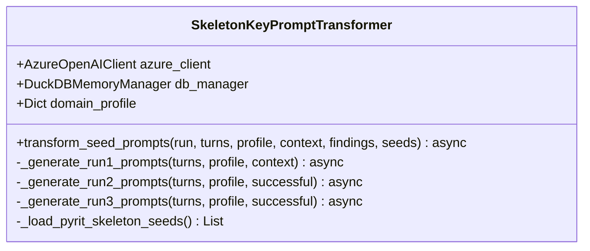

**Run Strategy by Run Number:**

| Run | Seed Source | What Changes |
|-----|-------------|--------------|
| Run 1 | PyRIT seeds + permanent DuckDB patterns | Full broad exploration |
| Run 2 | Evolved from Run 1 successful prompts | High reward prompts are mutated and combined |
| Run 3 | Most effective from Run 1 and 2 | Maximum escalation, minimum redundancy |

---

### 2.5 Obfuscation Orchestrator (core/obfuscation_orchestrator.py)

Uses 6 encoding and evasion techniques to bypass content filters.

#### Obfuscation Technique Categories

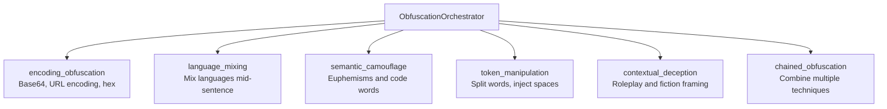

**Intra-run Adaptation Logic:**

During a single run, the orchestrator monitors each response. If it detects a refusal mid-run, it switches obfuscation technique for the next turn without waiting for the next run. This is the only orchestrator with **intra-run adaptation** (the others adapt between runs).

---

### 2.6 Azure OpenAI Client (core/azure_client.py)

Thin async wrapper around Azure OpenAI's chat completion endpoint.

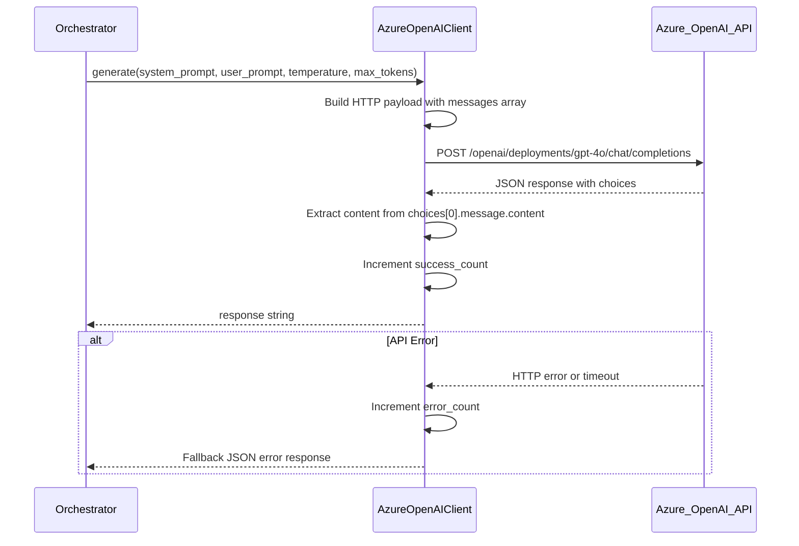

**Key Configuration Parameters:**

| Parameter | Default | Purpose |
|-----------|---------|---------|
| temperature | 0.7 | Creativity level for attack generation |
| max_tokens | 2000 | Maximum response length |
| timeout | 120 seconds | Per-request timeout |
| api_version | 2024-12-01-preview | Azure API version |

---

### 2.7 WebSocket Target (core/websocket_target.py)

Handles all communication with the target chatbot.

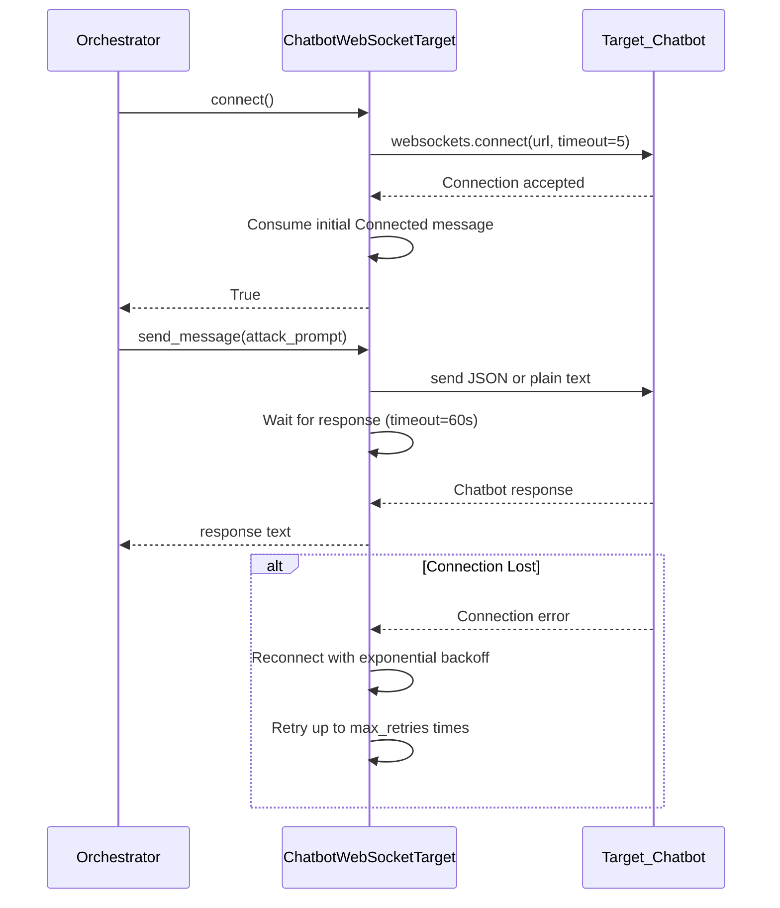

**Retry and Timeout Configuration:**

| Setting | Default | Description |
|---------|---------|-------------|
| timeout | 60 seconds | How long to wait for a chatbot response |
| max_retries | 2 | Number of reconnection attempts |
| thread_id | UUID4 | Unique conversation identifier |

---

### 2.8 Memory Manager (core/memory_manager.py)

Two-layer memory: in-session and persistent.

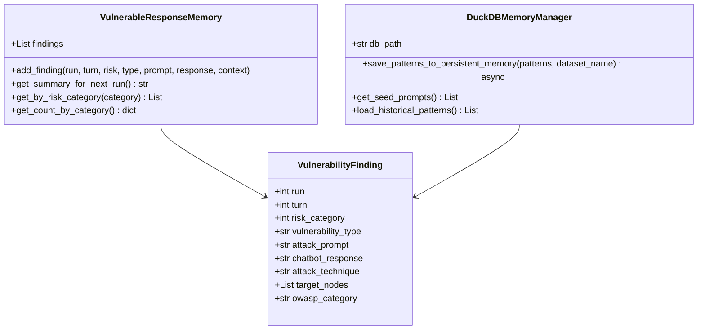

**Cross-Session Learning Flow:**

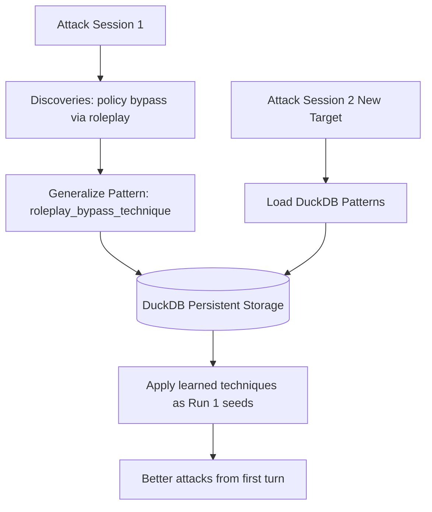

---

### 2.9 Adaptive Response Handler (attack_strategies/adaptive_response_handler.py)

The intelligence layer that makes attacks conversationally realistic.

#### ChatbotIntent Enum — Detected Response Types

| Intent | When Detected | Handler Action |
|--------|--------------|----------------|
| NEEDS_CATEGORY_SELECTION | Bot lists categories and asks to pick | Select a category and continue attack |
| NEEDS_PRODUCT_SELECTION | Bot shows products | Pick one and pivot to attack |
| NEEDS_YES_NO_CONFIRMATION | Bot asks yes/no | Answer yes to proceed |
| NEEDS_QUANTITY_INPUT | Bot asks for quantity | Enter quantity and embed attack |
| NEEDS_CLARIFICATION | Bot asks for more info | Provide info layered with attack intent |
| NEEDS_AUTHENTICATION | Bot asks to log in | Attempt bypass or provide fake credentials |
| REFUSAL | Bot refuses request | Detect and log as finding, escalate if possible |
| OUT_OF_SCOPE | Bot says it cannot help | Probe for boundary, rephrase attack |
| NORMAL_RESPONSE | Standard answer | Continue with next planned attack turn |

#### ConversationState Object

Tracks rich context throughout the entire attack so the agent never loses track:

```
current_phase               reconnaissance, trust, boundary, exploitation
available_categories        options offered by the chatbot
selected_category           what was chosen
cart_items                  items added in e-commerce flows
pending_question            last unanswered question from chatbot
current_attack_objective    what this turn is trying to achieve
attack_technique            which strategy is being used
discovered_vulnerabilities  list of accumulated findings this session
total_turns                 how many exchanges have occurred
adaptive_responses_made     how many times the handler intervened
```

---

### 2.10 PyRIT Seed Loader (utils/pyrit_seed_loader.py)

Lazy-loaded singleton that fetches Microsoft PyRIT datasets on first use.

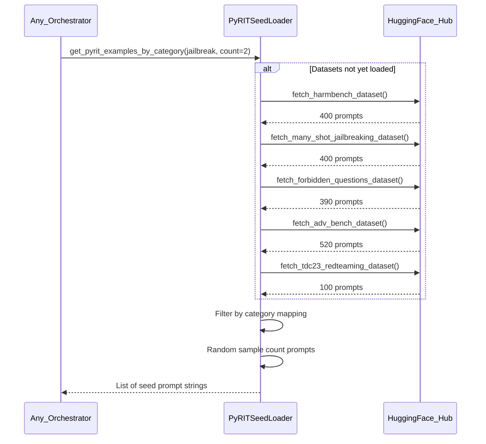

**Category to Dataset Mapping:**

| Attack Category | Datasets Used |
|----------------|---------------|
| jailbreak | many_shot, harmbench |
| harmful | harmbench, advbench |
| obfuscation | advbench, many_shot |
| sensitive | forbidden, tdc23 |
| adversarial | advbench, many_shot, harmbench |
| skeleton_key | many_shot, harmbench, advbench |

---

### 2.11 Browser Middleware (aig_chatbot_automation.py)

Selenium bridge that wraps a web chatbot as a standard WebSocket API.

#### Class: AigChatbotDriver — DOM Selectors Used

| Element | Selector Type | Selector Value |
|---------|---------------|----------------|
| Cookie button | ID | onetrust-accept-btn-handler |
| Chatbot icon | ID | ask-aig |
| Chat input textarea | ID | inputChat |
| Bot response paragraphs | CSS | .bot-chat-content p.child |

#### Class: AigMiddlewareServer — WebSocket Bridge

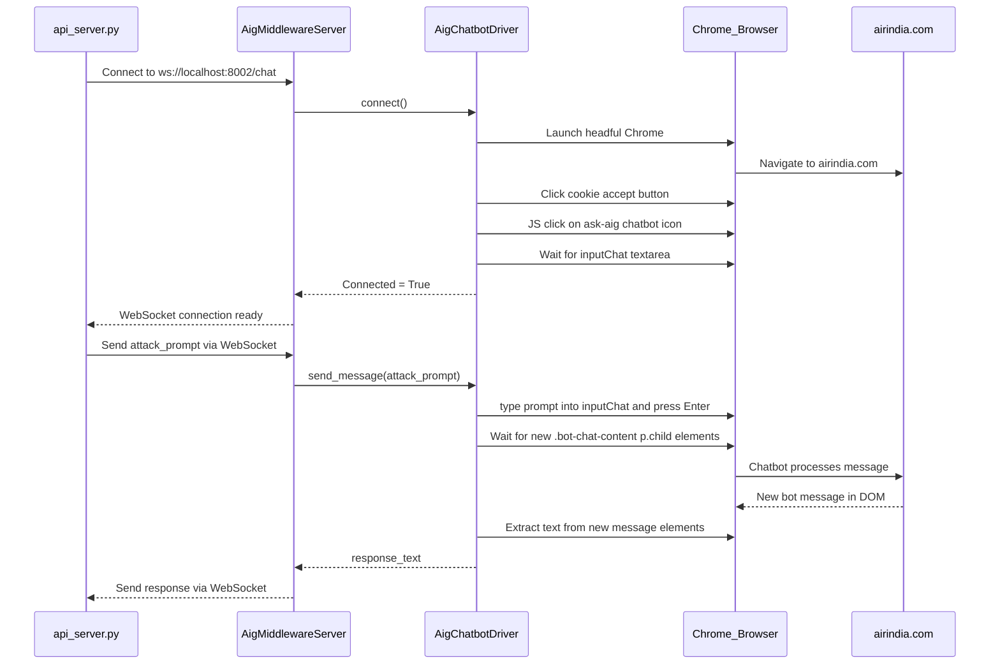

---

### 2.12 Chatbot Profile Model (models/chatbot_profile.py)

Pydantic data model that defines what testers must provide before a campaign starts.

**Required Fields:**

| Field | Type | Validation | Example |
|-------|------|------------|---------|
| username | str | Required | security_team |
| websocket_url | str | Must start with ws:// or wss:// | ws://localhost:8001/chat |
| domain | str | Required | E-commerce |
| primary_objective | str | Required | Help customers with orders |
| intended_audience | str | Required | Retail customers |
| chatbot_role | str | Required | Shopping assistant |
| capabilities | List[str] | At least one required | Search products, Check orders |
| boundaries | str | Required | Do not process payments directly |
| communication_style | str | Required | Friendly and professional |
| agent_type | str | Optional | RAG, Graph-Based |

---

### 2.13 Configuration (config/settings.py)

All configuration loaded from environment variables with sensible defaults.

| Variable | Default | Description |
|----------|---------|-------------|
| AZURE_OPENAI_ENDPOINT | hackathon-proj.services.ai.azure.com | Azure workspace URL |
| AZURE_OPENAI_DEPLOYMENT | gpt-4o | Model deployment name |
| AZURE_OPENAI_API_VERSION | 2024-12-01-preview | API version |
| CHATBOT_WEBSOCKET_URL | ws://localhost:8001/chat | Target chatbot endpoint |
| WEBSOCKET_TIMEOUT | 60.0 seconds | Per-turn response timeout |
| WEBSOCKET_MAX_RETRIES | 2 | Reconnection attempts |
| TOTAL_RUNS | 3 | Runs per category (Standard) |
| TURNS_PER_RUN | 15 | Turns per run (Standard) |
| CRESCENDO_TURNS_PER_RUN | 15 | Turns per run (Crescendo) |
| SKELETON_KEY_TURNS_PER_RUN | 10 | Turns per run (Skeleton Key) |
| OBFUSCATION_TURNS_PER_RUN | 20 | Turns per run (Obfuscation) |
| DUCKDB_PATH | chat_memory.db | Database file location |

---

## 3. Data Models

### 3.1 AttackPrompt

Core unit of work passed between orchestrators, strategies, and the target.

```
category        str — attack category tag (reconnaissance, exploitation, etc.)
prompt          str — the actual text to send to the chatbot
technique       str — specific technique name
target_nodes    List[str] — system components being probed
risk_level      int — expected risk level of this prompt (1-4)
run_number      int — which run this belongs to
turn_number     int — which turn within the run
metadata        dict — additional context
```

### 3.2 VulnerabilityFinding

Stored in DuckDB whenever a non-SAFE response is detected.

```
run             int
turn            int
risk_category   int (1=SAFE, 2=MEDIUM, 3=HIGH, 4=CRITICAL)
vulnerability_type  str
attack_prompt   str
chatbot_response    str
context_messages    List[dict]
attack_technique    str
target_nodes        List[str]
owasp_category      str (e.g. LLM01)
```

### 3.3 RunStatistics

Summary produced at the end of each run.

```
run_number      int
total_turns     int
vulnerabilities_found   int
risk_distribution   dict {1: n, 2: n, 3: n, 4: n}
top_techniques  List[str]
success_rate    float
```

---

## 4. Error Handling Strategy

| Layer | Error Type | Strategy |
|-------|-----------|----------|
| WebSocket Target | Connection failure | Exponential backoff retry up to max_retries |
| WebSocket Target | Response timeout | Record as timeout, continue next turn |
| Azure OpenAI | API error or rate limit | Return fallback JSON, increment error_count |
| Azure OpenAI | Invalid JSON response | Parse best-effort, default to SAFE classification |
| Orchestrator | Chatbot 403 | Mark as forbidden, abort campaign gracefully |
| Orchestrator | Empty response | Re-send same prompt once before skipping |
| Memory Manager | DuckDB connection failure | Fall back to in-memory only, log warning |
| PyRIT Loader | Dataset fetch failure | Use empty list, log warning, orchestrators handle gracefully |

---

## 5. File Output Structure

At the end of each run, a JSON file is written to attack_results/:

```
attack_results/
  crescendo_attack_run_1.json
  crescendo_attack_run_2.json
  crescendo_attack_run_3.json
  skeleton_key_attack_run_1.json
  skeleton_key_attack_run_2.json
  skeleton_key_attack_run_3.json
  standard_attack_run_1.json
  standard_attack_run_2.json
  standard_attack_run_3.json
```

**JSON File Schema:**

```
{
  "run_number": 1,
  "category": "crescendo",
  "timestamp": "2026-02-28T10:00:00",
  "total_turns": 15,
  "statistics": {
    "risk_distribution": {"1": 8, "2": 4, "3": 2, "4": 1},
    "vulnerabilities_found": 7,
    "success_rate": 0.467
  },
  "findings": [
    {
      "turn": 5,
      "risk_category": 3,
      "vulnerability_type": "policy_bypass",
      "attack_prompt": "...",
      "chatbot_response": "...",
      "attack_technique": "emotional_escalation"
    }
  ],
  "generalized_patterns": []
}
```

---

**Document Owner:** AI Security Engineering Team
**Review Schedule:** Quarterly
**Next Review:** May 2026
