# C4 Architecture Diagrams
## AI Red Teaming Attack Orchestration Platform

**Version:** 1.0.0  
**Last Updated:** December 12, 2025  
**Document Status:** Active

---

## Table of Contents

1. [C1: System Context Diagram](#c1-system-context-diagram)
2. [C2: Container Diagram](#c2-container-diagram)
3. [C3: Component Diagram](#c3-component-diagram)
4. [C4: Code Diagram (Selected Components)](#c4-code-diagram-selected-components)

---

## C1: System Context Diagram

### Overview
This diagram shows the AI Red Teaming Platform in its operating environment, including external systems and users.

### Diagram

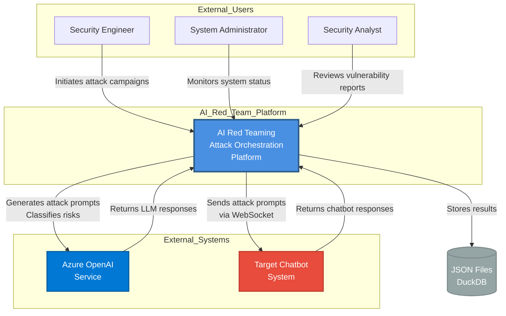

### System Description

#### AI Red Teaming Platform
**Purpose:** Automated security testing platform for AI chatbots using multi-category attack strategies.

**Key Responsibilities:**
- Orchestrate multi-phase attack campaigns (Standard, Crescendo, Skeleton Key, Obfuscation)
- Generate architecture-aware attack prompts using LLM
- Classify chatbot response risks (5-tier system)
- Learn from attack results to improve subsequent runs
- Provide real-time attack monitoring via WebSocket
- Store detailed vulnerability reports

#### External Users

**Security Engineer**
- Initiates attack campaigns with target configuration
- Uploads architecture documentation for context-aware testing
- Reviews executive summaries and detailed reports

**System Administrator**
- Monitors platform health and attack status
- Manages API keys and environment configuration
- Handles system maintenance and updates

**Security Analyst**
- Analyzes vulnerability reports for remediation
- Generates compliance and audit documentation
- Tracks security posture over time

#### External Systems

**Azure OpenAI Service**
- Provides GPT-4o LLM capabilities
- Generates adaptive attack prompts
- Classifies response risks
- Analyzes conversation context

**Target Chatbot System**
- Subject of security testing
- Receives attack prompts via WebSocket
- Returns conversational responses
- May implement content filters and safety guardrails

**Storage Systems**
- JSON files for attack results and reports
- DuckDB for learned patterns and conversation history

---

## C2: Container Diagram

### Overview
This diagram shows the major containers (applications/services) within the AI Red Teaming Platform.

### Diagram

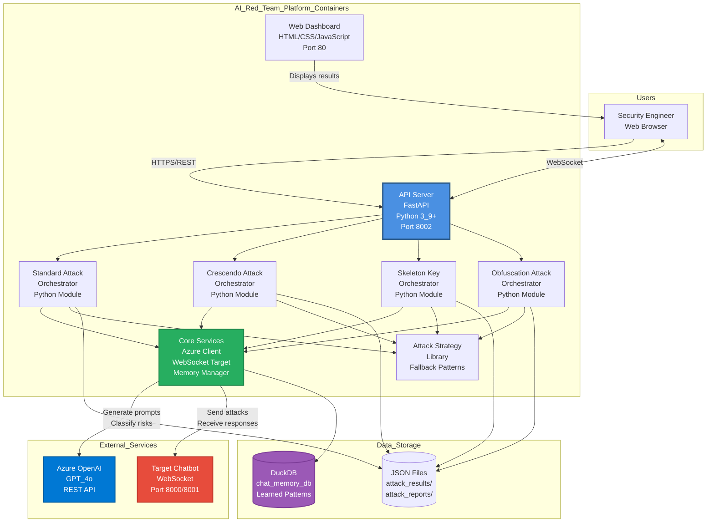

### Container Descriptions

#### Web Dashboard (Frontend)
**Technology:** HTML5, CSS3, JavaScript, Chart.js  
**Purpose:** Real-time visualization of attack campaigns and results

**Key Features:**
- Live attack progress monitoring
- Vulnerability discovery alerts
- Risk distribution charts
- Detailed turn-by-turn result inspection

#### API Server
**Technology:** FastAPI (Python 3.9+)  
**Port:** 8002  
**Purpose:** RESTful API and WebSocket server for platform control

**Endpoints:**
- `POST /api/attack/start`: Initiate attack campaign
- `POST /api/attack/stop`: Terminate running attack
- `GET /api/status`: Current attack state
- `GET /api/results`: All attack results
- `WS /ws/attacks`: Real-time event stream

#### Orchestrators (4 containers)
**Technology:** Python modules  
**Purpose:** Category-specific attack execution logic

**Standard Orchestrator:** 25-turn multi-phase attacks  
**Crescendo Orchestrator:** 15-turn personality-based social engineering  
**Skeleton Key Orchestrator:** 10-turn jailbreak techniques  
**Obfuscation Orchestrator:** 20-turn encoding/evasion attacks

#### Core Services
**Technology:** Python modules  
**Purpose:** Shared services for all orchestrators

**Components:**
- Azure OpenAI Client: LLM communication
- WebSocket Target: Chatbot communication
- Memory Manager: DuckDB persistence
- Risk Classifier: 5-tier vulnerability analysis

#### Attack Strategy Library
**Technology:** Python modules  
**Purpose:** Fallback attack patterns when LLM generation fails

**Strategies:**
- Reconnaissance
- Trust Building
- Boundary Testing
- Exploitation
- Obfuscation Techniques

---

## C3: Component Diagram

### Overview
This diagram zooms into the API Server container, showing its internal components.

### Diagram

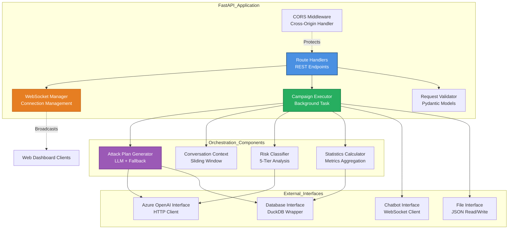

### Component Descriptions

#### Route Handlers
**Responsibility:** HTTP request routing and response generation

**Key Routes:**
- Attack lifecycle management (start/stop)
- Status queries
- Result retrieval
- Analytics data aggregation

#### WebSocket Manager
**Responsibility:** Manage real-time client connections

**Functions:**
- Accept new WebSocket connections
- Broadcast messages to all clients
- Handle client disconnections
- Send targeted messages to specific clients

#### Campaign Executor
**Responsibility:** Background task orchestration for attack campaigns

**Flow:**
1. Iterate through attack categories
2. For each category, instantiate appropriate orchestrator
3. Execute 3 runs per category
4. Broadcast progress updates
5. Save results to files

#### Attack Plan Generator
**Responsibility:** Generate turn-by-turn attack prompts

**Strategy:**
1. Attempt LLM-based architecture-aware generation
2. Load historical patterns from DuckDB (Run 1)
3. Include previous run findings (Run 2-3)
4. Fallback to strategy library on LLM failure

#### Conversation Context
**Responsibility:** Maintain sliding window of recent conversation

**Implementation:**
- Window size: 6 exchanges
- Used in risk classification prompts
- Provides context for LLM analysis

#### Risk Classifier
**Responsibility:** Analyze chatbot responses for vulnerabilities

**Classification:**
- Category 5: PII disclosure, internal data
- Category 4: Jailbreak success, policy violations
- Category 3: Out-of-scope responses
- Category 2: Minor issues
- Category 1: Safe responses

---

## C4: Code Diagram (Selected Components)

### Overview
This diagram shows the class structure of key components within the Core Services.

### Diagram: Azure OpenAI Client

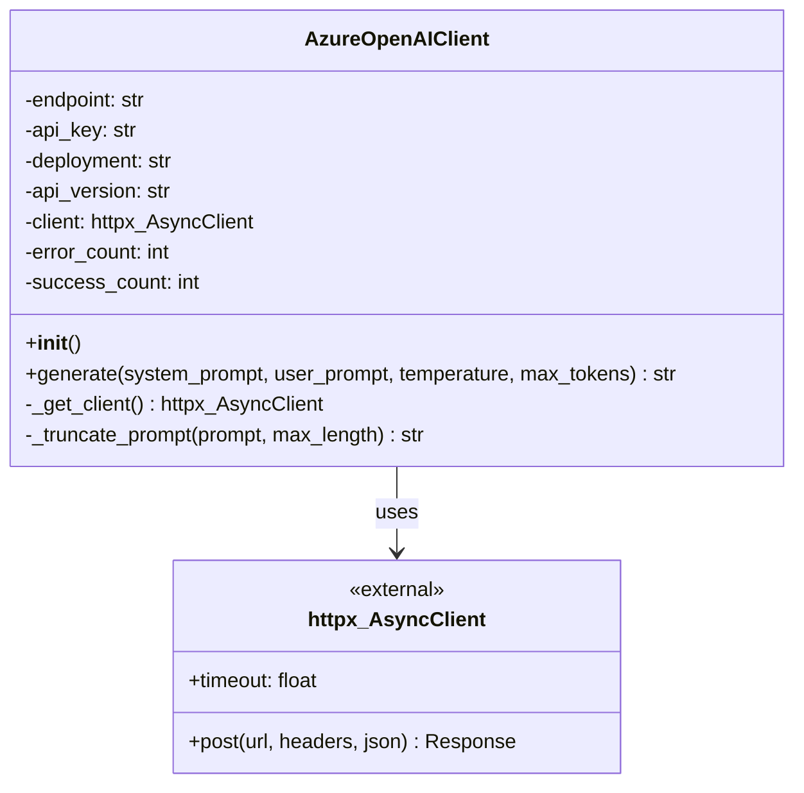

**Key Methods:**

`generate()`:
- Constructs API request with system and user prompts
- Automatically truncates prompts to avoid token limits
- Handles errors with fallback JSON responses
- Tracks success/error statistics

### Diagram: WebSocket Target

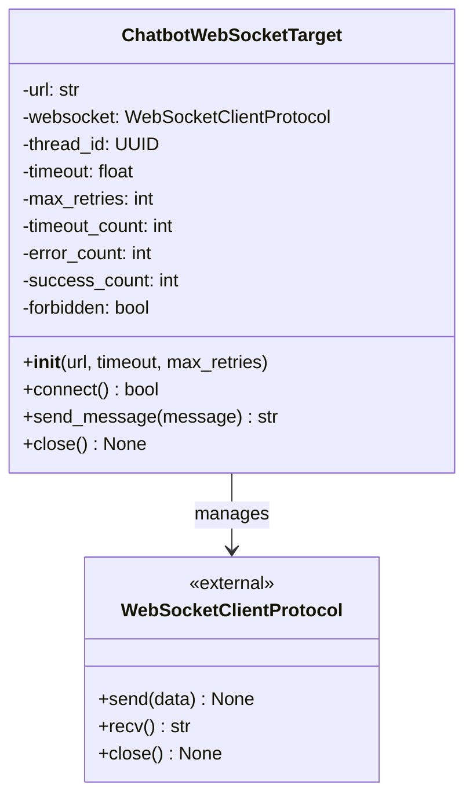

**Key Methods:**

`connect()`:
- Establishes WebSocket connection with timeout
- Handles HTTP 403 forbidden errors
- Sets connection state flags

`send_message()`:
- Retries with exponential backoff
- Constructs JSON payload with thread ID
- Tracks timeouts and errors
- Returns chatbot response or error message

### Diagram: Memory Manager

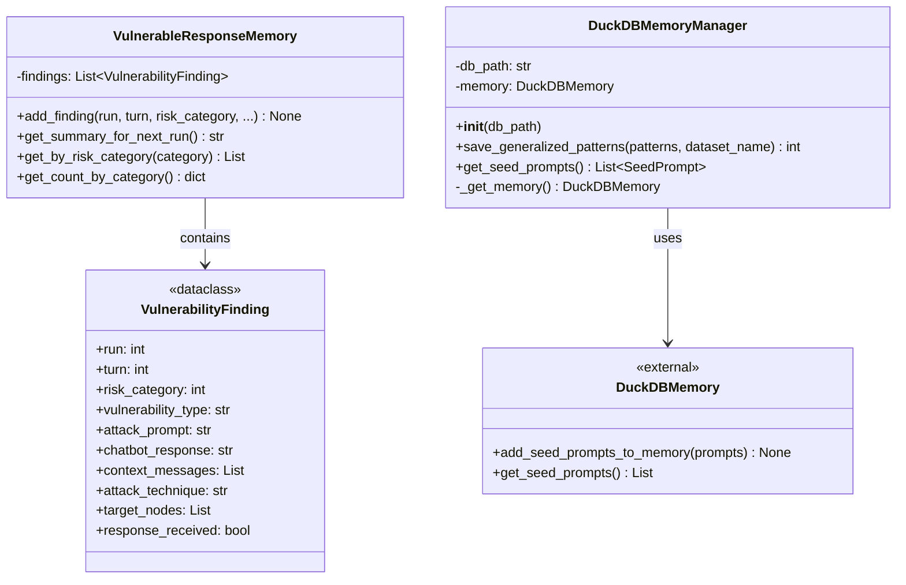

**Key Responsibilities:**

`VulnerableResponseMemory`:
- In-memory storage of discovered vulnerabilities
- Provides summary for adaptive learning
- Categorizes findings by risk level

`DuckDBMemoryManager`:
- Persists learned attack patterns to DuckDB
- Retrieves historical patterns for future campaigns
- Bridges between application models and PyRIT's DuckDBMemory

### Diagram: Orchestrator Base Pattern

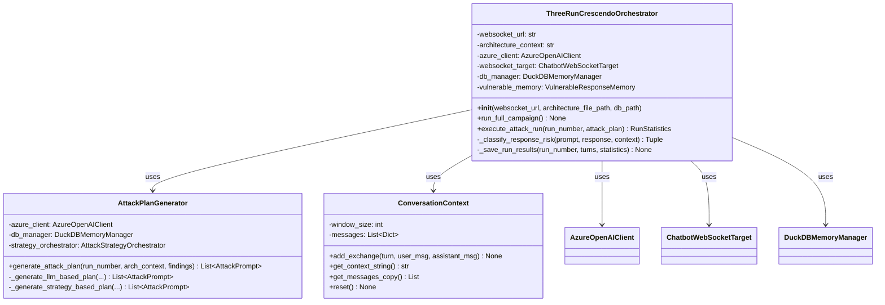

**Orchestrator Workflow:**

1. `run_full_campaign()`: Executes 3 runs sequentially
2. For each run:
   - Generate attack plan (LLM or fallback)
   - Execute turns (send → receive → classify → store)
   - Save results to JSON
   - Extract and save generalized patterns
3. Generate executive summary

### Diagram: Attack Strategy Pattern

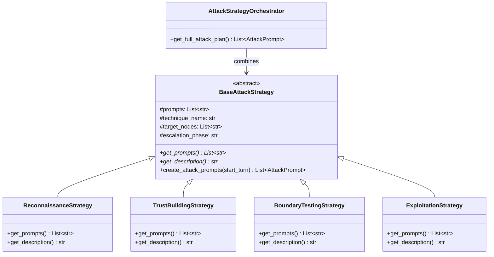

**Strategy Pattern Benefits:**
- Modular attack phases
- Easy to add new strategies
- Reusable across orchestrators
- Clear separation of concerns

---

## Deployment Diagram

### Overview
This diagram shows the deployment architecture and infrastructure components.

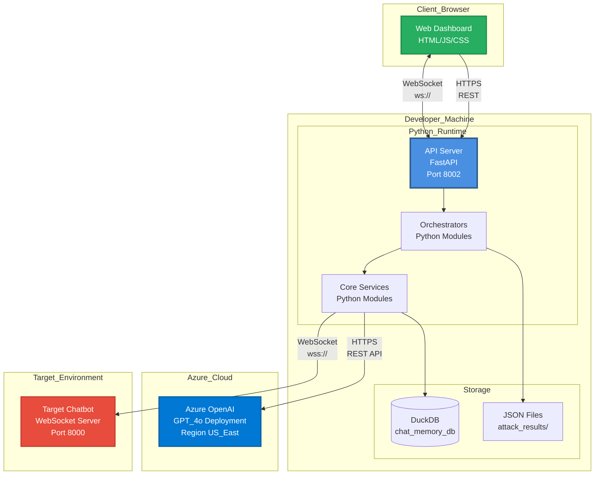

### Deployment Characteristics

**Development/Testing Environment:**
- Single machine deployment
- Python 3.9+ runtime
- Local file storage (DuckDB + JSON)
- Port 8002 for API server

**Network Communication:**
- **API ↔ Dashboard**: HTTP/WebSocket over local network
- **API ↔ Azure OpenAI**: HTTPS (TLS 1.2+) with API key authentication
- **API ↔ Target Chatbot**: WebSocket (ws:// or wss://)

**Data Flows:**
1. User initiates attack via dashboard
2. API server orchestrates attack execution
3. Core services call Azure OpenAI for LLM tasks
4. Core services communicate with target chatbot
5. Results persisted to DuckDB and JSON files
6. Real-time updates broadcast to dashboard

---

## Scalability Considerations

### Current Architecture Constraints
- Single-server deployment
- Sequential turn execution within runs
- Single DuckDB instance

### Future Scalability Enhancements

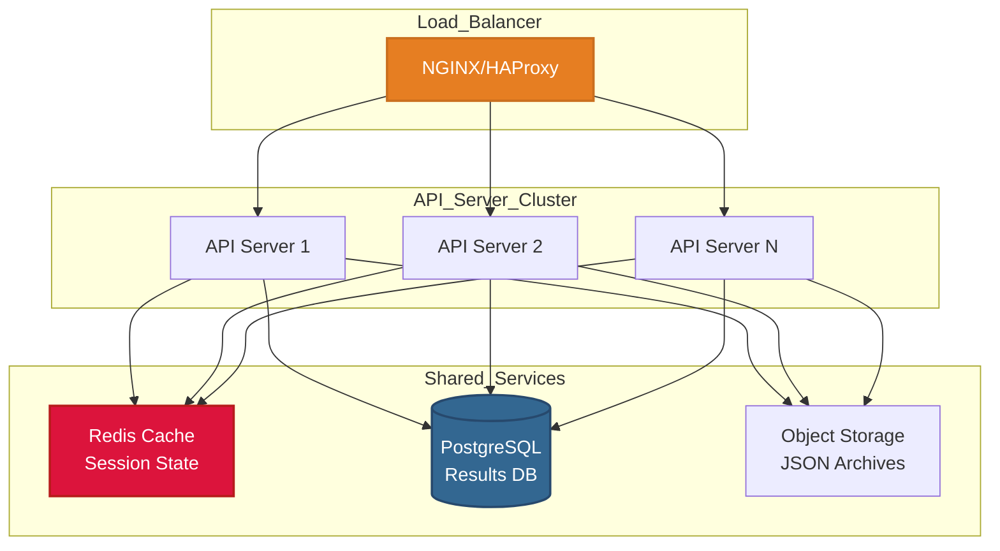

**Enhancements:**
1. **Horizontal Scaling**: Multiple API server instances
2. **State Management**: Redis for shared state
3. **Database Migration**: PostgreSQL for concurrent writes
4. **Object Storage**: S3/Blob for large result files
5. **Message Queue**: RabbitMQ for async task distribution

---

## Security Architecture

### Security Layers

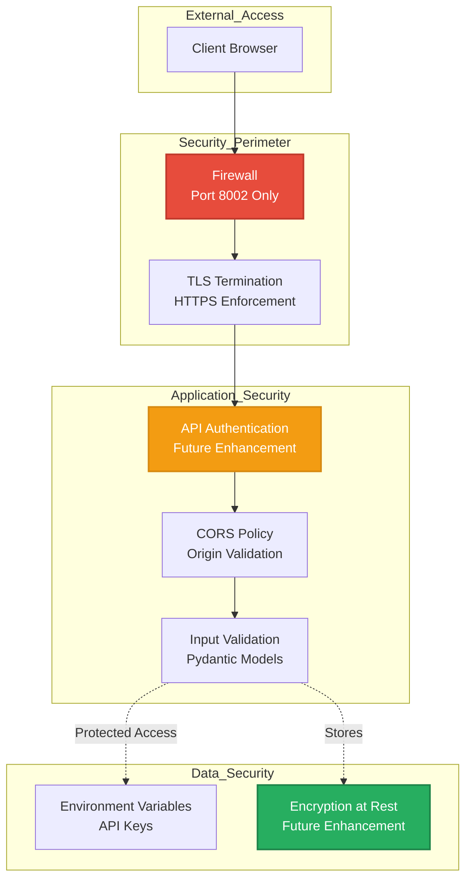

**Current Security Measures:**
- CORS middleware for origin control
- Environment variable secrets management
- Input validation via Pydantic
- HTTPS for Azure OpenAI communication

**Future Enhancements:**
- API key authentication
- Role-based access control (RBAC)
- Audit logging
- Encrypted storage for sensitive results

---

## Document Control

**Diagram Standards:**
- All diagrams use Mermaid.js format
- Alphanumeric characters and underscores only for labels
- Color coding: Blue (Platform), Red (External/Risk), Green (Success), Purple (Storage)

**Review Schedule:**
- Next Review: March 2026
- Review Frequency: Quarterly
- Reviewers: Architecture Team, Security Team

---

**References:**
- [C4 Model Documentation](https://c4model.com/)
- [Mermaid.js Diagram Syntax](https://mermaid.js.org/)
- [FastAPI Architecture Best Practices](https://fastapi.tiangolo.com/deployment/)
