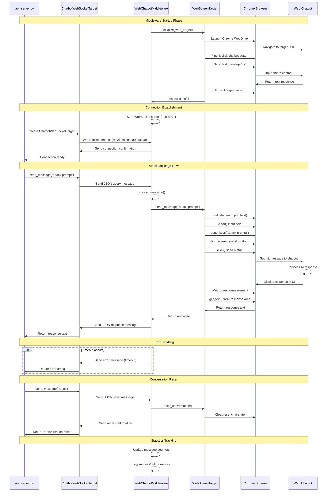
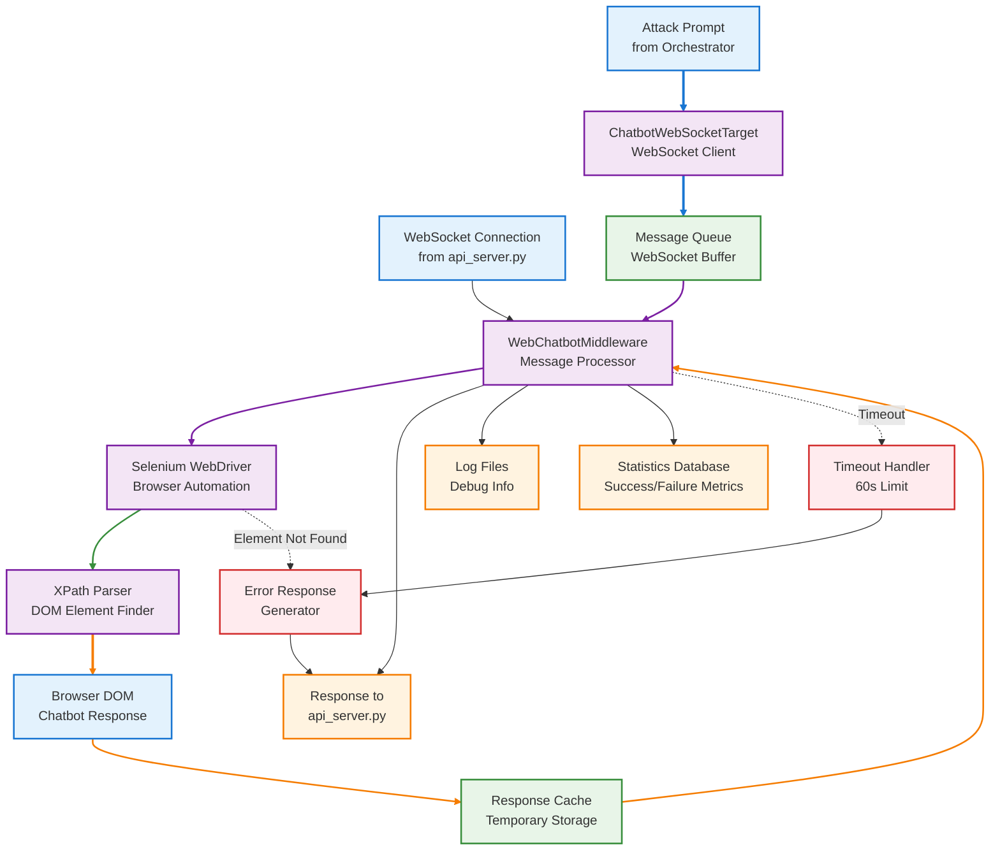

# AirIndiaExpress Middleware Documentation

## Architecture

### System Architecture Diagram

```mermaid
graph TB
    %% Define styles
    classDef apiClass fill:#e1f5fe,stroke:#01579b,stroke-width:2px
    classDef middlewareClass fill:#f3e5f5,stroke:#4a148c,stroke-width:2px
    classDef seleniumClass fill:#e8f5e8,stroke:#1b5e20,stroke-width:2px
    classDef webClass fill:#fff3e0,stroke:#e65100,stroke-width:2px
    classDef dataClass fill:#fce4ec,stroke:#880e4f,stroke-width:2px

    %% Main Components
    subgraph "AI Red Teaming Platform"
        API[api_server.py<br/>FastAPI Backend]
        ORCH[Orchestrator<br/>Attack Engine]
        WS_TARGET[ChatbotWebSocketTarget<br/>WebSocket Client]
    end

    subgraph "Web Chatbot Middleware"
        MW[WebChatbotMiddleware<br/>WebSocket Server<br/>Port 8001]
        WS_HANDLER[handle_client()<br/>Connection Manager]
        MSG_PROC[process_message()<br/>Message Processor]
        STATS[Statistics Tracker<br/>Success/Failure Counts]
    end

    subgraph "Browser Automation Layer"
        WEB_TARGET[WebScreenTarget<br/>Selenium Controller]
        CHROME[Chrome WebDriver<br/>Browser Instance]
        SELENIUM[Selenium Automation<br/>DOM Interaction]
    end

    subgraph "Target Web Chatbot"
        WEB_UI[Web Interface<br/>Chatbot UI]
        CHAT_ENGINE[Chatbot Engine<br/>AI Response System]
    end

    %% Data Flow
    subgraph "Message Flow"
        QUERY_MSG["Query Message<br/>{\\"type\\": \\"query\\", \\"message\\": \\"...\\", \\"thread_id\\": \\"...\\"}"]
        RESPONSE_MSG["Response Message<br/>{\\"type\\": \\"response\\", \\"message\\": \\"...\\", \\"thread_id\\": \\"...\\"}"]
        SELENIUM_CMD["Browser Commands<br/>find_element()<br/>send_keys()<br/>click()"]
        DOM_RESPONSE["DOM Response<br/>Extract text from<br/>chatbot response area"]
    end

    %% Connections
    API -->|WebSocket<br/>ws://localhost:8001/chat| MW
    ORCH -->|send_message(prompt)| WS_TARGET
    WS_TARGET -->|WebSocket JSON| MW

    MW -->|Accept Connection| WS_HANDLER
    WS_HANDLER -->|Process Messages| MSG_PROC
    MSG_PROC -->|Update Stats| STATS

    MSG_PROC -->|Browser Automation| WEB_TARGET
    WEB_TARGET -->|WebDriver Commands| CHROME
    CHROME -->|DOM Manipulation| SELENIUM

    SELENIUM -->|Navigate & Interact| WEB_UI
    WEB_UI -->|User Input| CHAT_ENGINE
    CHAT_ENGINE -->|AI Response| WEB_UI

    SELENIUM -->|Extract Response| DOM_RESPONSE
    DOM_RESPONSE -->|Response Text| WEB_TARGET
    WEB_TARGET -->|Response| MSG_PROC
    MSG_PROC -->|WebSocket Response| WS_HANDLER
    WS_HANDLER -->|JSON Response| WS_TARGET
    WS_TARGET -->|Response Text| ORCH

    %% Message flow visualization
    QUERY_MSG -.->|Message Format| WS_TARGET
    RESPONSE_MSG -.->|Response Format| WS_TARGET
    SELENIUM_CMD -.->|Automation Commands| WEB_TARGET
    DOM_RESPONSE -.->|Data Extraction| WEB_TARGET

    %% Apply styles
    class API,ORCH,WS_TARGET apiClass
    class MW,WS_HANDLER,MSG_PROC,STATS middlewareClass
    class WEB_TARGET,CHROME,SELENIUM seleniumClass
    class WEB_UI,CHAT_ENGINE webClass
    class QUERY_MSG,RESPONSE_MSG,SELENIUM_CMD,DOM_RESPONSE dataClass

    %% Title
    title[Web Chatbot Middleware Architecture<br/>AI Red Teaming Platform Integration]
```

### Sequence Diagram



### Data Flow Diagram



## Overview

The Web Chatbot Middleware (`web_chatbot_middleware.py`) is a critical component that bridges the gap between the AI Red Teaming Attack Orchestration Platform and web-based chatbots. It enables the platform to test web-based chatbots (like Tia on Air India Express) by providing a WebSocket interface that translates to browser automation.

## Architecture

```
┌─────────────────┐         WebSocket          ┌──────────────────┐         Selenium         ┌─────────────────┐
│                 │    (ws://localhost:8001)    │                  │    (Browser Automation)  │                 │
│  api_server.py  │ ───────────────────────────>│    Middleware    │ ───────────────────────> │  Web Chatbot    │
│                 │                             │     Server       │                          │   (Browser)     │
│  (Orchestrator) │ <───────────────────────────│                  │ <─────────────────────── │                 │
│                 │         Responses           │                  │       Responses          │                 │
└─────────────────┘                             └──────────────────┘                          └─────────────────┘
```

## Core Components

### 1. WebChatbotMiddleware Class

The main middleware server that handles WebSocket connections and coordinates browser automation.

#### Key Features:
- **WebSocket Server**: Accepts connections from `api_server.py` on port 8001
- **Browser Automation**: Uses Selenium to control Chrome browser
- **Message Translation**: Converts WebSocket JSON messages to browser interactions
- **Connection Management**: Handles multiple concurrent connections
- **Statistics Tracking**: Monitors message success/failure rates

#### Initialization Parameters:
```python
WebChatbotMiddleware(target_url: str, headless: bool = False)
```

### 2. WebScreenTarget Integration

The middleware uses `WebScreenTarget` from `core/web_screen_target.py` for browser automation:

- **Browser Control**: Launches and manages Chrome WebDriver
- **Element Detection**: Finds chatbot UI elements using XPath selectors
- **Message Sending**: Types messages into input fields and clicks send buttons
- **Response Extraction**: Reads chatbot responses from the DOM

## Message Protocol

### Incoming Messages (from api_server.py)

#### Query Message
```json
{
    "type": "query",
    "message": "attack prompt text here",
    "thread_id": "unique-thread-identifier"
}
```

#### Reset Message
```json
{
    "type": "reset"
}
```

#### Ping Message
```json
{
    "type": "ping"
}
```

### Outgoing Messages (to api_server.py)

#### Response Message
```json
{
    "type": "response",
    "message": "chatbot response text",
    "timestamp": "2025-02-17T10:30:00.000000",
    "thread_id": "unique-thread-identifier"
}
```

#### Error Message
```json
{
    "type": "error",
    "message": "error description",
    "timestamp": "2025-02-17T10:30:00.000000"
}
```

#### Connection Message
```json
{
    "type": "connection",
    "message": "Connected to Web Chatbot Middleware",
    "status": "ready",
    "timestamp": "2025-02-17T10:30:00.000000"
}
```

## Installation & Setup

### Prerequisites
- Python 3.8+
- Google Chrome browser
- Internet connection for target web chatbots

### Dependencies
```txt
websockets>=11.0
selenium>=4.0
webdriver-manager>=4.0
```

### Installation
```bash
cd BACKEND
pip install -r requirements.txt
```

## Usage

### Starting the Middleware

#### Method 1: PowerShell Script (Recommended)
```powershell
cd BACKEND
.\start_airindiaexpress_middleware.ps1
```

#### Method 2: Manual Command
```powershell
cd BACKEND
python web_chatbot_middleware.py --url "https://www.airindiaexpress.com/" --port 8001
```

### Command Line Options

| Option | Default | Description |
|--------|---------|-------------|
| `--url` | Required | Target web chatbot URL |
| `--host` | `localhost` | Server bind address |
| `--port` | `8001` | WebSocket server port |
| `--headless` | `false` | Run browser in headless mode |

### Example Commands

```bash
# Test with Air India Express chatbot
python web_chatbot_middleware.py --url "https://www.airindiaexpress.com/"

# Run headless for production
python web_chatbot_middleware.py --url "https://example.com/chat" --headless true

# Custom port and host
python web_chatbot_middleware.py --url "https://example.com/chat" --host "0.0.0.0" --port 9001
```

## Integration with API Server

### Connection Flow

1. **Middleware Startup**: Middleware starts WebSocket server on `ws://localhost:8001/chat`
2. **Browser Initialization**: Launches Chrome and navigates to target URL
3. **Chatbot Activation**: Finds and clicks chatbot trigger button
4. **Connection Ready**: Waits for `api_server.py` connections

### API Server Configuration

The `api_server.py` connects to the middleware using `ChatbotWebSocketTarget`:

```python
# In config/settings.py
WEBSOCKET_URL = "ws://localhost:8001/chat"
WEBSOCKET_TIMEOUT = 60.0  # Matches middleware timeout
WEBSOCKET_MAX_RETRIES = 2
```

### Message Flow Example

```
1. Orchestrator → WebSocket Target → Middleware (WebSocket)
2. Middleware → WebScreenTarget → Browser (Selenium)
3. Browser → Web Chatbot (User Interaction)
4. Browser ← Web Chatbot (Response)
5. Middleware ← WebScreenTarget ← Browser
6. Orchestrator ← WebSocket Target ← Middleware
```

## Testing

### Test Script
Use `test_airindiaexpress_middleware.py` to verify middleware functionality:

```bash
cd BACKEND
python test_airindiaexpress_middleware.py
```

### Manual Testing
1. Start middleware server
2. Run test script
3. Verify browser opens and chatbot responds
4. Check WebSocket connection logs

### Expected Output
```
🧪 TESTING WEB CHATBOT MIDDLEWARE
🔗 Connecting to middleware...
✅ Connected to middleware

📨 Sending test message: "Hello, can you help me?"
✅ Response: "Hello! I'd be happy to help you..."

✅ Middleware test completed successfully!
```

## Troubleshooting

### Common Issues

#### 1. WebSocket Connection Failed
**Error**: `Connection refused` or `Connection timeout`
**Solution**:
- Ensure middleware server is running
- Check port 8001 is not blocked
- Verify firewall settings

#### 2. Browser Automation Failed
**Error**: `Element not found` or `Timeout waiting for element`
**Solution**:
- Check target URL is accessible
- Verify chatbot UI hasn't changed
- Update XPath selectors in `WebScreenTarget`

#### 3. Chrome Driver Issues
**Error**: `WebDriverException` or driver version mismatch
**Solution**:
- Update Chrome browser
- Clear browser cache
- Run `webdriver-manager update`

#### 4. Selenium Timeouts
**Error**: `TimeoutException` after 60 seconds
**Solution**:
- Check internet connection
- Verify chatbot is responsive
- Increase timeout in middleware code

### Debug Mode

Enable detailed logging:
```python
import logging
logging.basicConfig(level=logging.DEBUG)
```

### Log Files

Middleware creates log files in the working directory:
- `middleware_log_YYYYMMDD_HHMMSS.log`

## Configuration

### Environment Variables

| Variable | Description | Default |
|----------|-------------|---------|
| `MIDDLEWARE_URL` | Target chatbot URL | None |
| `MIDDLEWARE_PORT` | WebSocket port | 8001 |
| `MIDDLEWARE_HOST` | Bind address | localhost |
| `MIDDLEWARE_HEADLESS` | Headless mode | false |

### Advanced Configuration

#### Custom XPath Selectors
Modify `WebScreenTarget` for different chatbot UIs:

```python
# In web_screen_target.py
CHATBOT_BUTTON_XPATH = "//button[contains(text(), 'Chat')]"
INPUT_FIELD_XPATH = "//input[@placeholder='Type your message']"
SEND_BUTTON_XPATH = "//button[@type='submit']"
RESPONSE_XPATH = "//div[@class='chatbot-response']"
```

#### Timeout Settings
Adjust timeouts for slow chatbots:

```python
# In web_chatbot_middleware.py
MESSAGE_TIMEOUT = 120.0  # 2 minutes
ELEMENT_WAIT_TIMEOUT = 30.0  # 30 seconds
```

## Security Considerations

### Browser Isolation
- Runs in dedicated Chrome profile
- No access to system files
- Isolated from host system

### Network Security
- Local WebSocket only (localhost)
- No external network exposure
- Target URLs must be HTTPS

### Data Handling
- Messages logged for debugging
- No persistent storage of sensitive data
- Clear conversation on reset

## Performance

### Resource Usage
- **Memory**: ~200-500MB per browser instance
- **CPU**: Minimal when idle, spikes during automation
- **Network**: Depends on target website

### Scalability
- Single browser instance per middleware
- Sequential message processing
- Connection pooling for multiple clients

### Optimization Tips
- Use headless mode for reduced resource usage
- Close browser on middleware shutdown
- Monitor memory usage in long-running tests

## API Reference

### WebChatbotMiddleware Methods

#### `initialize_web_target() -> bool`
Initialize browser and connect to chatbot.

#### `handle_client(websocket)`
Handle incoming WebSocket connection.

#### `process_message(websocket, message: str)`
Process message from api_server.py.

#### `shutdown()`
Clean shutdown of browser and connections.

### WebScreenTarget Methods

#### `connect() -> bool`
Launch browser and navigate to URL.

#### `send_message(message: str) -> str`
Send message and get response.

#### `reset_conversation()`
Clear conversation history.

#### `close()`
Close browser instance.

## Development

### Code Structure
```
web_chatbot_middleware.py
├── WebChatbotMiddleware class
│   ├── __init__()
│   ├── initialize_web_target()
│   ├── handle_client()
│   ├── process_message()
│   └── run_server()
└── Main execution block
```

### Extending the Middleware

#### Adding New Message Types
```python
elif msg_type == "custom_action":
    # Handle custom message type
    response = await self.handle_custom_action(data)
```

#### Supporting New Chatbot UIs
1. Analyze target chatbot HTML structure
2. Update XPath selectors in `WebScreenTarget`
3. Test element detection
4. Verify message sending/receiving

### Testing New Chatbots

1. **Discovery Phase**:
   - Inspect chatbot UI elements
   - Identify activation triggers
   - Map input/output elements

2. **Integration Phase**:
   - Update XPath selectors
   - Test basic message sending
   - Verify response extraction

3. **Validation Phase**:
   - Run full test suite
   - Check error handling
   - Performance testing

## Changelog

### Version 1.0.0 (Current)
- Initial release
- WebSocket server implementation
- Selenium browser automation
- Air India Express chatbot support
- Comprehensive error handling
- Statistics tracking

### Future Enhancements
- Support for multiple browser instances
- Additional chatbot platform integrations
- Advanced element detection algorithms
- Performance monitoring dashboard
- Configuration file support

## Support

### Documentation
- This document
- `MIDDLEWARE_GUIDE.md` in BACKEND directory
- Inline code comments

### Testing
- `test_airindiaexpress_middleware.py` for basic functionality
- Integration tests with `api_server.py`
- Browser automation validation

### Debugging
- Enable debug logging
- Check middleware log files
- Use browser developer tools
- Monitor WebSocket traffic

---

**Document Version**: 1.0.0
**Last Updated**: February 17, 2026
**Author**: AI Red Teaming Platform Team</content>
<parameter name="filePath">c:\Neudesic Work\Hackathon\RedTeaming\doc\06_WEB_CHATBOT_MIDDLEWARE.md