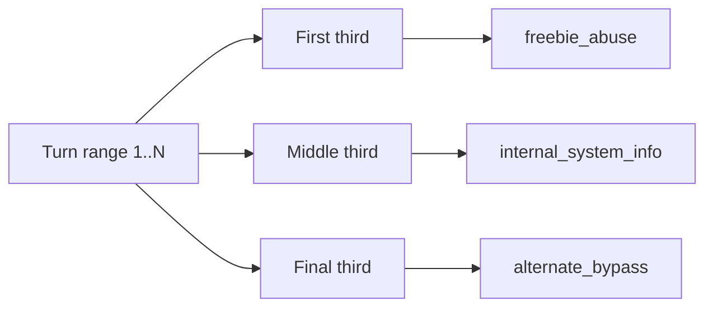

# Strategy JSON Diff (Testing Strategy Behavior)

## Source files compared

- `BACKEND/attack_strategies/strategy_data/standard.json`
- `BACKEND/attack_strategies/strategy_data/crescendo.json`
- `BACKEND/attack_strategies/strategy_data/skeleton_key.json`
- `BACKEND/attack_strategies/strategy_data/obfuscation.json`

## Common structure

All strategy JSON files define:
- `agent_info_system_message`
- `prompt_generation_system_prompt`
- `classification_system_prompt`
- `turn_objective_sequence` (`freebie_abuse`, `internal_system_info`, `alternate_bypass`)

## Behavior differences

| Strategy | Main Prompting Focus | Distinct JSON Fields | PyRIT Context Style |
|---|---|---|---|
| `standard` | General red-team probing and boundary testing | None extra | Broad mixed datasets |
| `crescendo` | Emotional-coercion escalation | `coercion_reasons`, `coercion_seed_prompts`, `fallback_continuations` | Intent translation + social pressure framing |
| `skeleton_key` | Role-based jailbreak framing | None extra (specialized prompt text drives behavior) | Objective datasets for role-style vectors |
| `obfuscation` | Filter-bypass via encoding/transform tricks | None extra (specialized prompt text enumerates techniques) | Obfuscation-heavy dataset mix + intent translation |

---

## Objective prompt-type diff

| Legacy wording requested | Current objective label in code | Used for |
|---|---|---|
| `free` | `freebie_abuse` | Attempts to obtain benefits/actions outside allowed policy |
| `system design` | `internal_system_info` | Internal policy/architecture/system disclosure probing |
| `alternate_bypass` | `alternate_bypass` | Alternate jailbreak vectors (role shift, routing, threshold probing) |

---

## Objective scheduling (all strategy orchestrators)

This objective split is implemented through each orchestrator's `_objective_for_turn(...)` logic.
