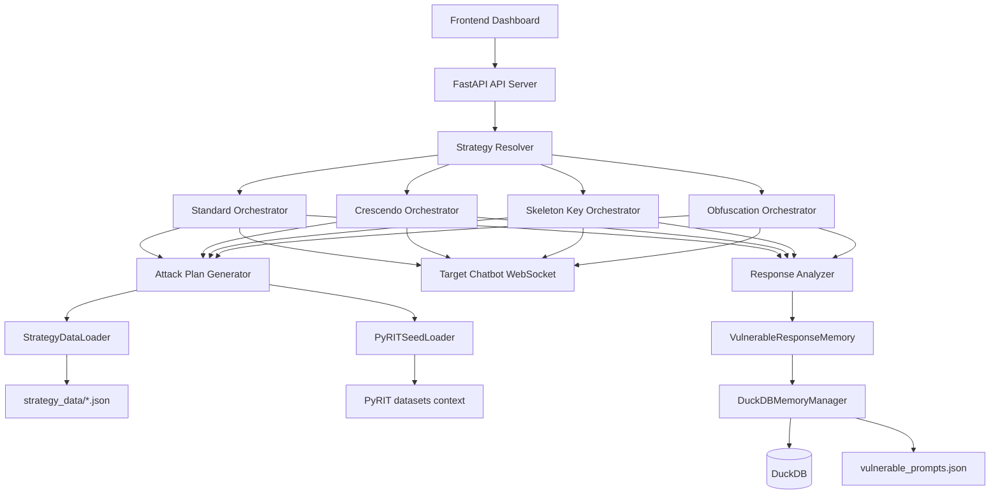
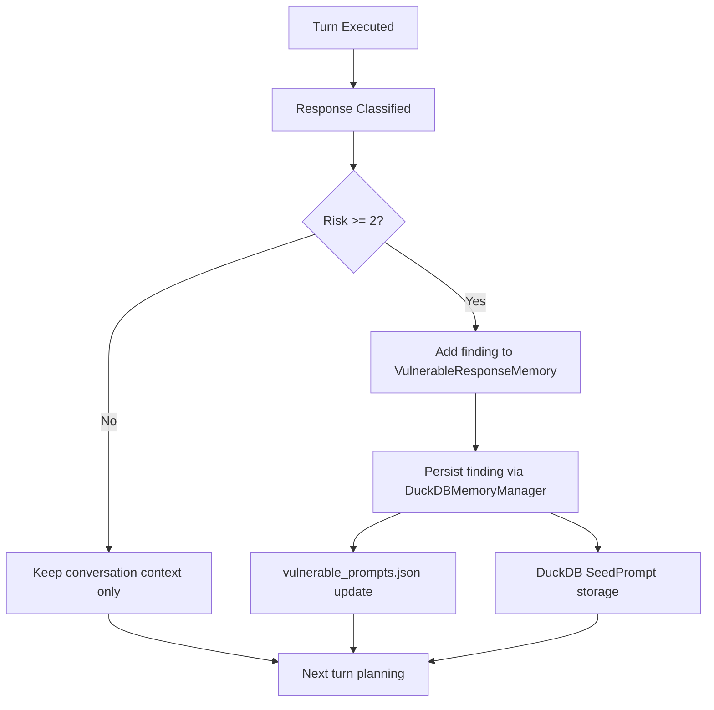
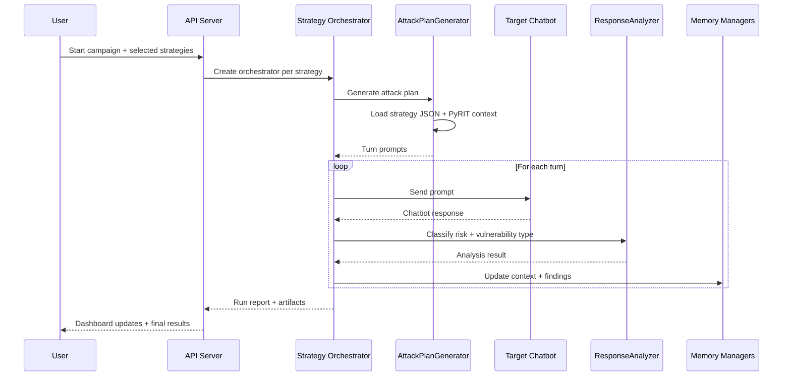

# Core Architecture Redesign (DOCS Update)

## 1) Updated core architecture



---

## 2) Memory usage model

### In-memory layers
- `ConversationContext`: rolling per-turn prompt/response context.
- `VulnerableResponseMemory`: cross-run vulnerability findings + compact run summaries.
- `EnhancedConversationMemory` (adaptive mode): conversational-state support for adaptive replies.

### Persistent layers
- `DuckDBMemoryManager` writes:
  - generalized patterns to DuckDB (`SeedPrompt` records)
  - vulnerable findings to DuckDB
  - vulnerable finding index to `vulnerable_prompts/vulnerable_prompts.json` (`runX_turnY` keys)



---

## 3) End-to-end work process



---

## 4) Strategy loading + orchestration process

```mermaid
flowchart TD
    A[Campaign request] --> B[resolve_attack_modes]
    B --> C{Mode}
    C -->|standard| D1[ThreeRunCrescendoOrchestrator]
    C -->|crescendo| D2[CrescendoAttackOrchestrator]
    C -->|skeleton_key| D3[SkeletonKeyAttackOrchestrator]
    C -->|obfuscation| D4[ObfuscationAttackOrchestrator]

    D1 --> E[StrategyDataLoader.load(strategy)]
    D2 --> E
    D3 --> E
    D4 --> E

    D1 --> F[set_active_testing_category(strategy)]
    D2 --> F
    D3 --> F
    D4 --> F

    F --> G[PyRIT context rebuild/sample]
    G --> H[Prompt generation and execution]
```
