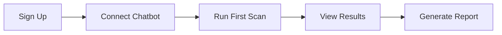

# MLP: Chatbot Security Testing Agent

## 📋 Overview

**Product Name:** Chatbot Security Testing Agent  
**Version:** 1.0 (Minimum Lovable Product)  
**Goal:** Build a testing agent that evaluates chatbot vulnerabilities using red teaming techniques and PyRIT (Python Risk Identification Toolkit) prompts.

---

## 🎯 Key Use Cases

### Use Case 1: Automated Vulnerability Scanning
**Description:** Security teams can automatically scan chatbots for common vulnerabilities without manual intervention.
- **Actor:** Security Analyst
- **Trigger:** User initiates a security scan on a target chatbot
- **Outcome:** Comprehensive vulnerability report with severity ratings

### Use Case 2: Red Team Attack Simulation
**Description:** Simulate adversarial attacks against chatbots to identify weaknesses in response handling.
- **Actor:** Red Team Engineer
- **Trigger:** User configures and launches attack scenarios
- **Outcome:** Detailed attack logs and chatbot response analysis

### Use Case 3: Prompt Injection Testing
**Description:** Test chatbots against various prompt injection techniques using PyRIT prompt library.
- **Actor:** Security Researcher
- **Trigger:** User selects prompt injection test suite
- **Outcome:** Report on successful/failed injection attempts

### Use Case 4: Compliance Validation
**Description:** Validate chatbot responses against security compliance standards and best practices.
- **Actor:** Compliance Officer
- **Trigger:** User runs compliance validation suite
- **Outcome:** Compliance report with pass/fail status for each criterion

### Use Case 5: Continuous Security Monitoring
**Description:** Integrate with CI/CD pipelines for continuous security assessment of chatbot deployments.
- **Actor:** DevSecOps Engineer
- **Trigger:** Automated trigger from CI/CD pipeline
- **Outcome:** Automated security gate with pass/fail status

---

## 🚀 Core Features

### 1. PyRIT Integration Engine
**Description:** Seamless integration with Microsoft's PyRIT framework for executing red team prompts against target chatbots.

**Why Essential:**
- PyRIT provides a comprehensive library of adversarial prompts
- Standardized approach to security testing
- Reduces time to develop custom attack vectors

**Expected Experience:**
```
User selects PyRIT prompt categories → Agent executes prompts → Results displayed in real-time → Summary report generated
```

### 2. Multi-Chatbot Connector
**Description:** Connect to various chatbot platforms (OpenAI, Azure Bot Service, custom APIs) through a unified interface.

**Why Essential:**
- Organizations use diverse chatbot platforms
- Single tool for all chatbot security testing
- Reduces tool sprawl and learning curve

**Expected Experience:**
```
User configures chatbot endpoint → Agent validates connection → Ready for testing within seconds
```

### 3. Vulnerability Detection Dashboard
**Description:** Visual dashboard showing detected vulnerabilities, severity levels, and remediation suggestions.

**Why Essential:**
- Clear visibility into security posture
- Prioritization based on severity
- Actionable remediation guidance

**Expected Experience:**
```
Tests complete → Dashboard updates in real-time → User views categorized vulnerabilities → Clicks for detailed remediation steps
```

### 4. Attack Scenario Builder
**Description:** Visual builder for creating custom red team attack scenarios combining multiple techniques.

**Why Essential:**
- Pre-built scenarios cover common cases
- Custom scenarios for unique chatbot behaviors
- Reusable templates for regression testing

**Expected Experience:**
```
User opens scenario builder → Drags attack components → Configures parameters → Saves and executes scenario
```

### 5. Comprehensive Reporting
**Description:** Generate detailed security reports in multiple formats (PDF, JSON, HTML) with executive summaries.

**Why Essential:**
- Different stakeholders need different report formats
- Executive summaries for leadership
- Technical details for engineering teams

**Expected Experience:**
```
User selects report type → Customizes sections → Generates report → Downloads or shares via link
```

---

## 👤 Expected User Experience

### Onboarding Flow



### Primary User Journey

1. **Connect:** User connects their chatbot endpoint with API credentials
2. **Configure:** User selects testing scope and attack vectors
3. **Execute:** Agent runs selected tests against the chatbot
4. **Analyze:** Real-time results displayed on dashboard
5. **Report:** User generates and shares security report
6. **Remediate:** User follows remediation guidance to fix issues

### User Interface Preview

```
┌─────────────────────────────────────────────────────────────────┐
│  Chatbot Security Testing Agent                    [Settings] [?]│
├─────────────────────────────────────────────────────────────────┤
│                                                                  │
│  Connected Chatbot: Production Bot v2.1        [Disconnect]     │
│                                                                  │
│  ┌──────────────┐ ┌──────────────┐ ┌──────────────┐             │
│  │ Vulnerabilities│ │ Test Coverage │ │ Last Scan    │             │
│  │     12         │ │     87%       │ │ 2 hours ago  │             │
│  │ ▲ 3 Critical   │ │               │ │              │             │
│  └──────────────┘ └──────────────┘ └──────────────┘             │
│                                                                  │
│  [▶ Run Full Scan]  [📊 View Reports]  [⚙ Configure Tests]      │
│                                                                  │
│  Recent Findings:                                                │
│  ├─ 🔴 Critical: Prompt Injection Vulnerability                 │
│  ├─ 🟠 High: Data Leakage via Conversation                      │
│  ├─ 🟡 Medium: Jailbreak Susceptibility                         │
│  └─ 🟢 Low: Verbose Error Messages                              │
│                                                                  │
└─────────────────────────────────────────────────────────────────┘
```

---

## 📊 Success Metrics

| Metric | Target | Measurement |
|--------|--------|-------------|
| Time to First Scan | < 5 minutes | From signup to first completed scan |
| Vulnerability Detection Rate | > 90% | Known vulnerabilities detected |
| False Positive Rate | < 10% | Verified false positives |
| User Satisfaction | > 4.5/5 | Post-scan survey |
| Report Generation Time | < 30 seconds | Time to generate full report |

---

## 🔧 Technical Requirements (High-Level)

- **Backend:** Python 3.10+ with PyRIT integration
- **Frontend:** React-based dashboard
- **Database:** PostgreSQL for test results storage
- **Queue:** Redis for async job processing
- **Deployment:** Docker containers with Kubernetes support

---

## 📅 MLP Timeline

| Phase | Duration | Deliverables |
|-------|----------|--------------|
| Phase 1 | 2 weeks | Core PyRIT integration, basic scanning |
| Phase 2 | 2 weeks | Dashboard, reporting, multi-chatbot support |
| Phase 3 | 1 week | Testing, bug fixes, documentation |
| **Total** | **5 weeks** | **MLP Release** |

---

## 🎉 What Makes This "Lovable"

1. **Immediate Value:** Users see security insights within minutes of connecting their chatbot
2. **Beautiful UX:** Clean, intuitive interface that security professionals enjoy using
3. **Actionable Results:** Not just identifying problems, but guiding users to solutions
4. **Time Savings:** Automates hours of manual security testing
5. **Confidence:** Users trust their chatbots are secure before deployment

---

*Last Updated: December 2024*
