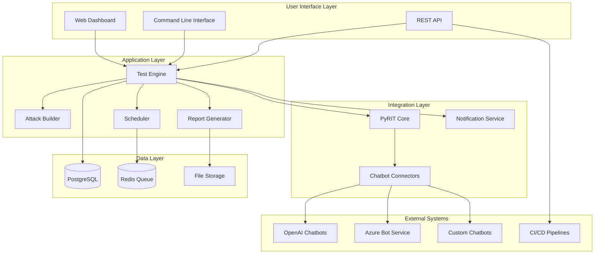
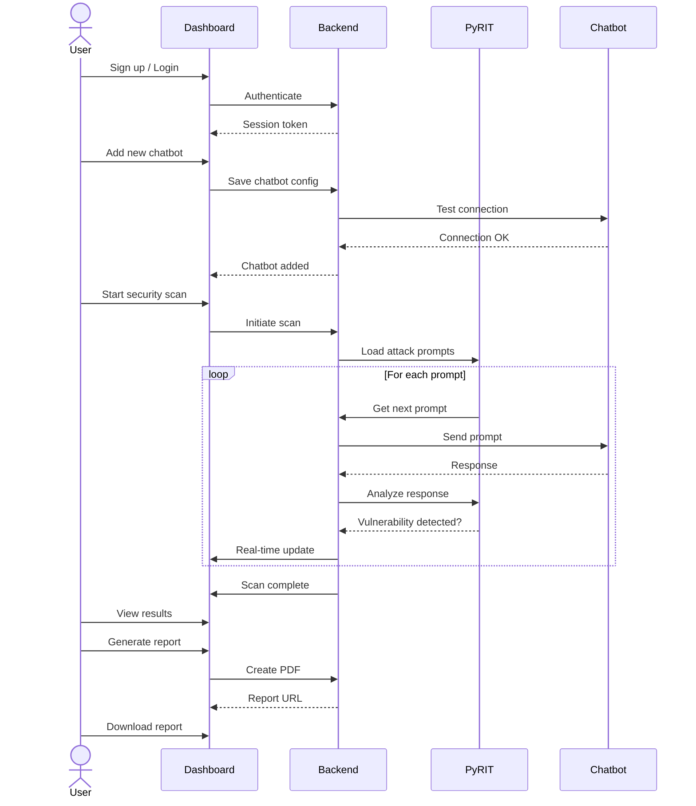
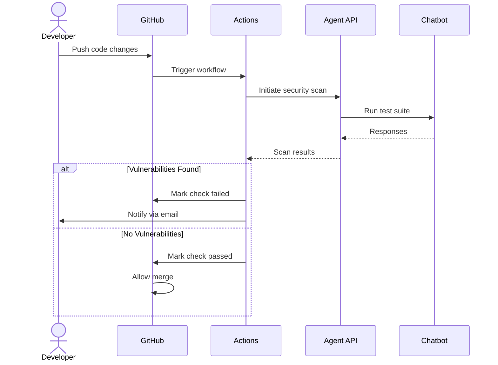
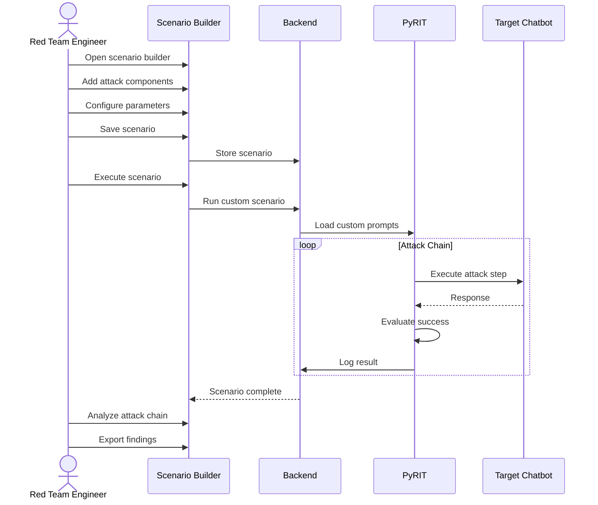
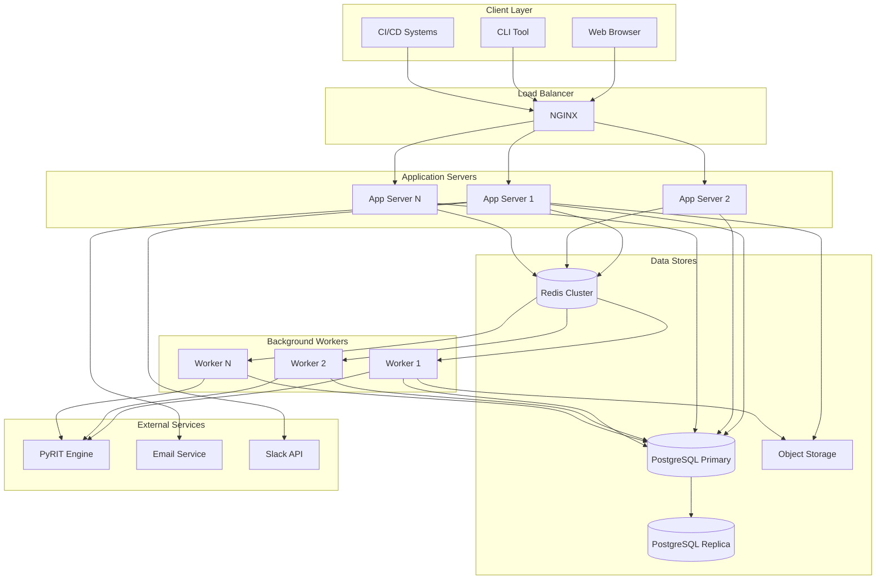
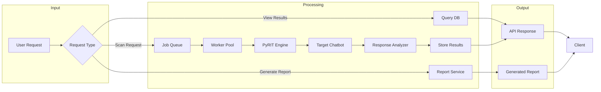
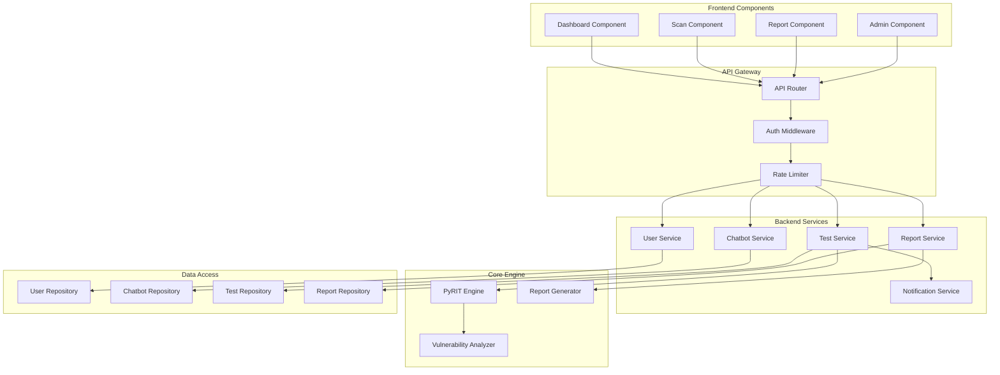
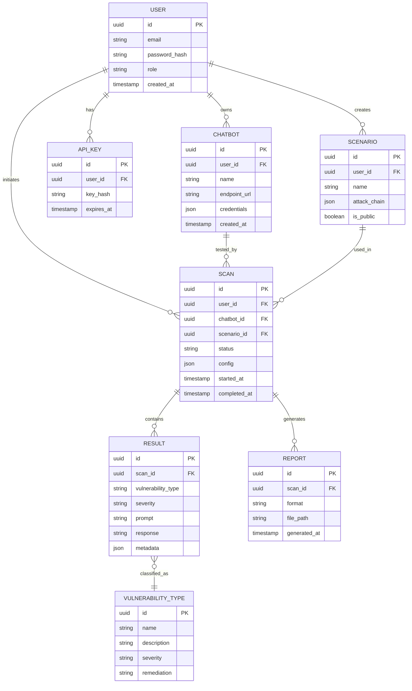
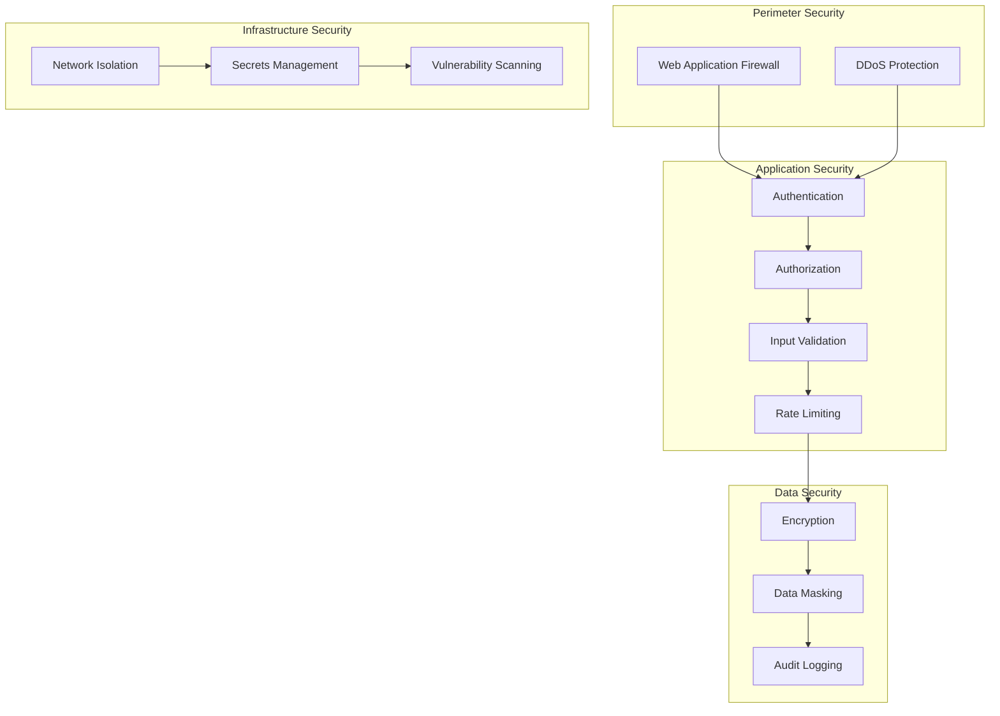
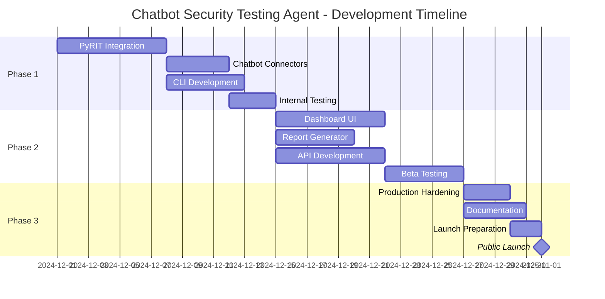

# PRD: Chatbot Security Testing Agent

## 📋 Document Information

| Field | Value |
|-------|-------|
| **Product Name** | Chatbot Security Testing Agent |
| **Version** | 1.0 |
| **Author** | Product Team |
| **Last Updated** | December 2024 |
| **Status** | Draft |

---

## 1. Problem Statement

### 1.1 Background

As conversational AI and chatbots become integral to business operations, they present new attack surfaces for malicious actors. Current security testing tools are not designed for the unique challenges of testing AI-powered chatbots, leaving organizations vulnerable to:

- **Prompt injection attacks** that manipulate chatbot behavior
- **Data leakage** through crafted conversation flows
- **Jailbreaking** attempts that bypass content filters
- **Social engineering** exploits targeting AI systems

### 1.2 The Problem

Organizations deploying chatbots lack specialized tools to:

1. **Systematically test** chatbot security before deployment
2. **Identify vulnerabilities** specific to conversational AI
3. **Simulate adversarial attacks** in a controlled environment
4. **Validate compliance** with security best practices
5. **Continuously monitor** chatbot security posture

### 1.3 Impact

Without proper security testing:
- Sensitive data may be exposed through chatbot conversations
- Brand reputation damaged by jailbroken chatbots
- Regulatory non-compliance leading to fines
- Customer trust erosion due to security incidents

### 1.4 Target Users

| User Persona | Role | Primary Need |
|--------------|------|--------------|
| **Security Analyst** | Tests applications for vulnerabilities | Automated vulnerability scanning |
| **Red Team Engineer** | Simulates adversarial attacks | Attack simulation tools |
| **DevSecOps Engineer** | Integrates security in CI/CD | Pipeline integration |
| **Compliance Officer** | Ensures regulatory compliance | Compliance validation |
| **AI/ML Engineer** | Builds and deploys chatbots | Pre-deployment security checks |

---

## 2. Proposed Solution

### 2.1 Solution Overview

Build a comprehensive **Chatbot Security Testing Agent** that leverages Microsoft's PyRIT (Python Risk Identification Toolkit) to perform automated red team testing against chatbots. The solution provides:

- Automated vulnerability scanning
- Red team attack simulation
- Comprehensive reporting
- CI/CD integration capabilities

### 2.2 Key Differentiators

1. **PyRIT-Powered:** Leverages Microsoft's proven red teaming framework
2. **Chatbot-Specific:** Purpose-built for conversational AI security
3. **Automation-First:** Reduces manual testing effort by 80%+
4. **Extensible:** Custom attack scenarios and integrations

### 2.3 Solution Architecture



---

## 3. Functional Requirements

### 3.1 User Management

| ID | Requirement | Priority | Description |
|----|-------------|----------|-------------|
| FR-001 | User Registration | P0 | Users can create accounts with email/password |
| FR-002 | User Authentication | P0 | Secure login with MFA support |
| FR-003 | Role-Based Access | P1 | Admin, Analyst, Viewer roles |
| FR-004 | API Key Management | P1 | Generate and manage API keys |
| FR-005 | Team Management | P2 | Create teams and manage members |

### 3.2 Chatbot Connection

| ID | Requirement | Priority | Description |
|----|-------------|----------|-------------|
| FR-010 | Add Chatbot Endpoint | P0 | Configure chatbot API endpoints |
| FR-011 | Connection Testing | P0 | Validate chatbot connectivity |
| FR-012 | Credential Storage | P0 | Secure storage of API credentials |
| FR-013 | Multiple Chatbots | P1 | Support multiple chatbot configurations |
| FR-014 | Connection Templates | P2 | Pre-configured templates for common platforms |

### 3.3 Security Testing

| ID | Requirement | Priority | Description |
|----|-------------|----------|-------------|
| FR-020 | PyRIT Integration | P0 | Execute PyRIT prompts against chatbots |
| FR-021 | Prompt Injection Tests | P0 | Test for prompt injection vulnerabilities |
| FR-022 | Jailbreak Detection | P0 | Test jailbreak susceptibility |
| FR-023 | Data Leakage Tests | P0 | Test for unintended data disclosure |
| FR-024 | Custom Attack Scenarios | P1 | Create custom test scenarios |
| FR-025 | Scheduled Testing | P1 | Schedule recurring security tests |
| FR-026 | Parallel Test Execution | P2 | Run multiple tests concurrently |

### 3.4 Results & Reporting

| ID | Requirement | Priority | Description |
|----|-------------|----------|-------------|
| FR-030 | Real-time Results | P0 | Display test results as they complete |
| FR-031 | Vulnerability Classification | P0 | Categorize findings by severity |
| FR-032 | PDF Report Generation | P1 | Export reports as PDF |
| FR-033 | JSON Export | P1 | Export results as JSON |
| FR-034 | Trend Analysis | P2 | Track security posture over time |
| FR-035 | Remediation Guidance | P1 | Provide fix recommendations |

### 3.5 Integration

| ID | Requirement | Priority | Description |
|----|-------------|----------|-------------|
| FR-040 | REST API | P0 | Full-featured REST API |
| FR-041 | CLI Tool | P1 | Command-line interface |
| FR-042 | GitHub Actions | P2 | GitHub Actions integration |
| FR-043 | Webhook Notifications | P1 | Send results to webhooks |
| FR-044 | Slack Integration | P2 | Slack notifications |

---

## 4. Non-Functional Requirements

### 4.1 Performance

| ID | Requirement | Target | Measurement |
|----|-------------|--------|-------------|
| NFR-001 | API Response Time | < 200ms | 95th percentile |
| NFR-002 | Test Execution Throughput | 100 prompts/min | Per chatbot connection |
| NFR-003 | Report Generation Time | < 30 seconds | For 1000 test results |
| NFR-004 | Concurrent Users | 100 | Simultaneous active users |

### 4.2 Reliability

| ID | Requirement | Target | Description |
|----|-------------|--------|-------------|
| NFR-010 | Uptime | 99.9% | Monthly availability |
| NFR-011 | Data Durability | 99.999% | Test results persistence |
| NFR-012 | Backup Frequency | Every 4 hours | Automated backups |
| NFR-013 | Recovery Time | < 1 hour | RTO for full service |

### 4.3 Security

| ID | Requirement | Description |
|----|-------------|-------------|
| NFR-020 | Data Encryption | AES-256 for data at rest, TLS 1.3 in transit |
| NFR-021 | Credential Protection | Secrets stored in encrypted vault |
| NFR-022 | Audit Logging | All user actions logged with timestamps |
| NFR-023 | Vulnerability Scanning | Weekly automated security scans |
| NFR-024 | Penetration Testing | Annual third-party pen test |

### 4.4 Scalability

| ID | Requirement | Target | Description |
|----|-------------|--------|-------------|
| NFR-030 | Horizontal Scaling | Auto-scale 1-10 instances | Based on load |
| NFR-031 | Database Scaling | Up to 1TB | Test results storage |
| NFR-032 | API Rate Limiting | 1000 req/min/user | Prevent abuse |

### 4.5 Usability

| ID | Requirement | Target | Description |
|----|-------------|--------|-------------|
| NFR-040 | Time to First Scan | < 5 minutes | New user onboarding |
| NFR-041 | Accessibility | WCAG 2.1 AA | Compliance standard |
| NFR-042 | Mobile Responsiveness | Full support | Dashboard on mobile |
| NFR-043 | Documentation | 100% API coverage | OpenAPI spec + guides |

---

## 5. User Journeys

### 5.1 First-Time User Scan



### 5.2 CI/CD Integration Flow



### 5.3 Custom Attack Scenario



---

## 6. System Architecture

### 6.1 High-Level Architecture



### 6.2 Data Flow Architecture



### 6.3 Component Diagram



---

## 7. API Specification

### 7.1 Core Endpoints

| Method | Endpoint | Description |
|--------|----------|-------------|
| POST | `/api/v1/auth/register` | Register new user |
| POST | `/api/v1/auth/login` | User login |
| GET | `/api/v1/chatbots` | List connected chatbots |
| POST | `/api/v1/chatbots` | Add new chatbot |
| DELETE | `/api/v1/chatbots/{id}` | Remove chatbot |
| POST | `/api/v1/scans` | Start new security scan |
| GET | `/api/v1/scans/{id}` | Get scan status/results |
| GET | `/api/v1/scans/{id}/report` | Generate scan report |
| GET | `/api/v1/vulnerabilities` | List all vulnerabilities |
| GET | `/api/v1/scenarios` | List attack scenarios |
| POST | `/api/v1/scenarios` | Create custom scenario |

### 7.2 Example API Request/Response

**Start Security Scan**

```http
POST /api/v1/scans
Content-Type: application/json
Authorization: Bearer <token>

{
  "chatbot_id": "cb_123456",
  "scan_type": "full",
  "attack_categories": [
    "prompt_injection",
    "jailbreak",
    "data_leakage"
  ],
  "options": {
    "max_prompts": 100,
    "timeout_seconds": 300
  }
}
```

**Response**

```json
{
  "scan_id": "scan_789012",
  "status": "queued",
  "chatbot_id": "cb_123456",
  "created_at": "2024-12-01T10:30:00Z",
  "estimated_duration_seconds": 180,
  "progress_url": "/api/v1/scans/scan_789012/progress"
}
```

---

## 8. Data Models

### 8.1 Entity Relationship Diagram



---

## 9. Technology Stack

### 9.1 Backend

| Component | Technology | Justification |
|-----------|------------|---------------|
| Language | Python 3.11+ | PyRIT compatibility, AI ecosystem |
| Framework | FastAPI | Async support, OpenAPI generation |
| ORM | SQLAlchemy 2.0 | Mature, async support |
| Task Queue | Celery + Redis | Reliable background processing |
| Testing | pytest | Standard Python testing |

### 9.2 Frontend

| Component | Technology | Justification |
|-----------|------------|---------------|
| Framework | React 18 | Component-based, large ecosystem |
| State Management | Redux Toolkit | Predictable state management |
| UI Components | Tailwind CSS + shadcn/ui | Rapid development, customizable |
| Charts | Recharts | React-native charting |
| API Client | React Query | Caching, optimistic updates |

### 9.3 Infrastructure

| Component | Technology | Justification |
|-----------|------------|---------------|
| Container | Docker | Consistent environments |
| Orchestration | Kubernetes | Scalability, self-healing |
| Database | PostgreSQL 15 | Reliability, JSON support |
| Cache | Redis 7 | Speed, pub/sub capability |
| Object Storage | S3-compatible | Report storage |
| CI/CD | GitHub Actions | Native GitHub integration |

---

## 10. Security Considerations

### 10.1 Threat Model

| Threat | Impact | Mitigation |
|--------|--------|------------|
| Credential Theft | High | Encrypted vault, short-lived tokens |
| API Abuse | Medium | Rate limiting, API key rotation |
| Data Breach | High | Encryption, access controls, audit logs |
| Injection Attacks | High | Input validation, parameterized queries |
| Privilege Escalation | High | RBAC, principle of least privilege |

### 10.2 Security Controls



---

## 11. Rollout Plan

### 11.1 Phase 1: Alpha (Week 1-2)

- Core PyRIT integration
- Basic chatbot connection
- Command-line interface
- Internal testing only

### 11.2 Phase 2: Beta (Week 3-4)

- Web dashboard
- Multi-chatbot support
- Report generation
- Limited external beta users

### 11.3 Phase 3: GA (Week 5)

- Full feature set
- Production hardening
- Documentation complete
- Public launch

### 11.4 Timeline



---

## 12. Success Criteria

### 12.1 Launch Criteria

- [ ] All P0 functional requirements implemented
- [ ] > 90% test coverage on core functionality
- [ ] < 5 known P0/P1 bugs
- [ ] Security review completed
- [ ] Documentation published
- [ ] Performance benchmarks met

### 12.2 Post-Launch Metrics

| Metric | Target | Timeline |
|--------|--------|----------|
| Active Users | 100+ | 30 days |
| Scans Completed | 1000+ | 30 days |
| User Retention | > 60% | 30 days |
| NPS Score | > 40 | 60 days |
| Uptime | 99.9% | Ongoing |

---

## 13. Appendix

### 13.1 Glossary

| Term | Definition |
|------|------------|
| **PyRIT** | Python Risk Identification Toolkit - Microsoft's framework for AI red teaming |
| **Prompt Injection** | Attack that manipulates AI systems via malicious input prompts |
| **Jailbreak** | Technique to bypass content filters and safety measures |
| **Red Teaming** | Simulating adversarial attacks to find vulnerabilities |
| **MLP** | Minimum Lovable Product - smallest product that users will love |

### 13.2 References

- [Microsoft PyRIT Documentation](https://github.com/Azure/PyRIT)
- [OWASP AI Security Guidelines](https://owasp.org/www-project-machine-learning-security-top-10/)
- [NIST AI Risk Management Framework](https://www.nist.gov/itl/ai-risk-management-framework)

### 13.3 Change Log

| Version | Date | Author | Changes |
|---------|------|--------|---------|
| 1.0 | 2024-12 | Product Team | Initial PRD |

---

*Last Updated: December 2024*
